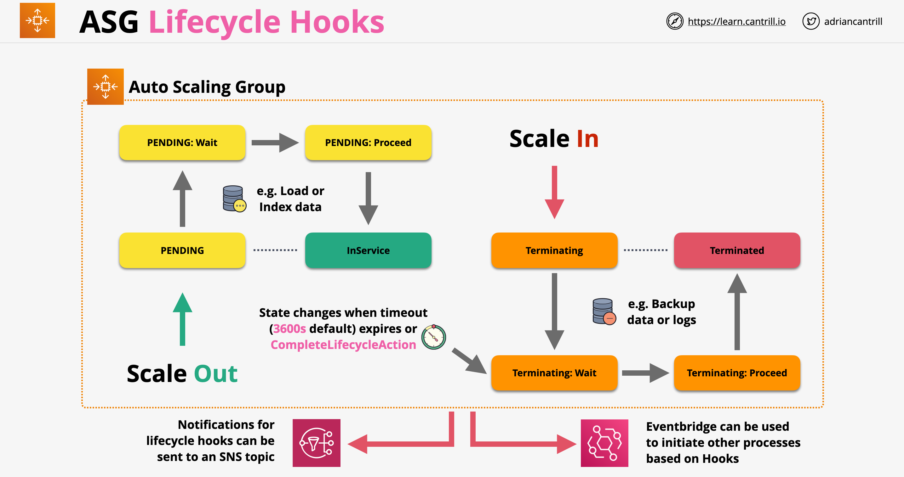

# ASG - Grupos de Auto Scaling

- Os Grupos de Auto Scaling fornecem auto scaling para o EC2
- Fornecem a capacidade de implementar uma arquitetura auto-reparável
- Os ASGs usam configurações definidas em templates de lançamento ou configurações de lançamento
- Os ASGs usam uma versão de um template/configuração de lançamento
- O ASG tem 3 valores importantes definidos: *Mínimo*, *Desejado* e *Máximo* de tamanho. O tamanho desejado deve ser maior que o tamanho mínimo e menor que o tamanho máximo
- O ASG fornece um trabalho fundamental: mantém o tamanho das instâncias em execução no tamanho desejado
- Arquiteturalmente, os ASGs definem onde as instâncias EC2 são lançadas. Eles são vinculados à VPC e quais sub-redes são configuradas dentro da VPC no ACG
- **Políticas de Scaling**: atualizam a capacidade desejada com base em alguma métrica (uso de CPU, número de conexões, etc.)
    - São essencialmente regras definidas por nós que podem ajustar os valores de um ASG
    - As políticas de scaling são usadas com o ASG
    - Tipos de scaling:
        - **Scaling Manual**: Ajusta manualmente a capacidade desejada
        - **Scaling Programado**: Programação baseada em janelas de tempo conhecidas
        - **Scaling Dinâmico**
        - **Scaling Preditivo**: escala com base na carga histórica para detectar padrões nos fluxos de tráfego
- O Scaling Dinâmico tem 3 subtipos:
    - **Scaling Simples**: Baseado em Métrica. Exemplo: "CPU acima de 50% +1", "CPU Abaixo de 50% -1"
    - **Scaling por Etapas**: scaling baseado na diferença, permitindo reagir mais rapidamente
    - **Rastreamento de Alvo**: exemplo de CPU agregada desejada = 40%. Nem todas as métricas são suportadas pelo scaling de rastreamento de alvo
- **Período de Cooldown**: um valor em segundos, controla quanto tempo esperar após uma ação de scaling antes de iniciar outra ação
- O ASG monitora a saúde das instâncias, por padrão usando as verificações de saúde do EC2
- O ASG pode integrar-se a balanceadores de carga: o ASG pode adicionar/remover instâncias de um grupo de destino do LB
- O ASG pode usar as verificações de saúde do LB no lugar das verificações de saúde do EC2

## Processos de Scaling

- `Launch` e `Terminate`: se o Launch for suspenso, o ASG não escalará para fora / se o Terminate for suspenso, o ASG não escalará para dentro
- `AddToLoadBalancer`: adiciona instância ao LB
- `AlarmNotification`: controla se o ASG reage a alarmes do CloudWatch
- `AZRebalance`: balanceia instâncias uniformemente entre todas as AZs
- `HealthCheck`: controla se as verificações de saúde das instâncias estão ativadas/desativadas
- `ReplaceUnhealthy`: controla se as instâncias são substituídas em caso de não estarem saudáveis
- `ScheduledActions`: controla se as ações programadas estão ativadas/desativadas
- `Standby`: suspende qualquer atividade do ASG em uma instância específica

## Considerações sobre ASG

- Os ASGs são gratuitos; pagamos apenas pelas instâncias provisionadas
- Devemos usar períodos de cooldown para evitar scaling rápido
- Devemos usar instâncias menores para granularidade
- O ASG integra-se com ALBs
- O ASG define quando e onde; o LT define o quê

## Hooks de Ciclo de Vida

- Permitem configurar ações personalizadas que podem ocorrer durante as ações do ASG
- Quando um ASG escala para fora/dentro, as instâncias podem pausar dentro do fluxo para permitir a execução de hooks de ciclo de vida
- Podemos especificar um timeout (36000s por padrão) para a ação do ciclo de vida; após a pausa, o sistema pode decidir se o processo do ASG continua ou é abandonado
- Podemos retomar o processo do ASG chamando `CompleteLifecycleAction`
- Os hooks de evento do ciclo de vida podem ser integrados com notificações do EventBridge ou SNS

## Políticas de Scaling

- Os ASGs não precisam de políticas de scaling; eles podem funcionar perfeitamente sem nenhuma
- Quando criado sem uma política de scaling, um ASG tem valores estáticos para `MinSize`, `MaxSize` e capacidade `Desired`
- Scaling manual: ajustamos manualmente os valores listados anteriormente; útil para testes ou situações urgentes ou quando precisamos manter a capacidade em um número fixo de instâncias
- Além do scaling manual, temos diferentes tipos de políticas de scaling dinâmico. Cada uma delas ajusta a capacidade desejada de um ASG com base em certos critérios
- Políticas de scaling dinâmico:
    - **Scaling Simples**:
        - Definimos ações que ocorrem quando um alarme entra no estado ALARM. Por exemplo: adicionar uma instância se `CPUUtilization` estiver acima de 40%
        - Ajuda a infraestrutura a escalar para fora/dentro com base na demanda
        - Este scaling é inflexível; adiciona/remove um número estático de instâncias com base no status de um alarme
    - **Scaling por Etapas**:
        - Ajusta o número de instâncias com base em uma série de ajustes por etapas, que variam com base no tamanho do alarme
        - Exemplo:
            - Se o uso de CPU estiver entre 50-60%, não fazer nada
            - Se o uso de CPU estiver entre 60 e 70%, adicionar uma instância
            - Se o uso de CPU estiver entre 70 e 80%, adicionar duas instâncias
            - Finalmente, adicionar 3 instâncias se o uso de CPU estiver acima de 80%
        - Geralmente é melhor em comparação ao Scaling Simples; permite que nos adaptemos melhor aos padrões de carga variável
    - **Rastreamento de Alvo**:
        - Vem com um conjunto predefinido de métricas: `CPUUtilization`, `AvgNetworkIn`, `AvgNetworkOut`, `AlbRequestCountPerTarget`
        - Definimos um valor ideal, um alvo que queremos rastrear para uma métrica suportada
        - O ASG calcula o ajuste de scaling com base na métrica e no valor alvo
        - O ASG mantém a métrica no valor alvo que especificamos e ajusta a capacidade conforme necessário
    - Scaling baseado em SQS - `ApproximateNumberOfMessagesVisible`:
        - O scaling é feito com base no número de mensagens atualmente na fila SQS
    - **Scaling Preditivo**:
        - O scaling preditivo usa dados de carga histórica para detectar padrões nos fluxos de tráfego e escalar adequadamente
        - Precisa de pelo menos 24 horas de dados para funcionar; se disponível, usa os últimos 14 dias de dados para analisar padrões
        - Quando habilitado, será executado no modo `somente previsão`, no qual nenhuma ação de autoscaling ocorrerá. Ele gerará previsões de capacidade que nos permitirão avaliar a precisão e a adequação do autoscaling
        - Depois de revisarmos, ele mudará para o modo `previsão e escala`
        - Limite máximo de capacidade: número máximo de instâncias EC2 que podem ser lançadas. Podemos permitir que a capacidade máxima dos grupos seja aumentada automaticamente
        - Uma suposição central do scaling preditivo é que o Grupo de Auto Scaling é homogêneo e todas as instâncias têm capacidade igual. Se isso não for verdade, a capacidade prevista pode ser imprecisa
- A AWS recomenda usar Scaling por Etapas em vez de política de Scaling Simples

## Verificações de Saúde do ASG

- Os ASGs avaliam a saúde das instâncias dentro do seu grupo usando verificações de saúde
- Se uma instância falhar nas verificações de saúde, ela é substituída dentro do grupo => cura automática
- Existem 3 tipos diferentes de verificações de saúde que podem ser usados pelos ASGs:
    - EC2 (padrão)
    - ELB (pode ser habilitado)
    - Personalizado
- Com verificações de saúde do EC2, qualquer um destes status é considerado não saudável: Stopping, Stopped, Terminated, Shutting Down, Impaired (sem verificações de status 2/2)
- Com verificações de saúde do ELB, para que uma instância seja considerada saudável, ela deve estar em execução e passando nas verificações de saúde do ELB
- As verificações de saúde do ELB podem ser mais conscientes da aplicação (Camada 7)
- Verificações de saúde personalizadas: as instâncias podem ser marcadas como saudáveis/não saudáveis por um sistema externo
- Período de carência da verificação de saúde:
    - É um valor configurável; por padrão é 300s
    - É um atraso antes das verificações de saúde começarem a verificar uma instância específica
    - Permite lançamento do sistema, bootstrapping e início da aplicação

---

# ASG - Auto Scaling Groups

- Auto Scaling Groups provide auto scaling for EC2
- Provide the ability to implement a self-healing architecture
- ASGs make use of configurations defined in launch templates or launch configurations
- ASGs are using one version of a launch template/configuration
- ASG have 3 important values defined: *Minimum*, *Desired* and *Maximum* size. Desired size has to be more than the minimum size and less than Maximum size.
- ASG provides on foundational job: keeps the size of running instances at the desired size
- Archechturally ASG define where the EC2 instances are launcehd. They are attcahed to VPC and which subnets are configured within the VPC in ACG. 
- **Scaling Policies**: update the desired capacity based on some metric (CPU usage, number of connections, etc.)
    - They are essentially rules defined by us which can adjust the values of an ASG
    - Scaling policies are used with ASG.
    - Scaling types:
        - **Manual Scaling** : Manually adjusts the desired capcacity.
        - **Scheduled Scaling**: Scheduling based on know time window
        - **Dynamic Scaling**
        - **Predictive Scaling**: scale based on historical load to detect patterns in traffic flows
- Dynamic Scaling has 3 subtypes:
    - **Simple Scaling**: Based on Metric. Example "CPU above 50%  +1", "CPU Below 50% -1"
    - **Step Scaling**: scaling based on difference, allowing to react quicker
    - **Target Tracking**: example desired aggregate CPU = 40%. Not all metrics are supported by target tracking scaling
- **Cooldown Period**: a value in seconds, controls how long to wait after a scaling action happened before starting another action
- ASG monitor the health of instances, by default using the EC2 health checks
- ASG can integrate with load balancers: ASG can add/remove instances from a LB target group
- ASG can use the LB health checks in case of EC2 health checks

## Scaling Processes

- `Launch` and `Terminate`: if Launch is suspended, the ASG wont scale out / if Terminate is suspended the ASG wont scale in
- `AddToLoadBalancer`: add instance to LB
- `AlarmNotification`: control is the ASG reacts to CloudWatch alarms
- `AZRebalance`: balances instances evenly across all of AZs
- `HealthCheck`: controls if instance health checks are on/off
- `ReplaceUnhealthy`: controls if instances are replaced in case there are unhealthy
- `ScheduledActions`: controls if scheduled actions are on/off
- `Standby`: suspend any activities of ASG in a specific instance

## ASG Consideration

- ASG are free, we pay only for the instances provisioned
- We should use cool downs to avoid rapid scaling
- We should use smaller instances for granularity
- ASG integrates with ALBs
- ASG defines when and where, LT defines what

## Lifecycle Hooks

- Allow to configure custom actions which can occur during ASG actions
- When an ASG scales out/in instances may pause within the flow to allow execution of lifecycle hooks
- We can specify a timeout (36000s by default) for the lifecycle action, after the pause the system can decide if the ASG process continues or is abandoned
- We can resume the ASG process by calling `CompleteLifecycleAction`
- Lifecycle event hooks can be integrated with EventBridge or SNS notifications

## Scaling Policies

- ASGs don't need scaling policies, they can work just fine with none
- When created without a scaling policy, an ASG has static values for `MinSize`, `MaxSize` and `Desired` capacity
- Manual scaling: we manually adjust the values listed before; useful for testing or urgent situations or when we need to hold capacity at fixed number of instances
- In addition to manual scaling, we had different types of dynamic scaling policies. Each of these adjusts the desired capacity of an ASG based on a certain criteria
- Dynamic scaling policies:
    - **Simple Scaling**:
        - We define action which occur when a alarm goes to ALARM state. For example: add one instance if `CPUUtilization` is above 40%
        - Helps infrastructure scale out/in based on demand
        - This scaling is inflexible, add/remove static number of instances based on the status of an alarm
    - **Step Scaling**:
        - Adjust number of instances based on a number of step adjustments, that wary based on the size of the alarm brige
        - Example:
            - If the CPU usage is between 50-60%, do nothing
            - If the CPU usage is between 60 and 70%, add one instance
            - If the CPU usage is between 70 and 80%, add two instances
            - Finally, add 3 instances if the CPU usage is above 80%
        - Generally is better compared to Simple Scaling, allows us to adjust better to change load patterns
    - **Target Tracking**:
        - Comes with a predefined set of metrics: `CPUUtilization`, `AvgNetworkIn`, `AvgNetworkOut`, `AlbRequestCountPerTarget`
        - We define an ideal value, a target we want to track against for a supported metric
        - The ASG calculates the scaling adjustment based on the metric and the target value
        - The ASG keeps the metric at the target value we specified and adjusts the capacity as required
    - Scaling based on SQS - `ApproximateNumberOfMessagesVisible`:
        - Scaling is done based on the number of messages currently in the SQS queue
    - **Predictive Scaling**:
        - Predictive scaling uses historical data load to detect patterns in traffic flows and scale accordingly
        - Needs at least 24 hours of data to work, if available uses the past 14 days of data to analyze patterns
        - When enabled it will run in `forecast only` mode, in which no autoscaling action will take place. It will generate capacity forecasts which will allow us to evaluate the accuracy and the suitability of the autoscaling
        - After we review it, it will switch to `forecast and scale` mode
        - Maximum capacity limit: maximum number of EC2 instances that can be launched. We can allow the groups maximum capacity to be automatically increased
        - A core assumption of predictive scaling is that the Auto Scaling group is homogenous and all instances are of equal capacity. If this isn't true, forecasted capacity can be inaccurate
- AWS recommends using Step Scaling instead of Simple Scaling policy

## ASG Health Checks

- ASGs assess the health of instances within their group using health checks
- If an instance fails health checks, it is replaced within the group => automatic healing
- There 3 different types of health checks that can be used by ASGs:
    - EC2 (default)
    - ELB (can be enabled)
    - Custom
- With EC2 health checks any of these statuses are viewed as unhealthy: Stopping, Stopped, Terminated, Shutting Down, Impaired (not 2/2 status checks)
- With ELB health checks in instance to be viewed as healthy it should be running and it should be passing the ELB health checks
- ELB health checks can be more application aware (Layer 7)
- Custom health checks: instances can be marked healthy/unhealthy by an external system
- Health check grace period:
    - It is configurable value, by default is 300s
    - It is a delay before health checks starting to check on a specific instance
    - Allows system launch, bootstrapping and application start