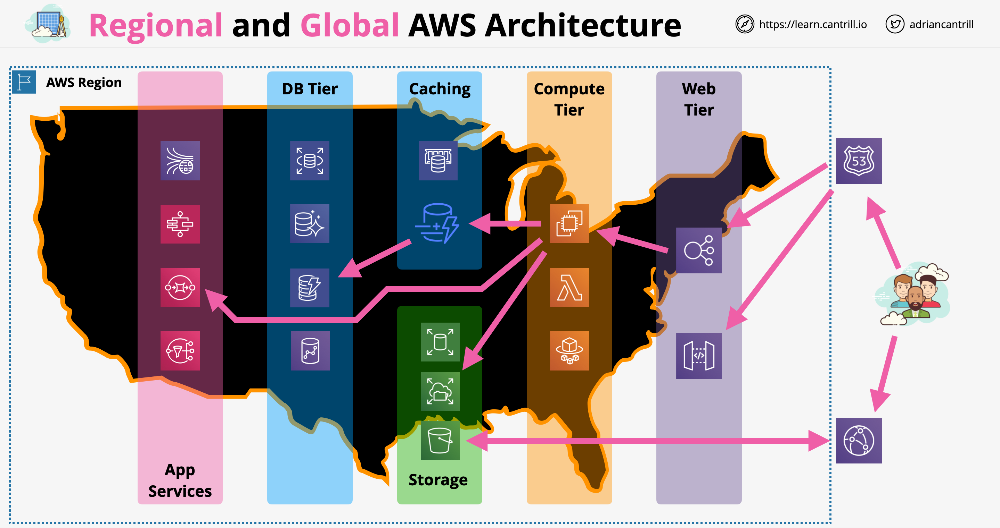

# Arquitetura Regional e Global da AWS

- Existem 3 tipos principais de arquitetura:
    - Arquiteturas de pequena escala: uma região/um país
    - Arquitetura pequena com DR: uma região + região de backup para recuperação de desastres
    - Sistemas baseados em múltiplas regiões
- Componentes arquiteturais em nível global:
    - Localização e Descoberta de Serviços Globais
    - Entrega de Conteúdo (CDN) e otimização
    - Verificações de saúde globais e Failover
- Componentes regionais:
    - Ponto de entrada regional
    - Escalabilidade e resiliência
    - Serviços e componentes de aplicação

Camada Web: Camada voltada para o cliente. Haveria serviços baseados em região como ALB ou API Gateway dependendo da arquitetura da aplicação. Abstrai os clientes da arquitetura subjacente.
Camada de Computação: A infraestrutura para a camada web é fornecida pela camada de computação usando EC2, Lambda ou contêineres.
Serviços de Armazenamento: Serviços como EBS, EFS ou S3.
Armazenamento de Dados: Produtos como RDS, Aurora, DynamoDB e RedShift.
Cache: ElasticCache para cache geral, DynamoDB Accelerator (DAX).
Serviços de Aplicação: Kinesis, Step Functions, SQS, SNS.

---

# Regional and Global AWS Architecture

- There are 3 main type of architectures:
    - Small scale architectures: one region/one country
    - Small architecture with DR: one region + backup region for disaster recovery
    - Multiple region based systems
- Architectural components at global level:
    - Global Service Location and Discovery
    - Content Delivery (CDN) and optimization
    - Global health checks and Failover
- Regional components:
    - Regional entry point
    - Scaling and resilience
    - Application services and components

Web Tier : Customer facing layer. There would be regional based services like ALB or API gateway dependig on application architecture. Abstracts customers from underlying architecture.
Compute Tier: The infra to web tier is provided by compute tier using EC2, lambda or containers.
Storage Services: Service like EBS, EFS or S3.
Data Storage: Products like RDS, Aurora, DynamoDB, and RedShift.
Caching: Elastic cache for general caching, DynamoDB acclerator(DAX)
App Services: Kinesis, Step Functions, SQS, SNS

