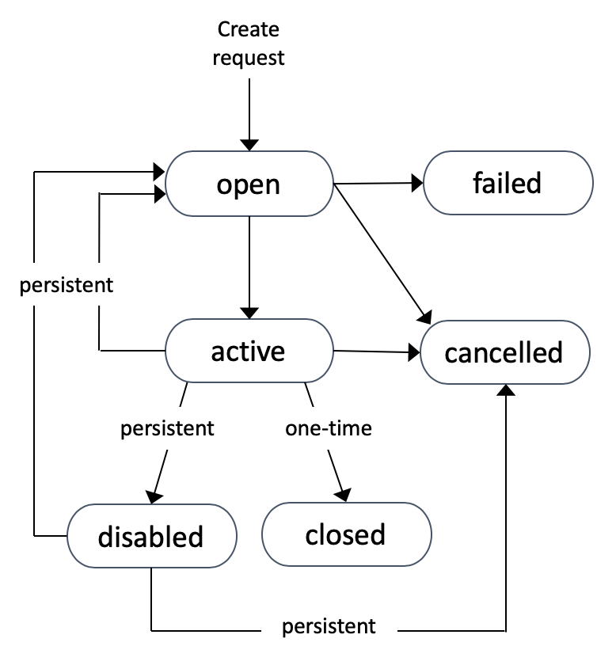

# EC2

## Opções de Compra do EC2 (Tipos de Lançamento)

- **Sob Demanda (padrão)**:
    - Média de tudo, sem contras ou prós específicos
    - As instâncias sob demanda são isoladas, mas múltiplas instâncias de clientes são executadas em hardware compartilhado
    - Múltiplos tipos de instância (tamanhos diferentes) podem ser executados nos mesmos hosts EC2, consumindo uma alocação diferente de recursos
    - Faturamento: faturamento por segundo enquanto uma instância está em execução; se um sistema for desligado, não somos cobrados por isso
    - Recursos associados como armazenamento consomem capacidade; seremos cobrados independentemente de a instância estar em execução ou parada
    - Devemos sempre começar o processo de avaliação usando sob demanda
    - Com o sob demanda não há interrupções. Iniciamos uma instância e ela deve ser executada enquanto não decidirmos desligá-la
    - Em caso de escassez de recursos, as instâncias reservadas recebem prioridade mais alta; considere-as em vez do sob demanda em caso de sistemas críticos para os negócios
    - O sob demanda oferece preços previsíveis sem opções de desconto
    - Se você não tiver certeza sobre a duração ou o tipo de carga de trabalho, o sob demanda deve ser considerado
- **Instâncias Spot**:
    - Forma mais barata de obter capacidade de computação EC2
    - Os preços spot vendem capacidade EC2 a preços mais baixos para utilizar a capacidade EC2 sobressalente nas máquinas host
    - Se o preço spot subir acima do preço máximo selecionado, nossas instâncias são encerradas
    - Nunca devemos usar as instâncias spot para cargas de trabalho que não podem tolerar interrupções
    - Qualquer coisa que possa tolerar interrupções e possa ser re-iniciada é adequada para spot
- **Instâncias Reservadas Padrão**:
    - O sob demanda geralmente é usado para uso desconhecido ou de curto prazo; o reservado é para uso consistente de longo prazo do EC2
    - Reservas:
        - São compromissos de que usaremos uma instância/conjunto de instâncias por um período mais longo de tempo
        - O efeito de uma reserva é reduzir o custo por segundo ou removê-lo completamente
        - A reserva precisa ser planejada com antecedência
        - Pagamos por reservas não utilizadas
        - As reservas podem ser compradas para um tipo específico de instâncias. Podem ser bloqueadas por região e AZ
        - Instâncias bloqueadas por AZ reservam capacidade EC2
        - Se uma instância for reservada para uma região, ela não reserva capacidade, mas pode beneficiar qualquer instância lançada em qualquer AZ nessa região
        - As reservas podem ter efeitos parciais no sentido de que podemos obter descontos para instâncias maiores em comparação às quais a reserva foi comprada
        - Podemos nos comprometer com reservas de 1 ano ou 3 anos
        - Estruturas de pagamento:
            - Sem adiantamento: pagamos por segundo uma taxa menor em comparação ao sob demanda. Pagamos mesmo se a instância não for usada
            - Total adiantado: o custo total dos 1 ou 3 anos. Nenhum pagamento por segundo será necessário. Oferece o maior desconto
            - Adiantamento parcial: pagamos uma taxa reduzida adiantada para uso por segundo menor
    - As instâncias reservadas são boas para componentes com uso conhecido que exigem acesso consistente à computação a longo prazo
- **Instâncias Reservadas Programadas**:
    - Ótimas para requisitos de longo prazo que não são executados constantemente, por exemplo: processamento em lote executando 5 horas/dia
    - Para instâncias reservadas programadas, especificamos uma janela de tempo. A capacidade pode ser usada apenas durante a janela de tempo
    - Limitações:
        - Não suporta todos os tipos de instância
        - A compra mínima por ano é de 1200 horas; o compromisso mínimo é de 1 ano
- **Hosts Dedicados**:
    - São hosts EC2 alocados inteiramente a um cliente
    - São hosts projetados para instâncias específicas, por exemplo: A, C, R, etc.
    - Os hosts vêm com todos os recursos esperados de uma máquina física: número de núcleos e CPUs, memória, armazenamento local e conectividade
    - Pagamos pelo host; não pagamos mais pelo uso de instâncias por segundo caso lançamos instâncias no host
    - Temos capacidade para um hosts dedicado; podemos lançar diferentes tamanhos de instâncias com base na capacidade disponível
    - Razões para hosts dedicados: queremos usar software licenciado pelo número de núcleos ou número de sockets
    - Afinidade de host: recurso dos hosts dedicados. Vincula instâncias a hosts; se pararmos e iniciarmos a instância, ela permanecerá no mesmo host
    - Apenas nossas instâncias serão executadas em hosts dedicados
    - Gerenciamento de capacidade:
        - Temos que gerenciar nossa capacidade em termos de subutilização do host
        - Temos uma capacidade limitada em termos de quantas instâncias EC2 podemos lançar
- **Instâncias Dedicadas**:
    - Nossas instâncias são executadas em um host EC2 com outras instâncias nossas. O host não é compartilhado com outros clientes AWS; nenhum outro cliente usará o mesmo hardware
    - Não pagamos pelo host, nem compartilhamos o host
    - Há algumas taxas extras para este tipo de opção de compra:
        - Uma taxa única por hora para qualquer região em que estamos usando instâncias dedicadas
        - Há uma taxa pelas próprias instâncias dedicadas
    - As instâncias dedicadas são comuns em setores onde não podemos compartilhar hardware
    - Não é necessário gerenciamento extra de capacidade por nossa parte

## Reservas de Capacidade

- A AWS prioriza qualquer compromisso programado para fornecer capacidade EC2
- Após instâncias programadas, o sob demanda é priorizado
- A capacidade restante pode ser usada para instâncias spot
- A reserva de capacidade é diferente das instâncias reservadas
- Reserva regional:
    - Fornece um desconto de faturamento para instâncias válidas lançadas em qualquer AZ nessa região
    - Embora seja flexível, a reserva regional não reserva capacidade dentro de uma AZ - arriscado se a capacidade for limitada durante uma falha grave
- Reserva zonal:
    - Mesmo desconto de faturamento que para a reserva regional, mas a reserva se aplica apenas a AZs específicas
- O compromisso de reserva regional/zonal é de 1 ou 3 anos
- Reserva de capacidade sob demanda: pode ser reservada para garantir que sempre tenhamos acesso à capacidade em uma AZ quando precisarmos, mas ao preço total sob demanda. Sem limites de prazo, mas pagamos independentemente de consumirmos a reserva ou não
- As reservas de capacidade não fornecem nenhum benefício de faturamento; apenas reservamos a capacidade para computação EC2

## Plano de Economia do EC2

- Um compromisso por hora de 1 ou 3 anos
- O Plano de Economia pode ser de 2 tipos diferentes:
    - Valores em dólares de computação geral: podemos economizar até 66% em comparação ao sob demanda
    - Plano de Economia EC2: até 72% de economia para EC2
    - Plano de economia SageMaker: reduz custos em até 64% para uso do SageMaker. Aplica-se a instâncias de ML do SageMaker (ml.t3, ml.m5, ml.m5d)
- O plano de economia de computação geral atualmente se aplica ao EC2, Fargate e Lambda
- O uso de recursos consome o compromisso do plano de economia à taxa reduzida dos planos de economia; além do compromisso, o faturamento sob demanda é usado

## Rede EC2

- As instâncias são criadas com uma ENI primária; isso não pode ser removido ou desanexado da instância
- ENIs secundárias podem ser adicionadas a uma instância que pode estar em sub-redes diferentes (NÃO AZs diferentes!)
- As ENIs secundárias podem ser desanexadas e anexadas a outras instâncias
- Os Grupos de Segurança estão associados a uma ENI, não a instâncias EC2
- Cada instância recebe um endereço IPv4 privado primário do intervalo de sub-rede. Este endereço IP permanece durante a vida útil da instância EC2
- O endereço IP primário é exposto ao sistema operacional
- As ENIs também podem ter um ou mais endereços IP secundários dependendo do tipo de instância
- O endereço IP público é alocado para a instância se a lançarmos em uma sub-rede onde isso está habilitado ou habilitamos explicitamente um endereço primário para a instância. Esses endereços IP públicos são dinâmicos e podem mudar se a instância EC2 for movida para outro host EC2
- Os IPs públicos não são visíveis para o sistema operacional
- Para obter endereços IP públicos estáticos, podemos associar um IP Elástico à instância
- Podemos alocar um IP público por IP privado
- Somos cobrados se os IPs Elásticos não estiverem associados a instâncias
- As ENIs podem ter 1 ou mais endereços IPv6, 1 endereço MAC e 1 ou mais Grupos de Segurança
- O endereçamento IPv6, se habilitado, todos os endereços IPv6 são roteáveis publicamente
- Os endereços IPv6 são sempre visíveis para o sistema operacional
- Verificações de origem/destino: cada ENI tem um sinalizador que pode ser desabilitado
- Por padrão, a verificação de origem/destino está habilitada; se desabilitada, a ENI pode processar tráfego que não foi criado pelas instâncias EC2 ou tráfego para o qual a instância EC2 não é o destino

## Bootstrapping e Baking de AMI

- Bootstrapping:
    - É uma forma de construir instâncias EC2 de forma flexível. Não é rápido, mas super flexível
    - Construção automatizada e flexível de instâncias EC2
    - Provisionamos instâncias EC2 e adicionamos um script aos dados do usuário
    - O CloudInit executa o script na instância quando a instância é lançada
    - Este processo pode levar mais tempo, embora seja muito flexível
    - Quando concluído, a instância ec2 está pronta para uso
- Baking de AMI:
    - Antecipamos o tempo e esforço necessários para configurar uma instância
    - Nosso objetivo é deixar a instância pronta ou quase pronta neste ponto do processo. Podemos usar bootstrapping para instalar o software e deixar a instância pronta
    - Lançamos uma instância EC2 e realizamos as tarefas necessárias a partir das quais podemos criar uma AMI
    - Podemos usar a AMI para implantar muitas instâncias rapidamente
    - A desvantagem é que é mais difícil mudar a AMI
    - O baking de AMI e o bootstrapping não são mutuamente exclusivos
    - Se houver alguma questão de exame relacionada ao tempo necessário para lançar a instância EC2, pense em baking de AMI

## Grupos de Posicionamento EC2

- Nos permitem influenciar os posicionamentos de instâncias EC2, garantindo que as instâncias estejam próximas ou não
- Existem 3 tipos de grupos de posicionamento na AWS:
    - **Cluster**: quaisquer instâncias em um único grupo de posicionamento estão fisicamente próximas
    - **Spread**: as instâncias estão usando hardware subjacente diferente
    - **Partition**: grupos de instâncias EC2 que estão separadas em hardware de host diferente

### Grupos de Posicionamento Cluster

- Usados para o maior desempenho possível
- A melhor prática é lançar todas as instâncias ao mesmo tempo que farão parte do grupo de posicionamento. Isso garante que a AWS aloque capacidade no mesmo local
- Os grupos de posicionamento cluster estão localizados na mesma AZ; quando a primeira instância é lançada, a AZ é bloqueada
- Idealmente, as instâncias em um grupo de posicionamento cluster estão localizadas no mesmo rack, frequentemente no mesmo host EC2
- Todas as instâncias têm largura de banda direta rápida entre si (podem atingir taxa de transferência de fluxo único de 10Gbps vs 5Gbps que é normalmente alcançável)
- Oferecem a menor latência possível e máximo PPS (pacotes por segundo) possível na AWS
- Para atingir esses níveis de desempenho, precisamos usar instâncias com rede de alto desempenho: instâncias com mais largura de banda e com Rede Aprimorada
- Os grupos de posicionamento cluster devem ser usados para o maior desempenho. Eles não oferecem HA e têm muito pouca resiliência
- Considerações para grupos de posicionamento cluster:
    - Não podemos abranger AZs; a AZ é bloqueada quando a primeira instância está sendo lançada
    - Podemos abranger peers de VPC, mas isso afetará negativamente o desempenho
    - Os grupos de posicionamento cluster não são suportados para todos os tipos de instância
    - *Recomendado*: use o mesmo tipo de instâncias e lance-as ao mesmo tempo
    - Os grupos de posicionamento cluster oferecem 10 Gbps para desempenho de fluxo único
    - Casos de uso: alto desempenho, velocidades rápidas, baixa latência

### Grupos de Posicionamento Spread

- Oferecem o máximo de disponibilidade e resiliência possível
- Podem abranger múltiplas AZs
- As instâncias no mesmo grupo de posicionamento spread estão localizadas em racks diferentes, com rede e fontes de alimentação isoladas
- Há um limite de 7 instâncias por AZ no caso de grupos de posicionamento spread. Isso ocorre porque cada instância é um rack de instância completamente separado
- Considerações:
    - O posicionamento spread fornece isolamento de infraestrutura
    - Limite rígido: 7 instâncias por AZ
    - Não podemos usar instâncias ou hosts dedicados
    - Casos de uso: Pequeno número de instâncias críticas que precisam ser mantidas separadas umas das outras. Podem ser espelhos de servidor de arquivos ou controladores de domínio diferentes dentro de uma organização

### Grupos de Posicionamento Partition

- Semelhantes aos grupos de posicionamento spread
- Projetados para situações em que precisamos de mais de 7 instâncias por AZ, mas ainda precisamos de separação
- Podem ser criados em múltiplas AZs em uma região
- Na criação, especificamos o número de partições por AZ (máximo 7 por AZ)
- Cada partição tem seu próprio rack com energia e rede isoladas
- Podemos lançar quantas instâncias precisarmos em um grupo de partições. Podemos selecionar a partição manualmente ou podemos deixar o EC2 decidir sobre uma partição para uma nova instância
- Casos de uso para grupos de partições: HDFS, HBase, Cassandra, aplicações conscientes de topologia
- As instâncias podem ser colocadas em uma partição específica ou podemos deixar a AWS decidir
- Oferecem visibilidade nas partições e você pode ver qual instância está em qual partição

## Instâncias Spot EC2

- Pode obter um desconto de até 90% em comparação com instâncias Sob Demanda
- Podemos definir um preço spot máximo e obter a instância se nosso preço for maior que o preço atual
- Se o preço spot atual ultrapassar nosso preço máximo, podemos optar por parar ou encerrar a instância dentro de um período de carência de 2 minutos
- Se não quisermos que nossa instância spot seja recuperada pela AWS, podemos usar um **Spot Block**
    - Podemos bloquear uma instância spot durante um período de tempo especificado (1 a 6 horas) sem interrupções
    - Em situações raras, a instância pode ser recuperada
- Casos de uso para instâncias spot: trabalhos em lote ou cargas de trabalho resilientes a falhas
- Podemos lançar instâncias spot com uma solicitação de spot. Uma solicitação de spot contém as seguintes informações:
    - Preço máximo
    - Número desejado de instâncias
    - Especificação de lançamento
    - Tipo de solicitação: uma vez, persistente
    - Válido a partir de, válido até
- Tipos de solicitação:
    - Solicitação única: assim que a solicitação for atendida, a solicitação desaparecerá
    - Solicitação persistente: o número de instâncias é tentado ser mantido mesmo se algumas instâncias forem recuperadas, o que significa que a solicitação não desaparecerá assim que for concluída pela primeira vez
- Cancelando uma instância spot: para cancelar uma instância spot, ela deve estar em um estado **aberto**, **ativo** ou **desabilitado**
- Estados de instância spot:
    
- Cancelar uma solicitação de spot não encerrará as próprias instâncias. Para encerrar instâncias, primeiro temos que encerrar a solicitação de spot, se houver uma ativa

## Frotas Spot

- Frota Spot - conjunto de instâncias spot + instâncias sob demanda (opcional)
- A frota spot tentará atingir a capacidade alvo com restrições de preço
- Um pool de lançamento pode ter tipos de instância, sistema operacional e AZ diferentes
- Podemos ter múltiplos pools de lançamento, para que a frota possa escolher o melhor
- A frota spot parará de lançar instâncias quando a capacidade alvo for atingida
- Estratégias para alocar instâncias spot:
    - **lowestPrice**: a frota spot lançará instâncias do pool com o menor preço
    - **diversified**: distribui instâncias em todos os pools
    - **capacityOptimized**: lança instâncias com base na capacidade ideal para o número de instâncias
- As frotas spot nos permitem solicitar automaticamente instâncias spot com o menor preço

---

# EC2

## EC2 Purchase Options (Launch Types)

- **On-Demand (default)**:
    - Average of anything, no specific cons or pros
    - On-demand instances are isolated but multiple customer instances run on a shared hardware
    - Multiple instance types (different sizes) can run on the same EC2 hosts, consuming a different allocation of resources
    - Billing: per-second billing while an instance is running, if a system is shut down, we don't get billed for that
    - Associated resources such as storage consume capacity, we will be billed regardless the instance is running or it is stopped
    - We should always start the evaluation process using on-demand
    - With on-demand there are no interruptions. We start an instance and it should run as long as we don't decide to shut it down
    - In case of resource shortage the reserved instances receive highest priority, consider them instead of on-demand in case of business critical systems
    - On-demand offers predictable pricing without any discount options
    - If you are unsure of duration or type of workload, On-demand should be considered.
- **Spot instances**:
    - Cheapest way to get EC2 compute capacity
    - Spot pricing is selling EC2 capacity at lower price in order make use of spare EC2 capacity on the host machines
    - If the spot price goes above selected maximum price, our instances are terminated
    - We should never use the spot instances for workloads which can't tolerate interruptions
    - Anything which can tolerate interruptions and can be re-triggered is good for spot
- **Standard Reserved Instances**:
    - On-demand is generally used for unknown or short term usage, reserved is for long term consistent usage of EC2
    - Reservations:
        - They are commitments that we will use a instance/set of instances for a longer amount of time
        - The effect of a reservation is to reduce the per second cost or remove it entirely
        - Reservation needs to be planned in advance
        - We pay for unused reservations
        - Reservations can be bought for a specific type of instances. They can be region and AZ locked
        - Az locked instances reserve EC2 capacity
        - If an instance is reserved for a region,it doesn't reserve capacity but it can benefit any instances launched in any AZ in that region.
        - Reservations can have a partial effects in a sense the we can get discounts for larger instances compared to which the reservation was purchased
        - We can commit to reservations of 1 year of 3 years
        - Payment structures:
            - No upfront: we pay per second a lower amount of fee compared to on-demand. We pay even if the instance is not used
            - All upfront: the whole cost of the 1 or 3 years. No second per fee payment will be required. Offer the greatest discount
            - Partial upfront: we pay a reduced fee upfront for smaller per second usage
    - Reserved instances are good for components which have known usage, require consistent access for compute for a long term basis
- **Scheduled Reserved Instances**:
    - Great for long term requirements which does not run constantly, ex. batch processing running 5 hours/day
    - For scheduled reserved instances we specify a time window. The capacity can be used only during the time window
    - Limitations: 
        - Does not support all kind of instance types
        - Minimum purchase per year is 1200 hours, minimum commitment is 1 year
- **Dedicated Hosts**:
    - They are EC2 hosts allocated to a customer entirely
    - They are hosts designed for specific instances, ex. A, C, R, etc.
    - Hosts come with all of the resources we expected from a physical machine: number of cores and CPUs, memory, local storage and connectivity
    - We pay for the host, we don't pay anymore for instance usage per second in case we launch instances on the host
    - We have a capacity for a dedicated hosts, we can launch different sizes of instances based on the available capacity
    - Reasons for dedicated hosts: we want to use software which is licensed for number of cores or number of sockets
    - Host affinity: feature of dedicated hosts. Links instances to hosts, if we stop and start the instance, it will remain on the same host
    - Only our instances will run on a dedicated hosts
    - Capacity management:
        - We have to manage our capacity in terms of under utilization of the host
        - We have a limited capacity in terms of how many EC2 instances we can launch
- **Dedicated Instances**:
    - Our instances run on an EC2 host with other instances of ours. The host is not shared with other AWS customers, no other customers will use the same hardware
    - We don't pay for the host, nor do we share the host
    - There are some extra fees for this kind of purchase option:
        - One-of hourly fee for any regions in which we are using dedicated instances
        - There is a fee for the dedicated instances themselves
    - Dedicated instances are common in industries where we cannot share hardware
    - No extra capacity management required from us

## Capacity Reservations

- AWS prioritizes any scheduled commitment for delivering EC2 capacity
- After scheduled instances on-demand is prioritized
- The leftover capacity can be used for spot instances
- Capacity reservation is different compared to reserved instances
- Regional reservation 
    - Provides a billing discount for valid instances launched in any AZ in that region
    - While this is flexible, region reservation don't reserve capacity within az AZ - risky if the capacity is limited during a major fault
- Zonal reservation: 
    - Same billing discount as for region reservation, but the reservation applies only to specific AZs
- Regional/zonal reservation commitment is 1 or 3 years
- On-Demand capacity reservation: can be booked to ensure we always have access to capacity in an AZ when we need it but at full on-demand price. No term limits, but we pay regardless if we consume the reservation or not
- Capacity reservations do not provide any billing benefit, we just reserve the capacity for EC compute

## EC2 Savings Plan

- A hourly commitment for 1 or 3 years term
- Saving Plan can be 2 different types:
    - General compute dollar amounts: we can save up to 66% version on-demand
    - EC2 Saving Plan: up to 72% saving for EC2
    - SageMaker savings plan: reduces costs up to 64% for SageMaker usage. Applies to Sagemaker ML instances (ml.t3, ml.m5, ml.m5d)
- General compute savings plan currently apply to EC2, Fargate and Lambda
- Resource usage consumes savings plan commitment at the reduced saving plans rate, beyond commitment on-demand billing is used

## EC2 Networking

- Instances are created with a primary ENI, this can not be removed or detached from the instance
- Secondary ENIs can be added to an instance which can be in different subnets (NOT AZs!)
- Secondary ENIs can be detached and attached to other instances
- Security Groups are associated with an ENI, not an EC2 instances
- Every instances is allocated a primary private IPv4 address from the subnet range. This IP address remains the within the lifetime of EC2 instance
- The primary IP address is exposed to the OS
- ENIs can also have one or more secondary IP addresses depending on the instance type
- Public IP address is allocated to the instance if we launch it in a subnet where this is enabled or we explicitly enable a primary address to the instance. These public IP addresses are dynamic and they can change if the EC2 instance is moving to another EC2 host
- Public IPs are not visible to the OS
- In order to get static public IP addresses, we can associate an Elastic IP to the instance
- We can allocate one public IP per private IP
- We get charged if the Elastic IPs are not associated to instances
- ENIs can have 1 or more IPv6 addresses, 1 MAC address and 1 or more Security Groups
- IPv6 addressing if enabled, all the IPv6 addresses are publicly routable
- IPv6 addresses are always visible to the OS
- Source/destination checks: each ENI has a flag which can be disabled
- By default source/destination check is enabled, if disabled the ENI can process traffic which was not created by the EC2 instances or traffic for which the EC2 instance is not the destination

## Bootstrapping and AMI Baking

- Bootstrapping:
    - Is a way of building EC2 instances in a flexible way. Isn't fast, but super flexible.
    - Flexible, automated building of EC2 instances
    - We provision EC2 instances and add a script to the user data
    - CloudInit runs the script on the instance when the instance is launched
    - This process can longer time, although it is very flexible
    - When finished, ec2 instance is ready to use.
- AMI Baking:
    - We front-load the time and effort required to configure an instance
    - Our aim is to get the instance ready or almost ready at this point of the process. We can use bootstrapping to install the software and make the instance ready.
    - We launch an EC2 instance and perform the necessary tasks from which we can create an AMI
    - We can use the AMI to deploy many instances quickly.
    - The tradeoff is, it harder to change the AMI.
    - AMI baking and bootstrappig are not mutually exclusive.
    - If there are any exam question related to time taken to launch the EC2 instance, think of AMI baking.

## EC2 Placement Groups

- Allow us to influence EC2 instance placements, insuring that instances are closed together or not
- There are 3 types of placements groups in AWS:
    - **Cluster**: any instances in a single placement groups are physically close
    - **Spread**: instances are all using different underlying hardware
    - **Partition**: groups of EC2 instances which are spread apart on different host hardware

### Cluster Placement Groups

- Used for highest possible performance
- Best practice is to launch all of the instances at the same time which will be part of the placement group. This ensures that AWS allocates capacity in the same location
- Cluster placement groups are located in the same AZ, when the first instance is launched, the AZ is locked
- Ideally the instances in a cluster placement group are located on the same rack, often on the same EC2 host
- All instances have fast direct bandwidth between each other (they can achieve single stream transfer rate of 10Gbps vs 5Gbps which is achievable normally)
- They offer the lowest latency possible and max PPS(packets per second) possible in AWS
- To achieve these levels of performance we need to use instances with high performant networking: instances with more bandwidth and with Enhanced Networking
- Cluster placement groups should be used for highest performance. They offer no HA and very little resilience
- Considerations for cluster placement groups: Important for EXAM!!!
    - We can not span over AZs, the AZ is locked when the first instance is launching
    - We can span over VPC peers, but this will impact performance negatively
    - Cluster placement groups are not supported for every instance type
    - *Recommended*: use the same type of instances and launch them at the same time
    - Cluster placement groups offer 10 Gbps for single stream performance
    - Use cases: High performace, fast speeds, low latency

### Spread Placement Groups

- They offer the maximum possible availability and resiliency
- They can span multiple AZs
- Instances in the same spread placement group are located on different racks, having isolated networking and power supplies
- There is a limit for 7 instances per AZ in case of spread placement groups. This is because each instance is a completely separate instance rack 
- Considerations: Important for EXAM!!!
    - Spread placement provides infrastructure isolation
    - Hard limit: 7 instances per AZ
    - We can not use dedicated instances or hosts
    - Use cases: Small number of critical instances that need to be kept seperated from each other. May be mirrors of file server, or may be different domain controllers within an organization.

### Partition Placement Groups

- Similar to spread placement groups
- They are designed for situations when we need more than 7 instances per AZ but we still need separation
- Can be created across multiple AZs in a region
- At creation we specify the number of partition per AZ (max 7 per AZ)
- Each partition has its own rack with isolated power and networking
- We can launch as many instances as we need in a partition group. We can select the partition by hand or we can let EC2 decide on a partition for a new instance
- Use cases for partition groups: HDFS, HBase, Cassandra, topology aware applicationsImportant for EXAM!!!
- Instances can be placed in a specific partition or we can let AWS to decide
- Offer visibility in partitions and you can see which instance is in which partition.

## EC2 Spot Instances

- Can get a discount of up to 90% compared to On Demand instances
- We can define a max spot price and get he instance of our price is bigger than the current price
- If the current spot price goes beyond our max price, we can choose to stop or terminate the instance within 2 minutes grace period
- If we don't want our spot instance to be reclaimed by AWS, we can use a **Spot Block**
    - We can block a spot instance during a specified time frame (1 to 6 hours) without interruptions
    - In rare situations the instance may be reclaimed
- Use cases for spot instances: batch jobs or workloads that are resilient to failure
- We can launch spot instances with a spot request. A spot request contains the following information:
    - Maximum price
    - Desired number of instances
    - Launch specification
    - Request type: on-time, persistent
    - Valid from, valid until
- Request types:
    - One time request: as soon as the request is fulfilled, the request will go away
    - Persistent request: the number of instances is attempted to be kept even if some instances are reclaimed, meaning that the request will not go away as soon as it is completed first time
- Canceling a spot instances: in order ot cancel a spot instance, it has to be in an **open**, **active** or **disabled** state
- Spot instance states:
    
- Cancelling a spot request, it will not terminate the instances themselves. In order to terminate instances, first we have to terminate the spot request, if there is one active

## Spot Fleets

- Spot Fleet - set of spot instances + (optional) on-demand instances
- The spot fleet will try to meet the target capacity with price constraints
- A launch pool can have the following can have different instance types, OS, AZ
- We can have multiple launch pools, so the fleet can choose the best
- Spot fleet will stop launching instances the target capacity is reached
- Strategies to allocate spot instances:
    - **lowestPrice**: the spot fleet will launch instances from the pool with the lowest price
    - **diversified**: distribute instances across all pools
    - **capacityOptimized**: launch instances based on the optimal capacity for the number of instances
- Spot fleets allow us to automatically request spot instances with the lowest price