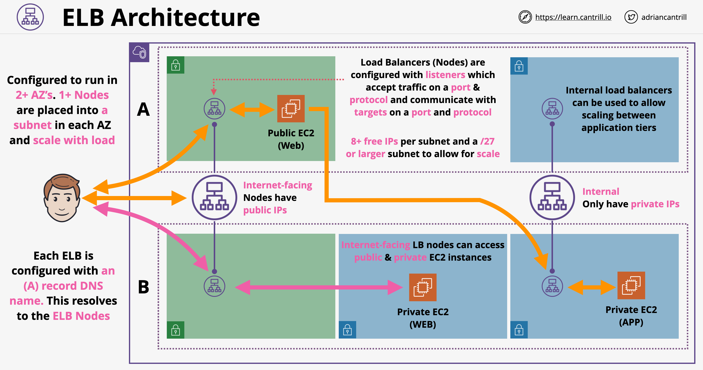
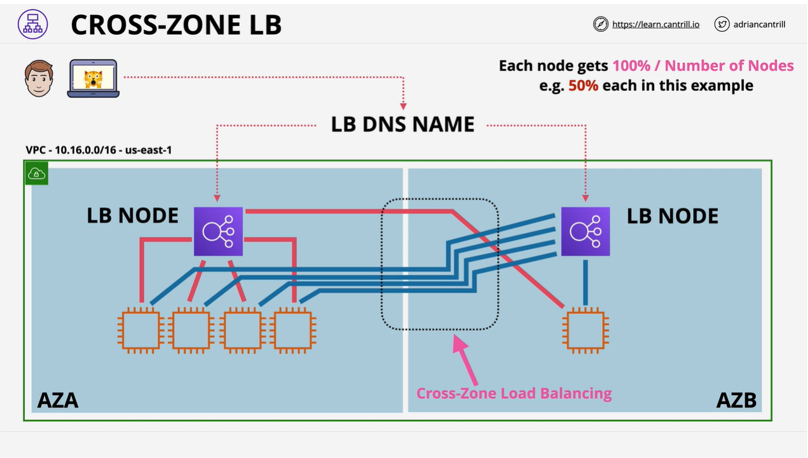

# ELB - Elastic Load Balancer

## Arquitetura do ELB

- É trabalho do balanceador de carga aceitar conexões dos clientes e distribuir essas conexões para qualquer computação de backend registrada
- Os ELBs suportam muitos tipos diferentes de serviços de computação
- Arquitetura do LB:

- Configurações iniciais para o ELB:
    - IPv4 ou pilha dupla (IPv4 + IPv6)
    - Temos que escolher a AZ que o LB usará, especificamente estamos escolhendo uma sub-rede em 2 ou mais AZs
    - Quando escolhemos uma sub-rede, a AWS coloca um ou mais nós de balanceador de carga nessa sub-rede
    - Quando um LB é criado, ele tem um registro DNS A. Este registro A aponta para todos os nós provisionados para o LB => todas as conexões de entrada são distribuídas igualmente
    - Os nós são altamente disponíveis (HA): se o nó falhar, um diferente é criado. Se a carga estiver muito alta, múltiplos nós são criados
    - Temos que decidir na criação se o LB é interno ou voltado para a internet. Para o voltado para internet, os nós terão endereços IP públicos; caso contrário, um endereço IP privado é atribuído. As instâncias EC2 não precisam ter endereço IP público para o LB voltado para internet
- Os Load Balancers são configurados com listeners que aceitam tráfego em uma porta e protocolo e se comunicam com os alvos
- Um balanceador de carga voltado para internet pode se conectar a instâncias públicas e privadas
- O tamanho mínimo de sub-rede para um LB funcionar é /28 - 8 ou mais endereços livres por sub-rede (a AWS sugere um mínimo de /27)
- Os LBs internos são iguais aos LBs de internet, mas têm endereços IP privados atribuídos aos nós. Os LBs internos são usados para se conectar a nós privados e ajudam no scaling interno

## Balanceamento de Carga entre Zonas (Cross-Zone Load Balancing)

- Um LB, por padrão, tem pelo menos um nó por AZ configurada para ele
- Inicialmente, cada nó do LB poderia distribuir conexões para instâncias na mesma AZ
- Balanceamento de Carga entre Zonas: permite que qualquer nó do LB distribua conexões igualmente entre todas as instâncias registradas em todas as AZs
- Isso ajuda com a distribuição desigual de carga

## Estado de Sessão do Usuário

- Estado de sessão:
    - Uma informação do lado do servidor específica para um único usuário de uma aplicação
    - Persiste enquanto o usuário interage com a aplicação
    - Exemplos de estado de sessão: carrinho de compras, posição no fluxo de trabalho, estado de login
- Os dados que representam o estado de uma sessão são armazenados internamente ou externamente (aplicações sem estado)
- Sessão hospedada externamente:
    - Os dados da sessão são hospedados fora das instâncias de backend => a aplicação se torna sem estado
    - Oferece a possibilidade de fazer balanceamento de carga para as instâncias de backend; a sessão não será perdida caso o LB redirecione o usuário para uma instância diferente

## Evolução do ELB

- Atualmente existem 3 tipos diferentes de LB na AWS
- Os balanceadores de carga são divididos entre v1 e v2 (preferido)
- O produto LB começou com Classic Load Balancers (v1)
- Os CLBs podem fazer balanceamento de carga para HTTP/HTTPS e protocolos de nível inferior também, embora não possam entender o protocolo HTTP; eles não podem tomar decisões com base nos recursos do protocolo HTTP
- Os CLBs podem ter apenas 1 certificado SSL por balanceador de carga
- Eles não podem ser considerados inteiramente como um produto de camada 7
- Devemos usar o balanceador de carga v2 por padrão para novas implantações
- Balanceadores de carga versão 2 (v2):
    - Application Load Balancer (ALB - LB v2) são dispositivos de camada 7; eles suportam protocolos HTTP(S) e WebSocket
    - Network Load Balancers (NLB) também são balanceadores de carga v2 suportando protocolos de nível inferior como TCP, TLS e UDP. Eles podem ser usados para aplicações como servidores de email, jogos ou aplicações que não usam protocolos HTTP/S
- Em geral, os balanceadores de carga v2 são mais rápidos e suportam grupos de destino e regras; isso permite usar um único LB para múltiplas finalidades

## Application e Network Load Balancers

- Consolidação de balanceadores de carga:
    - Os classic load balancers não escalam; não suportam múltiplos certificados SSL (sem suporte SNI) => para cada aplicação um novo balanceador de carga é necessário
    - Os balanceadores de carga V2 suportam regras e grupos de destino
    - Os balanceadores de carga V2 podem ter regras baseadas em host usando SNI
- **Application Load Balancer (ALB)**:
    - O ALB é um balanceador de carga de camada 7 verdadeiro, configurado para escutar protocolos HTTP ou HTTPS
    - O ALB não pode entender nenhum outro protocolo de camada 7 (como SMTP, SSH, etc.)
    - O ALB requer listeners HTTP e HTTPS
    - Pode entender o conteúdo de camada 7, como cookies, cabeçalhos personalizados, localização do usuário, comportamento da aplicação, etc.
    - Qualquer conexão de entrada (HTTP, HTTPS) é sempre terminada no ALB - sem SSL não interrompido
    - Todos os ALBs usando HTTPS devem ter certificados SSL instalados
    - Os ALBs são mais lentos que os NLBs porque requerem mais níveis da pilha de rede para processar. Qualquer questão de exame que fale sobre desempenho, o NLB deve ser considerado em vez do ALB
    - O ALB oferece avaliação de verificações de saúde na camada de aplicação
    - Regras do Application Load Balancer:
        - As regras direcionam as conexões que chegam a um listener
        - As regras são processadas em ordem de prioridade; a regra padrão é um catch-all
        - Condições de regra: host-header, http-header, http-request-method, path-pattern, query-string e source-ip
        - Ações de regra: forward, redirect, fixed-response, authenticate-oidc e authenticate-cognito
    - A conexão do LB para a instância é uma conexão separada
    - Se você precisar encaminhar conexões sem terminar no LB, então você precisa considerar o NLB
- **Network Load Balancer (NLB)**:
    - Os NLBs são balanceadores de carga de camada 4, o que significa que suportam conexões TPC, TLS, UDP, TCP_UDP
    - Eles não entendem HTTP ou HTTPS => sem conceito de stickiness de rede
    - Eles são muito rápidos, podem lidar com milhões de requisições por segundo tendo 25% de latência dos ALBs porque não precisam lidar com nenhuma das camadas superiores computacionalmente pesadas
    - Recomendado para SMTP, SSH, servidores de jogos, aplicações financeiras (não HTTP(S))
    - As verificações de saúde só podem verificar o handshake ICMP ou TCP
    - Podem ser alocados com endereços IP estáticos, o que é útil para whitelisting, o que é benéfico para clientes corporativos
    - Podem encaminhar TCP diretamente para as instâncias => criptografia não interrompida
    - Os NLBs podem ser usados para PrivateLink

- **Cenários para NLB**:
    - Criptografia não interrompida
    - IP estático para whitelisting
    - Alto desempenho
    - Protocolos diferentes de HTTP ou HTTPS
    - Privatelink

## Afinidade de Sessão (Session Stickiness)

- Stickiness: nos permite controlar qual instância de backend usar para uma determinada conexão
- Sem stickiness, as conexões são distribuídas entre todos os serviços de backend
- Habilitando stickiness:
    - CLB: podemos habilitar por LB
    - ALB: podemos habilitar por grupo de destino
- Quando a stickiness é habilitada, o LB gera um cookie: `AWSALB` para ALB / `AWSELB` para CLB, que é entregue ao usuário final
- Este cookie tem uma duração definida entre 1 segundo e 7 dias
- Quando o usuário acessa o LB, ele fornece o cookie ao LB
- O LB pode então decidir rotear a conexão para a mesma instância de backend toda vez enquanto o cookie não estiver expirado
- Mudança da instância de backend se o cookie estiver presente:
    - Se a instância para a qual o cookie mapeia falhar, então uma nova instância será selecionada
    - Se o cookie expirar => o cookie será removido; um novo cookie é criado enquanto uma nova instância é escolhida
- Problemas de stickiness de sessão: a carga pode ficar desequilibrada
- Habilite a stickiness de sessão se uma aplicação não usar sessões externas

## Drenagem de Conexão e Atraso de Cancelamento de Registro

- A drenagem de conexão é uma configuração que controla o que acontece quando as instâncias estão não saudáveis ou desregistradas
- Comportamento padrão: o LB fecha todas as conexões e a instância não recebe novas conexões
- A drenagem de conexões permite que as requisições em andamento sejam concluídas por um certo período de tempo, enquanto nenhuma nova conexão é enviada para a instância
- A drenagem de conexão é suportada apenas em Classic Load Balancers! É definida no próprio balanceador de carga
- A drenagem de conexão tem um timeout entre 1 e 3600 segundos (padrão 300)
- Se a instância se tornar não saudável por causa de uma verificação de saúde falha, as configurações de drenagem de conexão não se aplicam a ela
- Se uma instância for retirada do serviço manualmente ou por um ASG, ela é listada como "InService: Instance deregistration currently in progress". Se usarmos um ASG, ele aguardará que todas as conexões sejam concluídas antes de encerrar ou até o valor de timeout
- O atraso de cancelamento de registro é essencialmente o mesmo recurso que a drenagem de conexão, mas é suportado por ALB, NLB e GWLBs
- É definido em grupos de destino, não no LB
- Funciona parando de enviar conexões para alvos que estão cancelando o registro. As conexões existentes podem continuar até que sejam concluídas naturalmente ou o atraso de cancelamento de registro seja atingido
- O atraso de cancelamento de registro é habilitado por padrão em todos os novos LBs; o valor padrão é 300 segundos (configurável entre 0-3600 segundos)

## Protocolo `X-Forwarded-For` e PROXY

- Caso um cliente se conecte a um backend sem nenhum balanceamento de carga na frente do backend, o endereço IP do cliente é visível e pode ser registrado
- Com balanceadores de carga isso pode ser mais complicado; é aqui que o cabeçalho `X-Forwarded-For` e o protocolo PROXY se tornam úteis
- `X-Forwarded-For` é um cabeçalho HTTP; funciona apenas com HTTP/HTTPS. Este é um cabeçalho de camada 7
- Este cabeçalho é adicionado/anexado por proxies/balanceadores de carga. Pode ter múltiplos valores caso a requisição passe por múltiplos proxies/balanceadores de carga. Ex: X-Forwarded-For: 1.3.3.7(ClientIP), proxy1, proxy2..
- O servidor de backend precisa estar ciente deste cabeçalho e precisa suportá-lo
- Suportado em CLB e ALB; o NLB não suporta porque não suporta a camada 7 da pilha OSI
- O protocolo PROXY funciona na Camada 4; é um cabeçalho adicional de camada 4 (tcp) => funciona com uma ampla gama de protocolos (incluindo HTTP/HTTPS)
- Existem 2 versões do protocolo PROXY:
    - v1: legível por humanos; funciona com CLB
    - v2: codificado em binário; funciona com NLB
- A v2 pode suportar uma conexão HTTPS não interrompida (listener tcp). Caso de uso para isso: criptografia de ponta a ponta
- Ao usar o protocolo PROXY, podemos adicionar um cabeçalho HTTP; a requisição não é descriptografada

---

# ELB - Elastic Load Balancer

## ELB Architecture

- It is the job of the load balancer to accept connection from customers and distribute those connections to any registered backend compute
- ELBs support many different type of compute services
- LB architecture:

- Initial configurations for ELB:
    - IPv4 or double stacking (IPv4 + IPv6)
    - We have to pick the AZ which the LB will use, specifically we are picking one subnet in 2 or more AZs
    - When we pick a subnet, AWS places one or more load balancer nodes in that subnet
    - When an LB is created, it has a DNS A record. This A record points to all the nodes provisioned for the LB => all the incoming connections are distributed equally
    - The nodes are HA: if the node fails, a different one is created. If the load is to high, multiple nodes are created
    - We have to decide on creation if the LB is internal or internet facing. The internet facing the nodes will have public IP addresses otherwise private IP address is assigned. EC2 innstances need not have public IP address for internet facing LB.
- Load Balancers are configured with listeners which accept traffic on a port and protocol and communicate with the targets
- An internat facing load balancer can connect to both public and private instances
- Minimum subnet size for a LB to function is /28 - 8 or more fee addresses per subnet (AWS suggests a minimum of /27)
- Internal LB are same as internet LB but they have private IP address assiged to the nodes. Internal LB are used to connect to private nodes and help in internal scaling,

## Cross-Zone Load Balancing

- An LB by default has at least one node per AZ that is configured for
- Initially each LB node could distribute connections to instances in the same AZ
- Cross-Zone Load Balancing: allows any LB node to distribute connections equally across all registered instances in all AZs.
- This help with the uneven distribution of load and could be helpful in EXAM

## User Session State

- Session state: 
    - A piece of server side information specific to one single user of one application
    - It does persist while the user interacts with the application
    - Examples of session state: shopping cart, workflow position, login state
- The date representing a sessions state is either stored internally or externally (stateless applications)
- Externally hosted session:
    - Session data is hosted outside of the back-end instances => application becomes stateless
    - Offers the possibility to do load balancing for the back-end instances, the session wont get lost in case the LB redirects the user to a different instance

## ELB Evolution

- Currently there are 3 different types of LB in AWS
- Load balancers are split between v1 and v2 (preferred)
- LB product started with Classic Load Balancers (v1)
- CLBs can load balance HTTP/HTTPS and lower level protocols as well, although they can not understand the http protocol, they can't make decision based on HTTP protocols features
- CLBs can have only 1 SSL certificate per load balancer
- They can not be considered entirely being a layer 7 product
- We should default to using v2 load balancer for newer deployments
- Version 2 (v2) load balancers:
    - Application Load Balancer (ALB - v2 LB) are layer 7 devices, they support HTTP(S) and WebSocket protocols
    - Network Load Balancers (NLB) are also v2 load balancers supporting lower level protocols such as TCP, TLS and UDP. 
      These could be used for applications like Email servers, Games or applications which does't use HTTP/s protocols.
- In general v2 load balancers are faster and they support target groups and rules, this allow to use single LB for multiple things.

## Application and Network Load Balancers

- Consolidation of load balancers:
    - Classic load balancers do not scale, they do not support multiple SSL certificates (no SNI support) => for every application a new load balancer is required
    - V2 load balancers support rules and target groups
    - V2 load balancers can have host based rules using SNI
- **Application Load Balancer (ALB)**:
    - ALB is a true layer 7 load balancer, configured to listen either HTTP or HTTPS protocols
    - ALB can not understand any other layer 7 protocols (such as SMTP, SSH, etc.)
    - ALB requires HTTP and HTTPS listeners
    - It can understand layer 7 content, such as cookies, custom headers, user location, app behavior, etc.
    - Any incoming connection (HTTP, HTTPS) is always terminated on the ALB - no unbroken SSL
    - All ALBs using HTTPS must have SSL certificates installed
    - ALBs are slower than NLBs because they require more levels of networking stack to process. Any EXAM question which talks about performance, NLB should be considered instead of ALB.
    - ALB offer health checks evaluation at application layer
    - Application Load Balancer Rules:
        - Rules direct connection which arrive at a listener
        - Rules are processed in a priority order, default rule being a catch all
        - Rule conditions: host-header, http-header, http-request-method, path-pattern, query-string and source-ip
        - Rule actions: forward, redirect, fixed-response, authenticate-oidc and authenticate-cognito
    - The connection from the LB and the instance is a separate connection
    - If you need to forward connections without terminating on the LB, then you need to consider NLB. (EXAM)
- **Network Load Balancer (NLB)**:
    - NLBs are layer 4 load balancers, meaning they support TPC, TLS, UDP, TCP_UDP connections
    - They have no understanding of HTTP or HTTPS => no concept of network stickiness
    - They are really fast, can handle millions of request per second having 25% latency of ALBs because they don't have to deal with any  of the heavy computational upper layers.
    - Recommended for SMTP, SSH, game servers, financial apps (not HTTP(S)) <-- EXAM
    - Health checks can only check ICMP or TCP handshake
    - They can be allocated with static IP addresses which is udeful for whitelisting which is beneficial for corporate client.
    - They can forward TCP straight through the instances => unbroken encryption <-- EXAM
    - NLBs can be used for PrivateLink <-- EXAM

- **Scenarios for NLB**:
    - Unbroken encryption
    - Static IP for whitelisting
    - Fast performance
    - Protocols other tha HTTP or HTTPS
    - Privatelink

## Session Stickiness

- Stickiness: allows us to control which backend instance to be used for a given connection
- With no stickiness connections are distributed across all backend services
- Enabling stickiness:
    - CLB: we can enable it per LB
    - ALB: we can enable it per target group
- When stickiness is enabled, the LB generates a cookie: `AWSALB` for ALB / `AWSELB` for CLB which is delivered to the end-user
- This cookie has a duration defined between 1 sec and 7 days
- When the user accesses the LB, it provides the cookie to the LB
- The LB than can decide to route the connection to the same backend instance every time while the cookie is not expired
- Change of the backed instance if the cookie is present:
    - If the instance to which the cookie maps to fails, then a new instance will be selected
    - If the cookie expires => the cookie will be removed, new cookie is created while a new instance is chosen
- Session stickiness problems: load can become unbalanced
- Enable session stickiness if an application does't use external sessions

## Connection Draining and Deregistration Delay

- Connection draining a setting which controls what happens when instances are unhealthy or deregistered
- Default behavior: LB closes all connections and the instance receives no new connections
- Connections draining allows in-flight requests to complete for a certain amount of time, while no new connections are sent to the instance
- Connection draining is supported on Classic Load Balancers only! It is defined on the load balancer itself
- Connection draining is a timeout between 1 and 3600 seconds (default 300)
- If the instance become unhealthy because if a failed health check, connection draining settings do not apply to it
- If an instance is taken out of service manually or by an ASG, it is listed "InService: Instance deregistration currently in progress". If we use an ASG, it will wait for all connections to complete before terminating or for the timeout value
- Deregistration delay is essentially the same feature as connection draining, but it is supported by ALB, NLB and GWLBs
- It is defined on target groups, not on the LB
- It works by stopping sending connections to deregistering targets. Existing connections can continue until thy complete naturally or the deregistration delay is reached
- Deregistration delay is enabled by default on all the new LBs, default value for it is 300 seconds (configurable between 0-3600 seconds)

## `X-Forwarded-For` and PROXY protocol

- In case a client connects to a backend without any load balancing in the front of the backend, the IP address of the client is visible and can be recorded
- With load balancers this can be more complicated, this is where `X-Forwarded-For` header and the PROXY protocol become handy
- `X-Forwarded-For` is a HTTP header, it only works with HTTP/HTTPS. This is a layer 7 header.
- This header is added/appended by proxies/load balancers. It can have multiple values in case the request is passing multiple proxies/load balancers. E.g X-Forwarded-For: 1.3.3.7(ClientIP), proxy1, proxy2..
- The backend server needs to be aware of this header and needs to support it
- Supported on CLB and ALB, NLB does not supports it because they don't support the layer 7 of the OSI stack.
- PROXY protocol works at Layer 4, it is an additional layer 4 (tcp) header => works with a wide range or protocols (including HTTP/HTTPS)
- There are 2 versions of PROXY protocol:
    - v1: human readable, works with CLB
    - v2: binary encoded, works with NLB
- v2 can support an unbroken HTTPS connection (tcp listener). Use case for this: end to end encryption
- When using PROXY protocol, we can add a HTTP header, the request is not decrypted