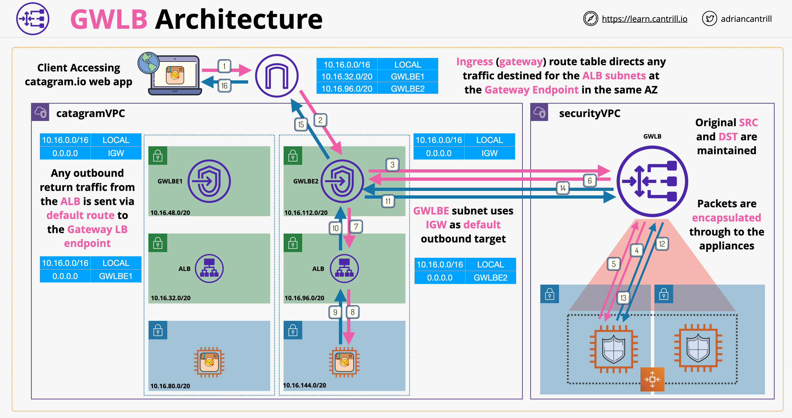

# Gateway Load Balancers (GWLB)

- É um produto para nos ajudar a executar e escalar appliances de segurança de terceiros
- Essas appliances podem ser firewalls, sistemas de detecção e prevenção de intrusões ou até ferramentas de análise de dados
- Podemos usá-los para realizar inspeção e proteção transparente de tráfego de entrada e saída
- Em alto nível, um GWLB tem dois componentes principais:
    - Endpoints do GWLB: executam a partir de uma VPC onde o tráfego entra/sai por meio desses endpoints. São semelhantes a endpoints de interface com algumas melhorias importantes
    - O próprio GWLB: são instâncias EC2 normais executando software de segurança
- O GWLB precisa encaminhar o tráfego sem nenhuma alteração; a appliance de segurança precisa revisar os pacotes conforme são enviados/recebidos
- O GWLB usa um protocolo chamado GENEVE, que é um protocolo de tunelamento de tráfego e metadados
- Os GWLBs são dispositivos de camada 3/4, semelhantes ao NLB, mas integram-se com endpoints GWLB e encapsulam todo o tráfego entre eles e o destino usando o protocolo GENEVE. Quando a varredura é concluída, o tráfego é retornado pelo mesmo túnel ao GWLB, de onde, usando o endpoint GWLB, é enviado ao destino pretendido
- O GWLB fará balanceamento de carga entre as appliances de segurança, para que possamos escalar horizontalmente
- O GWLB gerencia a afinidade de fluxo: um fluxo de dados sempre usará a mesma appliance
- Tabelas de rota de entrada:
    - São colocadas no gateway de internet
    - Influenciam o que acontece com o tráfego que chega à VPC
    - Podem redirecionar o tráfego para endpoints do GWLB
- Arquitetura do GWLB:

    Abaixo está uma arquitetura onde instâncias EC2 estão sendo executadas em um par de sub-redes privadas seguidas por um ALB que está sendo executado em um par de sub-redes públicas. No lado direito temos uma VPC executando um conjunto de appliances de segurança dentro de um ASG que pode crescer ou diminuir com base na carga.

    1. O tráfego atinge o IG que está configurado com tabela de rota que determina o que acontece quando o tráfego chega à VPC.
    2. O tráfego é roteado para o endpoint GWLB.
    3. O tráfego é encaminhado ao próprio GWLB que está sendo executado na VPC de segurança. Neste ponto, os pacotes ainda têm o endereço IP original.
    4. Os pacotes são encapsulados usando o protocolo GENEVE e encaminhados para as appliances de segurança.
    5. Uma vez que os pacotes são analisados, eles são retornados ao GWLB.
    6. Os pacotes são desencapsulados e retornados de volta ao endpoint GWLB via internet.
    7. Como os IPs originais são mantidos, o tráfego é roteado para o ALB usando a tabela de rota local.
    8. O tráfego é encaminhado para a instância de aplicação escolhida.
    9. O tráfego é retornado da instância de volta ao GWLB nos passos de 9 a 14, seguindo o mesmo fluxo que veio para a instância.
    15. Os dados são enviados de volta ao cliente original usando o IG.

    

---

# Gateway Load Balancers (GWLB)

- It is a product to help us run and scale third party security appliances
- This appliances can be firewalls, intrusion detection and prevention systems or even data analysis tools
- We can use these to perform inbound and outbound transparent traffic inspection and protection
- At high level a GWLB has to major components:
    - GWLB endpoints: run from a VPC where traffic enters/leaves via these endpoints. This are similar to interface endpoints with some key improvements
    - GWLB itself: there are normal EC2 instances running security software
- The GWLB needs to forward traffic without any alteration, the security appliance needs to review packets as they are sent/received
- GWLB use a protocol named GENEVE, this is a traffic and metadata tunneling protocol
- GWLBs are layer 3/4 devices, similar to NLB, but they integrate with GWLB endpoints and they encapsulate all traffic between them and the target using the GENEVE protocol. When the scanning is finished, the traffic is returned on the same tunnel to the GWLB from where, using the GWLB endpoint, it is returned to the intended destination
- GWLB will load balance between security appliances, so we can horizontally scale
- GWLB manage flow stickiness, one flow of data will always use the same appliance
- Ingress route tables:
    - They are placed on the internet gateway
    - They influence what happens with the traffic arriving to the VPC
    - They can redirect traffic to GWLB endpoints
- GWLB architecture:

    Below is an architecture where EC2 instances are running in a pair of private subnets followed by ALB which is runig in pair of public subnets. On thie right side we have a VPC running a set of security applicances inside ASG which ca grow or sink based on the load. 

    1. The traffic hits the IG which is configure with route table which determines what happens if the traffic arrives at VPC.
    2. Traffic is routed to GWLB endpoint. 
    3. Traffic is forwarded to GWLB itself whichis running in security VPC. At this point the packets still have original IP address.
    4. Packets are encapsulated using GENEVE protocol and forwarded to security appliances.
    5. Once the packets are aalyzed, they are returned to the GWLB.
    6. The packets are stripped and returned back to GWLB endpoint via the internet.
    7. Since the original IP are maintained, the traffic is routed to ALB using local route table.
    8. The traffic is forwarded to the choosen application instance.
    9. The traffic is returned back from instance to the GWLB in steps from 9 to 14, following the same flow as it came to the instance.
    15. The data is sent back to the original client using the IG. 

    