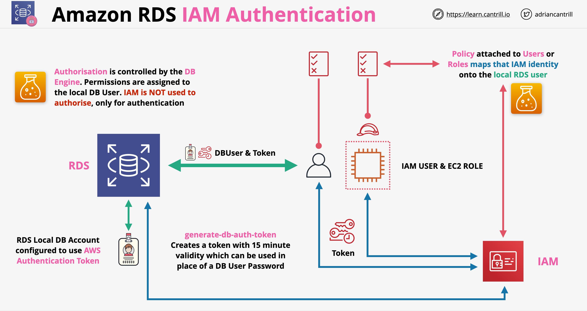

# RDS - Serviço de Banco de Dados Relacional

- O RDS é frequentemente descrito como um Database-as-a-service (DBaaS), mas isso não é preciso. Deveria ser chamado de Database Server as a Service (DBSaaS)
- O RDS fornece instâncias de banco de dados gerenciadas, que podem conter um ou mais bancos de dados
- Os benefícios do RDS são que não precisamos gerenciar o hardware físico, o sistema operacional do servidor ou o sistema de banco de dados em si
- O RDS suporta MySQL, MariaDB, PostgreSQL, Oracle, Microsoft SQL Server
- Amazon Aurora: é um mecanismo de banco de dados criado pela AWS e também podemos selecioná-lo para uso
- Grupo de Sub-rede RDS: lista de sub-redes que um banco de dados RDS pode usar. Geralmente é a melhor prática ter um Grupo de Sub-rede por implantação de banco de dados

## Instância de Banco de Dados RDS

- Executa um dos poucos tipos de mecanismo de banco de dados mencionados acima
- Pode conter múltiplos bancos de dados criados pelo usuário
- Uma instância de banco de dados após a criação pode ser acessada usando seu nome de host (CNAME)
- As instâncias RDS vêm em vários tipos e compartilham muitos recursos do EC2. Exemplo de instâncias: db.m5, db.r5, db.t3
- As instâncias RDS podem ser Single AZ ou Multi AZ (failover ativo-passivo)
- Quando uma instância é provisionada, ela terá um armazenamento dedicado alocado também (geralmente EBS)
- O armazenamento alocado pode ser baseado em armazenamento SSD (IO1, GP2) ou magnético (principalmente para compatibilidade)
- Faturamento para RDS:
    - Somos cobrados com base no tamanho da instância em uma taxa horária
    - Somos cobrados por instâncias adicionais usadas para implantações Multi AZ
    - Também somos cobrados por armazenamento (GB/mês) + extra por IOPS no caso de IOPS provisionado (IO1)
    - A transferência de dados também é cobrada se os dados estão chegando/saindo da internet/outras regiões
    - Backups e snapshots também são cobrados (por GB por mês)
    - O licenciamento, quando aplicável, também é cobrado

## RDS Multi AZ

- Existem 2 tipos de implantações Multi AZ:
    - Multi AZ Instance (historicamente chamado de Multi AZ)
    - Multi AZ Cluster
- Multi AZ Instance:
    - Usado para adicionar resiliência a uma instância RDS
    - A replicação acontece no nível de armazenamento
    - Habilita a replicação síncrona entre instâncias primária e em espera
    - Multi AZ é uma opção que pode ser habilitada em uma instância RDS; quando habilitada, hardware secundário é alocado em outra AZ (réplica em espera)
    - O RDS é acessado via endereço de endpoint fornecido (CNAME)
    - Com uma única instância, o endereço do endpoint aponta para a própria instância; com Multi AZ, por padrão o endpoint aponta para a instância primária
    - Não podemos acessar diretamente a instância em espera
    - Se ocorrer um erro com a instância primária, o RDS altera automaticamente o endpoint para apontar para a réplica em espera. Este failover ocorre em cerca de 60-120 segundos
    - Multi AZ não está disponível no nível gratuito (geralmente custa o dobro do que custaria Single AZ)
    - Os backups são feitos a partir da instância em espera (remove o impacto no desempenho)
    - Em caso de failover, o nome DNS será atualizado para apontar para a instância de réplica em espera. Como esta é uma alteração de DNS, geralmente leva entre 60-120 segundos para ocorrer. Isso pode ser reduzido removendo o cache de DNS na aplicação
    - Com a instância Multi AZ, temos UMA réplica em espera. Esta réplica não pode ser usada para leituras e gravações. Aguarda que um failover aconteça e então pode ser usada
    - Os backups podem ser feitos a partir da instância em espera para melhorar o desempenho
    - Failovers podem ocorrer se:
        - Interrupção de AZ
        - Falha da instância primária
        - Failover manual
        - Alteração do tipo de instância
        - Aplicação de patches de software
- Multi AZ Cluster:
    - O RDS é capaz de ter um escritor replicando para duas instâncias de leitura. Podemos ter apenas 2 leitores!
    - Esses leitores estão em AZs diferentes em comparação ao escritor
    - Em comparação com o modo de cluster Aurora, o Multi AZ cluster pode ter apenas 2 leitores, enquanto o Cluster Aurora pode ter mais
    - No caso de cluster Multi AZ, as instâncias para as quais os dados são replicados são utilizáveis, em comparação com o modo de instância Multi AZ, quando não são
    - Em termos de replicação, os dados são vistos como confirmados quando um dos leitores confirma que foram gravados
    - Outras comparações com o Cluster Aurora:
        - No cluster Multi AZ do RDS, cada instância tem seu próprio armazenamento; no caso do Aurora, isso não acontece
        - Como o Aurora, o cluster pode ser acessado com múltiplos endpoints:
            - Endpoint do Cluster: CNAME do banco de dados, aponta para o escritor; pode ser usado para leituras/gravações e administração
            - Endpoint do Leitor: aponta para qualquer endpoint disponível para leituras (pode apontar para a instância escritora em certos casos). Geralmente aponta para as instâncias de leitura dedicadas
            - Endpoints de Instância: cada instância tem um endpoint; geralmente não é recomendado ser usado
    - Geralmente o Multi AZ Cluster é executado em hardware mais rápido: Graviton + armazenamento SSD NVME local. Quaisquer gravações são escritas no armazenamento local super rápido; depois disso, são descarregadas para o EBS
    - As replicações são feitas via logs de transação => muito mais eficientes do que a instância Multi AZ. Isso também permite failover mais rápido: ~35 segundos + qualquer tempo necessário para aplicar os logs de transação

## Backups e Restaurações do RDS

- RPO (Recovery Point Objective): tempo entre o último backup funcional e a falha. Quanto menor o valor RPO, mais cara costuma ser a solução
- RTO (Recovery Time Objective): tempo entre a falha e o sistema totalmente recuperado. Pode ser reduzido com hardware sobressalente, processos predefinidos, etc. Quanto menor o valor RTO, mais caro o sistema costuma ser
- Tipos de backup do RDS:
    - Snapshots manuais:
        - Devem ser executados manualmente ou via script
        - O primeiro snapshot é o conteúdo completo do banco de dados; os subsequentes são incrementais
        - Quando qualquer snapshot ocorre, há uma breve interrupção no fluxo de dados entre o recurso de computação e o armazenamento (sem efeito perceptível no caso de Multi AZ, já que o backup é feito a partir da instância em espera)
        - Os snapshots manuais não expiram
        - Quando excluímos uma instância RDS, a AWS oferece a opção de fazer um snapshot final
    - Backups automáticos:
        - Ocorrem uma vez por dia (a janela de backup é definida na instância)
        - Snapshots que ocorrem automaticamente; o primeiro sendo um snapshot completo, os seguintes sendo incrementais
        - Além dos snapshots automatizados, a cada 5 minutos os logs de transação são gravados no S3
        - Os backups automáticos não são retidos indefinidamente; podemos definir o período de retenção entre 0 e 35 dias
        - Os backups automáticos podem ser retidos após a exclusão de um banco de dados, mas ainda expiram após o período de retenção
        - Podemos replicar backups para outra região: tanto snapshots quanto logs de transação podem ser replicados. Cobranças se aplicam à cópia de dados entre regiões e a qualquer armazenamento usado na região de destino
        - A replicação entre regiões deve ser configurada explicitamente nos backups automatizados
- Os backups são armazenados em buckets S3 gerenciados pela AWS (os backups não são visíveis diretamente para nós no S3) => quaisquer dados no S3 são resilientes regionalmente
- Os backups do RDS são feitos a partir da instância em espera caso o Multi AZ esteja habilitado
- Restaurações do RDS:
    - O RDS cria uma nova instância RDS quando restauramos um backup automatizado ou um snapshot manual => um novo endereço será criado para o banco de dados
    - Quando restauramos um snapshot, restauramos nosso banco de dados para um único ponto no tempo, quando a criação do snapshot ocorreu
    - Com backups automatizados, podemos escolher um ponto no tempo para onde queremos restaurar (qualquer ponto de 5 minutos)
    - Restaurar snapshots não é um procedimento rápido (importante para o RTO)

## Réplicas de Leitura do RDS

- Fornecem 2 benefícios principais: desempenho e disponibilidade
- As réplicas de leitura são réplicas somente leitura de uma instância RDS
- As réplicas de leitura podem ser usadas apenas para leitura de dados
- O modo Cluster Multi AZ é semelhante a como as réplicas de leitura funcionam, mas para réplicas de leitura, devemos pensar nelas como coisas separadas:
    - Elas não fazem parte da instância principal do banco de dados
    - Têm seu próprio endereço de endpoint
    - Requerem suporte da aplicação
    - Não há failover automático para uma réplica de leitura
- A instância primária e a réplica de leitura são mantidas em sincronia usando replicação assíncrona
- Pode haver uma pequena quantidade de lag no caso de replicação
- As réplicas de leitura podem ser criadas em uma AZ diferente ou região diferente (CRR - Replicação entre Regiões)
- Podemos ter 5 réplicas de leitura diretas por instância de banco de dados
- Cada réplica de leitura fornece uma instância adicional de desempenho de leitura
- As réplicas de leitura também podem ter réplicas de leitura, mas o lag começa a ser um problema neste caso
- As réplicas de leitura podem fornecer melhorias de desempenho globais
- Snapshots e backups melhoram o RPO, mas não o RTO. As réplicas de leitura oferecem RPO quase zero
- As réplicas de leitura podem ser promovidas a primárias em caso de falha. Isso também oferece baixo RTO (lags de minutos)
- As réplicas de leitura podem replicar a corrupção de dados

## Segurança de Dados

- Com todos os mecanismos RDS, podemos usar criptografia em trânsito (SSL/TLS). Isso pode ser definido como obrigatório por usuário
- Para criptografia em repouso, o RDS suporta criptografia de volume EBS usando KMS, que é gerenciada pelo host EBS e é invisível para o mecanismo de banco de dados
- Podemos usar chaves de dados CMK gerenciadas pelo cliente ou geradas pela AWS para criptografia em repouso
- Armazenamento, logs e snapshots serão criptografados com a mesma chave mestra do cliente
- A criptografia não pode ser removida após ser ativada
- Além da criptografia em repouso, MSSQL e Oracle suportam TDE (Transparent Data Encryption) - criptografia no nível do mecanismo de banco de dados
- Oracle suporta TDE com CloudHSM, oferecendo criptografia muito mais forte
- Autenticação IAM com RDS:
    - Normalmente, o login é controlado com usuários locais do banco de dados (nome de usuário/senha)
    - Podemos configurar o RDS para permitir autenticação IAM (apenas autenticação, não autorização; a autorização é gerenciada internamente!):
    

## Proxy RDS

- Abrir e fechar conexões consome recursos e leva tempo => no caso em que queremos apenas ler/gravar uma pequena quantidade de dados, a sobrecarga de estabelecer uma conexão cria uma latência significativa
- Lidar com falhas de instâncias de banco de dados é difícil; isso adiciona sobrecarga significativa e riscos à nossa aplicação
- Os proxies de banco de dados podem ajudar, mas gerenciá-los nem sempre é trivial (scaling, resiliência)
- No caso de um proxy RDS, nossa aplicação se conecta ao proxy, que lida com o pool de conexões e a conectividade com o banco de dados
- Os proxies RDS fornecem multiplexação: um número menor de conexões pode ser usado para se conectar ao banco de dados enquanto um número maior de aplicações usa o banco de dados através do proxy. Isso ajuda a reduzir a carga no banco de dados
- O Proxy RDS pode ajudar com eventos de failover de banco de dados, abstraindo-os das aplicações. O proxy pode aguardar até que uma instância de banco de dados saudável esteja disponível e conectar-se a ela automaticamente
- Quando usar o Proxy RDS?
    - No caso de erros como `Too many connections`. Um proxy RDS pode reduzir o número de conexões ao banco de dados enquanto é capaz de lidar com muito mais conexões das aplicações para si mesmo
    - Útil ao usar AWS Lambda; não precisaremos invocar uma nova conexão após cada invocação de nossa função. Economiza tempo reutilizando conexões e autenticação IAM
    - Útil para aplicações de longa execução (apps SAAS) reduzindo a latência
- Fatos-chave do Proxy RDS:
    - Totalmente gerenciado pelo RDS/Aurora
    - Por padrão, fornece auto scaling e HA
    - Fornece pool de conexões, que reduz a carga do banco de dados
    - Acessível apenas de uma VPC; não acessível da internet pública
    - Acessado via Endpoint do Proxy
    - Pode forçar conexão SSL/TLS
    - Pode reduzir o tempo de failover em mais de 60% no caso do Aurora
    - Abstrai a falha de um banco de dados da nossa aplicação

## RDS Personalizado (RDS Custom)

- Preenche a lacuna entre o produto RDS principal e o EC2 executando um mecanismo de banco de dados
- O RDS principal é um serviço de banco de dados totalmente gerenciado => o acesso ao SO/Mecanismo é limitado
- Em contraste, bancos de dados executados no EC2 são autogerenciados; isso pode ter uma sobrecarga de gerenciamento significativa
- O RDS Custom preenche essa lacuna; podemos utilizar o RDS, mas ainda obter acesso à personalização que teríamos ao executar uma instância de banco de dados no EC2
- Atualmente, o RDS Custom funciona com MSSQL ou Oracle
- Podemos nos conectar ao sistema operacional subjacente usando SSH, RDP ou Session Manager
- O RDS Custom será executado em nossa conta AWS. O RDS clássico é executado em um ambiente gerenciado pela AWS
- Se precisarmos realizar customização do RDS para RDS Custom, precisamos verificar nas configurações de Automação de Banco de Dados para garantir que não teremos nenhuma interrupção causada pela Automação de Banco de Dados. Precisamos pausar a Automação de Banco de Dados durante este período

---

# RDS - Relational Database Service

- RDS is often described as a Database-as-a-service (DBaaS) but this is not accurate. It should be named Database Server as a Service (DBSaaS) product
- RDS provides managed database instances, which can themselves hold one or more databases
- Benefits of RDS are the we don't need to manage the physical hardware, the server operating system or the database system itself
- RDS supports MySQL, MariaDB, PostgreSQL, Oracle, Microsoft SQL Server
- Amazon Aurora: it is a db engine created by AWS and we can select it as well for usage
- RDS Subnet Group: list of subnets which an RDS database can use. Generally it is best practice to have on Subnet Group per database deployment

## RDS Database Instance

- Runs one of the few types of db engine mentioned above
- Can contain multiple user created databases
- A database instance after creation can be accessed using its hostname (CNAME)
- RDS instances come in various types, share many of features of EC2. Example of instances: db.m5, db.r5, db.t3
- RDS instances can be single AZ or multi AZ (active-passive failover)
- When an instance is provisioned, it will have a dedicated storage allocated as well (usually EBS)
- Storage allocated can be based on SSD storage (IO1, GP2) or magnetic (mainly for compatibility)
- Billing for RDS:
    - We are billed based on instance size on a hourly rate
    - We are billed for additional instances used for Multi AZ deployments
    - We are also billed per storage (GB/month) + extra per iops in case of provisioned iops (IO1)
    - Data transfer is also billed if data is coming from/goes to the internet/other regions
    - Backups and snapshots are also billed (per GB per month)
    - Licensing is applicable is also billed

## RDS Multi AZ

- They are 2 types of Multi AZ deployments:
    - Multi AZ Instance (historically called Multi AZ)
    - Multi AZ Cluster
- Multi AZ Instance:
    - Used to add resilience to an RDS instance
    - Replication happens at the storage level
    - Enables synchronous replication between primary and standby instances
    - Multi AZ is an option which can be enabled on an RDS instance, when enabled secondary hardware is allocated in another AZ (standby replica)
    - RDS is accessed via provided endpoint address (CNAME)
    - With a single instance the endpoint address points the instance itself, with multi AZ, by default the endpoint points to the primary instance
    - We can not directly access the standby instance
    - If an error occurs with the primary instance, RDS automatically changes the endpoint to point to the standby replica. This failover occurs in around 60-120 seconds
    - Multi AZ is not available in the Free-tier (generally costs double as it would the single AZ)
    - Backups are taken from the standby instance (removes performance impact)
    - In case of a failover the DNS name will be updated to point to the standby replica instance. Since this is a DNS change, for the update it generally takes between 60-120 seconds to occur. This can be lessened by removing DNS caching in the application
    - With Multi AZ instance we have ONE standby replica. This replica cannot be used for read and writes. It waits for a failover to happen and then it can be used
    - Backups can be taken from the standby instance to improve performance
    - Failovers can happen if:
        - AZ outage
        - Primary instance failure
        - Manual failover
        - Instance type change
        - Software patching
- Multi AZ Cluster:
    - RDS is capable of having one writer replicate to two reader instances. We can have 2 readers only!
    - These readers are in different AZs compared to the writer
    - Compared two Aurora cluster mode, Multi AZ cluster can have 2 readers only, while Aurora Cluster can have more
    - In case of Multi AZ cluster the instances to which data is replicated are usable, compared to Multi AZ instance mode when they are not
    - In terms of replication the data is viewed as committed when one of the readers confirms that it was written
    - Other comparisons two Aurora Cluster:
        - In RDS multi AZ cluster each instance has its own storage, in case of Aurora this is not the case
        - Like Aurora, the cluster can be accessed with multiple endpoints:
            - Cluster endpoint: database CNAME, points to the writer, can be used for reads/writes and administration
            - Reader endpoint: points to any available endpoint for reads (it can point to the writer instance in certain cases). Generally it points to the dedicated reader instances
            - Instance endpoints: each instance gets one endpoint, generally not recommended to be used
    - Generally Multi AZ Cluster runs on faster hardware: Graviton + local NVME SSD storage. Any writes are written to local super fast storage, after that they are flushed to the EBS
    - Replications are done via transaction logs => much more efficient then Multi AZ instance. This also allows faster failover: ~35 seconds + any time required to apply the transaction logs

## RDS Backups and Restores

- RPO (Recovery Point Objective): time between the last working backup and the failure. Lower the RPO value, usually the more expensive the solution
- RTO (Recovery Time Objective): time between the failure and system being fully recovered. Can be reduced with spare hardware, predefined processes, etc. Lower the RTO value, the system is usually more expensive
- RDS backup types:
    - Manual snapshots:
        - Have to be run manually, or via a script
        - First snapshot is full content of the DB, incremental onward
        - When any snapshot occurs, there is brief interruption in the flowing of data between the compute resource and the storage (no noticeable effect in case of Multi AZ, since the backup is taken from the standby instance)
        - Manual snapshots do not expire
        - When we delete an RDS instance, AWS offers to make one final snapshot
    - Automatic backups:
        - They occur once per day (backup window is defined on the instance)
        - Snapshots which occur automatically, first being full snapshot, incremental afterwards
        - In addition to the automated snapshots, every 5 minute transaction logs are written to S3
        - Automatic backups are not retained, we can set the retention period between 0 and 35 days
        - Automatic backups can be retained after a DB is deleted, but they still expire after the retention period
        - We can replicate backups to another region: both snapshots and transaction logs can be replicated. Charges apply to cross-region data copy and any storage used in the destination region
        - Cross-region replication has to be explicitly configured within automated backups
- Backups are stored in AWS manages S3 buckets (backups are not visible to us directly in S3) => any data in S3 is regionally resilient
- RDS backups are taken from the standby instance in case Multi AZ is enabled
- RDS Restores:
    - RDS creates a new RDS instance when we restore an automated backup or a manual snapshot => new address will be created for the DB
    - When we restore a snapshot, we restore our DB to a single point in time, when the creation time of the snapshots happened
    - With automated backups we can chose a point-in-time to where we want to restore (any 5 minute point-in-time)
    - Restoring snapshots is not a fast procedure (important for RTO)

## RDS Read-Replicas

- Provide 2 main benefits: performance and availability
- Read replicas are read-only replicas of an RDS instance
- Read replicas can be used for reading only data
- Multi AZ Cluster mode is a similar to how read replicas work, but for read replicas we have to think of read replicas as separate things: 
    - They are not part of the main database instance
    - They have their own endpoint address
    - Require application support
    - There is no automatic failover to a read replica
- The primary instance and read replica is kept sync using asynchronous replication
- There can be a small amount of lag in case of replication
- Read replicas can be created in a different AZ or different region (CRR - Cross-Region Replication)
- We can 5 direct read-replicas per DB instance
- Each read-replica provides an additional instance of read performance
- Read-replicas can also have read-replicas, but lag starts to be a problem in this case
- Read-replicas can provide global performance improvements
- Snapshots and backups improve RPO but not RTO. Read-replicas offer near 0 RPO
- Read-replicas can be promoted to primary in case of a failure. This offers low RTO as well (lags of minutes)
- Read-replicas can replicate data corruption

## Data Security

- With all the RDS engines we can use encryption in transit (SSL/TLS). This can be set to be mandatory on a per user bases
- For encryption at rest RDS supports EBS volume encryption using KMS which is handled by the host EBS and it is invisible for the database engine
- We can use customer managed or AWS generated CMK data keys for encryption at rest
- Storage, logs and snapshots will be encrypted with the same customer master key
- Encryption can not be removed after it is activated
- In addition to encryption at rest MSSQL and Oracle support TDE (Transparent Data Encryption) - encryption at the database engine level
- Oracle supports TDE with CloudHSM, offering much stronger encryption
- IAM authentication with RDS:
    - Normally login is controlled with local database users (username/password)
    - We can configure RDS to allow IAM authentication (only authentication, not authorization, authorization is handled internally!):
    

## RDS Proxy

- Opening and closing connections consumes resources and takes time => in case we only want to read/write a tiny amount of data the overhead of establishing a connection creates a significant latency
- Handling failure of databases instances is hard, this adds significant overhead and risks to our application
- DB proxies can help, but managing them is not always trivial (scaling, resilience)
- In case of an RDS proxy our application connects to the proxy, which handles connection polling and connectivity to the database
- RDS proxies provide multiplexing: a smaller number of connections can be used to connect to the database while having a larger number of applications using the database through the proxy. This helps to reduce the load on the database
- RDS Proxy can help with database failover events abstracting this from the applications. The proxy can wait until a healthy database instance is in place and can automatically connect to it
- When to use RDS proxy?
    - In case we have errors such as `Too many connections`. An RDS proxy can reduce the number of connections to the dabase while being able to handle many more connections from the applications to itself
    - Useful when using AWS Lambda, we won't need to invoke a new connection after each invocation of our function. Saves time by connection reuse and IAM auth
    - Useful for long running applications (SAAS apps) by reducing latency
- RDS Proxy key facts:
    - Fully managed by RDS/Aurora
    - By default provides auto scaling, HA
    - Provides connections pooling, which reduces DB load
    - Only accessible from a VPC, not accessible from the public internet
    - Accessed via Proxy Endpoint
    - Can enforce SSL/TLS connection
    - Can reduce failover time by over 60% in case of Aurora
    - Abstracts the failure of a database away for our application

## RDS Custom

- Fills the gap between the main RDS product and EC2 running a DB engine
- The main RDS is fully managed database service => OS/Engine access is limited
- In contrast databases running on EC2 are self managed, this can have significant management overhead
- RDS custom bridges this gap, we can utilize RDS but still get access to customization we would have when running a DB instance on EC2
- Currently RDS custom works from MSSQL or Oracle
- We can connect to the underlying OS using SSH, RDP or Session Manager
- RDS custom will run withing our AWS account. Classic RDS will run in an AWS managed environment
- If we need to perform RDS customization for RDS Custom, we need to look inside the Database Automation settings to make sure we wont have any disruption caused by the Database Automation. We need to pause Database Automation for this period