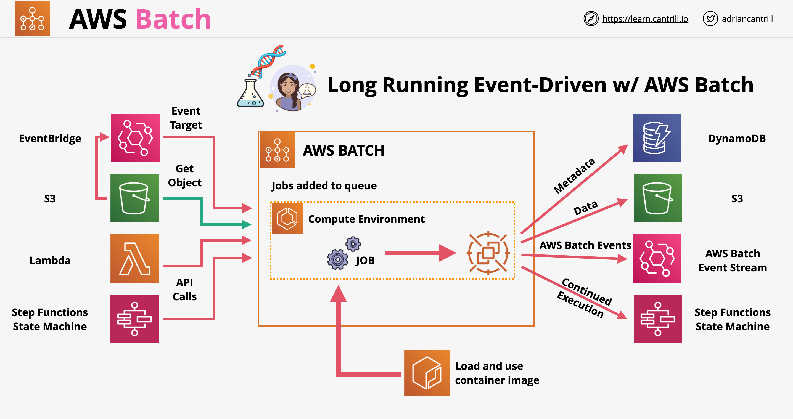

# AWS Batch

- Serviço de computação gerenciado comumente usado para análise e processamento de dados em larga escala
- É um produto de processamento em lote gerenciado
- Processamento em Lote: trabalhos que podem ser executados sem interação com o usuário final, ou podem ser agendados para serem executados conforme os recursos permitam
- O AWS Batch nos permite nos preocupar com a definição de trabalhos; ele lidará com a computação subjacente e a orquestração
- Componentes principais do AWS Batch:
    - Trabalho (Job): script, executável ou contêiner Docker submetido ao Batch. Os trabalhos são executados usando contêineres na AWS. O trabalho define o que deve ser feito. Os trabalhos podem depender de outros trabalhos
    - Definição de Trabalho (Job Definition): metadados para um trabalho, incluindo permissões IAM, configurações de recursos, pontos de montagem, etc.
    - Fila de Trabalhos (Job Queue): os trabalhos são submetidos a uma fila, onde aguardam a capacidade do ambiente de computação. As filas podem ter prioridade
    - Ambiente de Computação (Compute Environment): os recursos de computação que realizam o trabalho efetivo. Podem ser gerenciados pela AWS ou por nós mesmos. Podemos configurar o tipo de instância, quantidade de vCPU, preço spot, ou fornecer detalhes sobre um ambiente de computação que gerenciamos (ECS)
- Integração com outros serviços:
    

## AWS Batch vs Lambda

- O Lambda tem um limite de execução de 15 minutos; para fluxos de trabalho mais longos, devemos usar o Batch
- O Lambda tem espaço em disco limitado no ambiente; podemos corrigir isso usando o EFS, mas isso exigiria que a função fosse executada dentro de uma VPC
- O Lambda é totalmente serverless com seleção de runtime limitada
- O Batch não é serverless; usa Docker com qualquer runtime
- O Batch não tem limite de tempo para execução

# AWS Batch Gerenciado vs Não Gerenciado

- Gerenciado:
    - O AWS Batch gerencia a capacidade com base nas necessidades da nossa carga de trabalho
    - Decidimos o tipo/tamanho da instância e se queremos usar instâncias sob demanda ou spot
    - Podemos determinar nosso próprio preço máximo spot
    - Precisamos criar gateways VPC para acesso aos recursos
    - Usando o ambiente de computação gerenciado, permitimos que a AWS gerencie toda a infraestrutura em nosso nome; apenas precisamos ajustar alguns valores de alto nível
- Não Gerenciado:
    - Gerenciamos tudo; criamos o ambiente e direcionamos a AWS a usar esse ambiente
    - Geralmente usado quando temos um ambiente de computação completo pronto para uso
    - Requer AMI específica para as instâncias EC2

---

# AWS Batch

- Managed compute service commonly used for large scale data analytics and processing
- It is managed batch processing product
- Batch Processing: jobs that can run without end-user interaction, or can be scheduled to run as resources permit
- AWS Batch lets us worry about defining jobs, it will handle the underlying compute and orchestration
- AWS Batch core components:
    - Job: script, executable, docker container submitted to batch. Jobs are executed using containers in AWS. The job define the work. Jobs can depend on other jobs
    - Job Definition: metadata for a job, including IAM permissions, resource configurations, mount points, etc.
    - Job Queue: jobs are submitted to a queue, where they wait for compute environment capacity. Queues can have a priority
    - Compute Environment: the compute resources which do the actual work. Can be managed by AWS or by ourselves. We can configure the instance type, vCPU amount, spot price, or provide details on a compute environment we manage (ECS)
- Integration with other services:
    

## AWS Batch vs Lambda

- Lambda has a 15 minutes execution limit, for longer workflows we should use Batch
- Lambda has limited disk space in the environment, we can fix this by using EFS, but this would require the function to be run inside of a VPC
- Lambda is fully serverless with limited runtime selection
- Batch is not serverless, it uses Docker with any runtime
- Batch does not have a time limit for execution

# Managed vs Unmanaged AWS Batch

- Managed:
    - AWS Batch manages capacity based on our workload needs
    - We decide the instance type/size and if we want to use on-demand or spot instances
    - We can determine our own max spot price
    - We need to create VPC gateways for access to the resources
    - Using the managed compute environment we allow AWS the manage all the infra on our behalf, we just need to tweak some high level values
- Unmanaged:
    - We manage everything, we create the environment, we direct AWS to use that environment
    - Generally used if we have a full compute environment ready to go
    - Requires specific AMI for the EC2 instances
