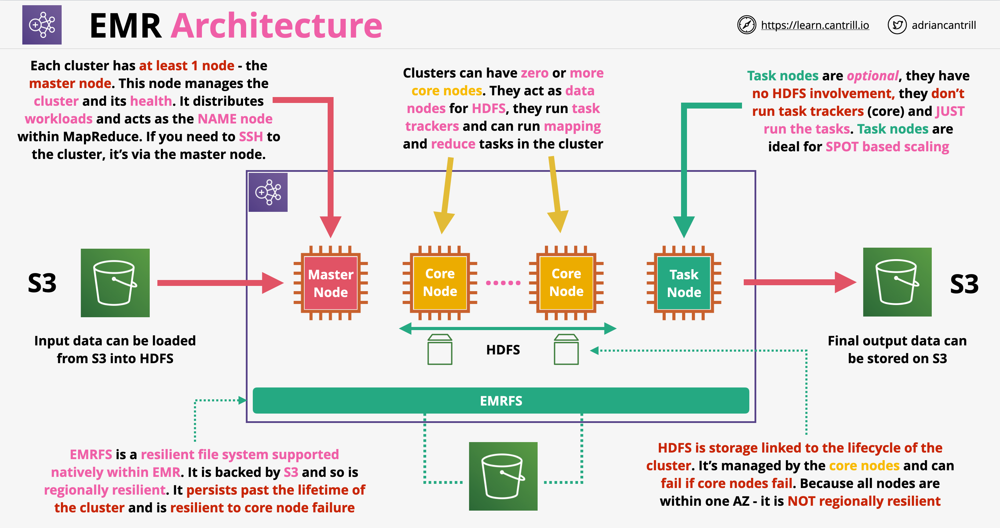

# EMR - Elastic Map Reduce

## MapReduce 101

- É um framework projetado para permitir o processamento de enormes quantidades de dados de forma paralela e distribuída
- Arquitetura de Análise de Dados: escala enorme, processamento paralelo
- O MapReduce tem duas fases principais: map e reduce
- Também tem fases opcionais: combine e partition
- Em alto nível, o processo de map reduce é o seguinte:
    - Os dados são separados em divisões (splits)
    - Cada divisão pode ser atribuída a um mapper
    - O mapper realiza a operação em escala
    - Os dados são recombinados após a conclusão da operação
- HDFS (Hadoop File System):
    - Tradicionalmente armazenado em vários nós de dados
    - Altamente tolerante a falhas - os dados são replicados entre os nós
    - Nós de Nome (Named Nodes): fornecem o namespace para o sistema de arquivos e controlam o acesso ao HDFS
    - Bloco (Block): um segmento de dados no HDFS, geralmente 64 MB

## Arquitetura do Amazon EMR

- É uma implementação gerenciada do Apache Hadoop, que é um framework para lidar com cargas de trabalho de big data
- O EMR inclui outros elementos como Spark, HBase, Presto, Flink, Hive, Pig
- O EMR pode ser operado a longo prazo, ou podemos provisionar clusters ad-hoc (transitórios) para cargas de trabalho de curto prazo
- O EMR é executado em apenas uma AZ dentro de uma VPC usando EC2 para computação
- Pode usar instâncias spot, frotas de instâncias, reservadas e instâncias sob demanda também
- O EMR é usado para processamento de big data, manipulação, análise, indexação, transformação, etc.
- Arquitetura do EMR:
    
    - Cada cluster requer pelo menos um **nó mestre**. Este gerencia o cluster, distribui cargas de trabalho e atua como o nó NAME dentro do MapReduce (fazemos SSH nele se necessário)
    - Historicamente, podíamos ter apenas um nó mestre; atualmente, podemos ter 3 nós mestres
    - **Nós centrais (Core nodes)**: o cluster pode ter muitos nós centrais. São usados para rastreamento de tarefas; não queremos destruir esses nós
    - Os nós centrais também gerenciam o armazenamento HDFS para o cluster. O tempo de vida do HDFS está vinculado ao tempo de vida dos nós centrais/cluster
    - **Nós de tarefa (Task nodes)**: usados apenas para executar tarefas. Se forem encerrados, o armazenamento HDFS não é afetado. Idealmente, usamos instâncias spot para nós de tarefa
    - EMRFS: sistema de arquivos com suporte do S3; pode persistir além do tempo de vida do cluster. Oferece desempenho inferior ao HDFS, que é baseado em volumes locais

## Amazon EMR Serverless

- É uma opção de implantação para o Amazon EMR que fornece um ambiente de runtime serverless
- Com o EMR Serverless, não precisamos configurar, otimizar, proteger ou operar clusters para executar aplicações com frameworks como Spark e Hive
- Execução de trabalho (Job run):
    - É uma solicitação submetida a uma aplicação EMR Serverless que a aplicação executa de forma assíncrona e rastreia até a conclusão
    - Quando um trabalho é submetido, devemos especificar uma função IAM que fornecerá o acesso necessário para o trabalho a outros serviços como o S3
    - Podemos submeter diferentes trabalhos ao mesmo tempo com funções de runtime diferentes
- Trabalhadores (Workers):
    - O EMR Serverless usa internamente trabalhadores para executar nossas cargas de trabalho
    - O tamanho padrão dessas cargas de trabalho depende do tipo de aplicação e da versão do EMR
    - Quando submetemos um trabalho, o EMR Serverless calcula os recursos que a aplicação precisa para o trabalho e agenda trabalhadores
    - O EMR Serverless dimensiona automaticamente os trabalhadores para cima ou para baixo com base na carga de trabalho e no paralelismo necessário em cada estágio do trabalho
- Capacidade pré-inicializada:
    - Usada para manter trabalhadores inicializados e prontos para responder em segundos
    - Efetivamente cria um pool quente de trabalhadores para uma aplicação
- EMR Studio:
    - É o console do usuário onde gerenciamos nossas aplicações EMR Serverless

---

# EMR - Elastic Map Reduce

## MapReduce 101

- Is a framework designed to allow processing huge amount of data in a parallel, distributed way
- Data Analysis Architecture: huge scale, parallel processing
- MapReduce has two main phases: map and reduce
- It also has to optional phases: combine and partition
- At high level the process of map reduce is the following:
    - Data is separated into splits
    - Each split can be assigned to a mapper
    - The mapper perform the operation at scale
    - The data is recombined after the operation is completed
- HDFS (Hadoop File System):
    - Traditionally stored across multiple data nodes
    - Highly fault-tolerant - data is replicated between nodes
    - Named Nodes: provide the namespace for the file system and controls access to HDFS
    - Block: a segment of data in HDFS, generally 64 MB

## Amazon EMR Architecture

- Is a managed implementation of Apache Hadoop, which is a framework for handling big data workloads
- EMR includes other elements such as Spark, HBase, Presto, Flink, Hive, Pig
- EMR can be operated long term, or we can provision ad-hoc (transient) clusters for short term workloads
- EMR runs in one AZ only within a VPC using EC2 for compute
- It can use spot instances, instance fleets, reserved and on-demand instances as well
- EMR is used for big data processing, manipulation, analytics, indexing, transformation, etc.
- EMR architecture:
    
    - Each cluster requires at least one **master node**. This manages the cluster and distributes workloads and acts as the NAME node within MapReduce (we SSH into this if necessary)
    - Historically we could have only one master node, nowadays we can have 3 master nodes
    - **Core nodes**: cluster can have many core nodes. They are used for tracking task, we don't want to destroy these nodes
    - Core nodes also managed to HDFS storage for the cluster. The lifetime of HDFS is linked to the lifetime of the core nodes/cluster
    - **Task nodes**: used to only run tasks. If they are terminated, the HDFS storage is not affected. Ideally we use spot instances for task nodes
    - EMRFS: file system backed by S3, can persist beyond the lifetime of the cluster. Offers lower performance than HDFS, which is based on local volumes

## Amazon EMR Serverless

- It is a deployment option for Amazon EMR that provides a serverless runtime environment
- With EMR Serverless we don't have to configure, optimize, secure or operate clusters to run applications with frameworks such as Spark and Hive
- Job run:
    - Is a request submitted to an EMR Serverless application that the application asynchronously executes and tracks it until completion
    - When a job is submitted we must specify an IAM role that will provide required access for the job to other services such as S3
    - We can submit different jobs at the same time with different runtime roles
- Workers:
    - EMR Serverless internally uses workers to execute our workloads
    - The default size of this workloads depends on the application type and EMR version
    - When we submit a job, EMR Serverless computes the resources that the application needs for the job and schedules workers
    - EMR Serverless automatically scales workers up or down based on the workload and parallelism required at every stage of the job
- Pre-initialized capacity:
    - Used to keep workers initialized and ready to respond in seconds
    - Effectively creates a warm pool of workers for an application
- EMR Studio:
    - It is the user console where we manage our EMR Serverless applications