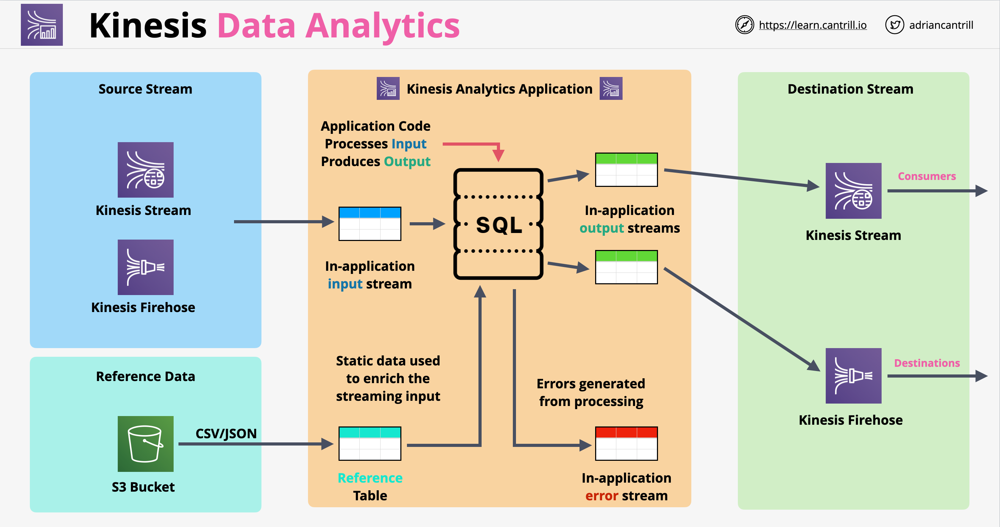

# Kinesis

- É um serviço de streaming escalável, projetado para ingerir grandes quantidades de dados
- Os produtores enviam dados para um stream do Kinesis, sendo o stream a entidade básica do Kinesis
- Os streams podem escalar de taxas de dados baixas a quase infinitas
- É um serviço público e altamente disponível em uma região por design
- Persistência: os streams armazenam por padrão uma janela móvel de 24H de dados
- O Kinesis inclui armazenamento para ingerir e reter dados por 24H por padrão (pode ser aumentado para 365 dias com custo adicional)
- Múltiplos consumidores podem acessar os dados dessa janela móvel

## Kinesis Data Streams

- Os Kinesis Data Streams usam arquitetura de shards para scaling; inicialmente há um shard; shards adicionais podem ser adicionados ao longo do tempo para aumentar o desempenho
- Cada shard fornece sua própria capacidade; cada shard tem capacidade de ingestão de 1 MB/s e capacidade de consumo de 2 MB/s
- Os shards afetam diretamente o preço do stream Kinesis; temos que pagar por cada shard
- O preço também é afetado pelo comprimento da janela de armazenamento. Por padrão é 24H; pode ser aumentado para 365 dias
- Os dados são armazenados em Kinesis Data Records (1 MB); esses registros são distribuídos entre os shards

## SQS vs Kinesis Data Streams

- Trata-se de ingestão de dados (Kinesis) ou de desacoplamento, pools de trabalhadores (SQS)?
- O SQS geralmente tem 1 grupo de produção, 1 grupo de consumo
- O SQS é projetado para desacoplamento e comunicação assíncrona
- O SQS não tem o conceito de persistência; sem janela para persistência
- O Kinesis é projetado para ingestão em enorme escala, tendo múltiplos consumidores com diferentes taxas de consumo
- O Kinesis é recomendado para ingestão, análise, monitoramento, fluxos de cliques

## Kinesis Data Firehose

- Usado para fornecer ingestão de dados para outros serviços AWS como o S3
- Serviço totalmente gerenciado usado para carregar dados para data lakes, armazenamentos de dados e serviços de análise
- O Data Firehose escala automaticamente; é serverless e resiliente
- Não é um produto em tempo real; é um produto de Quase Tempo Real com um produto de entrega de ~60 segundos
- Suporta transformação de dados em tempo real usando Lambda. Essa transformação pode adicionar latência
- O Firehose é um serviço pago por uso; pagamos por volume de dados
- Destinos suportados pelo Firehose:
    - Endpoints HTTP (provedores terceirizados)
    - Splunk (tem suporte direto para ele)
    - RedShift
    - OpenSearch (ElasticSearch)
    - S3
- O Firehose pode aceitar dados diretamente de produtores ou do Kinesis Data Streams
- O Firehose recebe os dados em tempo real, mas a ingestão é em buffer
- O buffer do Firehose aguarda por padrão 1 MB de dados em 60 segundos antes de entregar ao consumidor. Para cargas maiores, entregará toda vez que houver um bloco de 1 MB de dados
- Os dados são enviados diretamente do Firehose ao destino, com exceção do Redshift, onde os dados são armazenados em um bucket S3 intermediário
- Casos de uso do Firehose:
    - Persistência para dados que chegam ao Kinesis Data Streams
    - Armazenamento de dados em um formato diferente (ETL)

## Kinesis Data Analytics

- É um produto de processamento de dados em tempo real usando SQL
- O produto ingere dados do Kinesis Data Streams ou Firehose
- Após o processamento dos dados, eles podem ser enviados diretamente para destinos como:
    - Firehose (dados se tornando quase em tempo real)
    - Kinesis Data Streams
    - AWS Lambda
- Arquitetura do Kinesis Data Analytics:
    
- Casos de uso do Kinesis Data Analytics:
    - Qualquer coisa usando dados de stream que precise de processamento SQL em tempo real
    - Análise de séries temporais: dados eleitorais, e-sports
    - Dashboards em tempo real: placares de liderança para jogos
    - Métricas em tempo real

---

# Kinesis

- Is a scalable streaming service, designed to ingest lots of data
- Producers send data into a Kinesis stream, the stream being the basic entity of Kinesis
- Streams can scale from low to near infinite data rates
- It is a public service and it is highly available in a region by design
- Persistence: streams store by default a 24H moving window of data
- Kinesis include storage to be able to ingest and retain it for 24H by default (can be increased to 365 days at additional cost)
- Multiple consumers can access the data from that moving window

## Kinesis Data Streams

- Kineses Data Streams are using shards architecture for scaling, initially there is one shard, additional shards can be added over time to increase performance
- Each shard provides its own capacity, each shard has 1MB/s ingestion capacity, 2MB/s consumption capacity
- Shards directly affect the price of the Kinesis stream, we have to pay for each shard
- Pricing is also affected by the length of the storage window. By default is 24H, it can be increased to 365 days
- Data is stored in Kinesis Data Records (1MB), these records are distributed across shards

## SQS vs Kinesis Data Streams

- Is it about ingestion (Kinesis) of data or about decoupling, worker pools (SQS)
- SQS usually has 1 production group, 1 consumption group
- SQS is designed for decoupling and asynchronous communication
- SQS does not have the concept of persistence, no window for persistence
- Kinesis is designed for huge scale ingestion, having multiple consumers with different rate of consumption
- Kinesis is recommended for ingestion, analytics, monitoring, click streams

## Kinesis Data Firehose

- Used to provide data ingestion for other AWS services such as S3
- Fully managed service used to load data for data lakes, data stores and analytics services
- Data Firehose scales automatically, it is serverless and resilient
- It is not a real time product, it is a Near Real Time product with a deliver product of ~60 seconds
- Supports transformation of data on the fly using Lambda. This transformation can add latency
- Firehose is a pay as you go service, we pay per volume of data
- Firehose supported destinations:
    - HTTP endpoints (third party providers)
    - Splunk (has direct support for it)
    - RedShift
    - OpenSearch (ElasticSearch)
    - S3
- Firehose can accept data directly from producers or from Kinesis Data Streams
- Firehose receives the data in real-time, but the ingestion is buffered
- Firehose buffer by default waits for 1MB of data in 60 seconds before delivering to consumer. For higher load, it will deliver every time there is an 1MB chunk of data
- Data is sent directly form Firehose to destination, exception being Redshift, where data is stored in an intermediary S3 bucket
- Firehose use cases:
    - Persistence for data coming into Kinesis Data Streams
    - Storing data in a different format (ETL)

## Kinesis Data Analytics

- It is a real-time data processing product using SQL
- The product ingests data from Kinesis Data Streams or Firehose
- After the data is processed, it can be sent directly to destinations such as:
    - Firehose (data becoming near-real time)
    - Kinesis Data Streams
    - AWS Lambda
- Kinesis Data Analytics architecture:
    
- Kinesis Data Analytics use cases:
    - Anything using stream data which needs real-time SQL processing
    - Time-series analytics: election data, e-sports
    - Real-time dashboards: leader boards for games
    - Real-time metrics