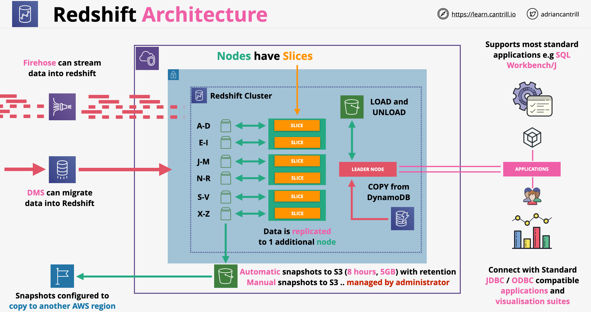
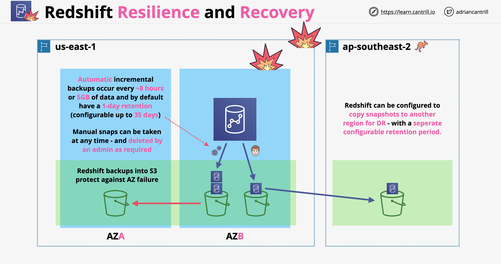

# Amazon Redshift

- É um data warehouse em escala petabyte
- É projetado para relatórios e análise
- É um banco de dados OLAP (baseado em colunas), não OLTP (baseado em linhas/transações)
    - OLTP (Processamento de Transações Online): captura, armazena e processa dados de transações em tempo real
    - OLAP (Processamento Analítico Online): projetado para consultas complexas para analisar dados históricos agregados de outros sistemas OLAP
- Recursos avançados do Redshift:
    - RedShift Spectrum: permite consultar dados do S3 sem carregá-los na plataforma Redshift
    - Consulta Federada: consulta diretamente dados armazenados em fontes de dados remotas
- O Redshift integra-se com o QuickSight para visualização
- Fornece uma interface semelhante a SQL com conexões JDBC/ODBC
- Por padrão, o Redshift é um produto provisionado; não é serverless (a AWS também oferece a opção Redshift Serverless). Tem tempo de provisionamento
- Usa uma arquitetura de cluster. Um cluster é uma rede privada e não pode ser acessado diretamente
- O Redshift é executado em uma AZ; não é altamente disponível por design
- Todos os clusters têm um nó líder com o qual podemos interagir para realizar consultas, planejamento e agregação
- Nós de computação: realizam consultas nos dados. Um nó de computação é particionado em fatias. Cada fatia recebe uma porção de memória e espaço em disco, onde processa uma porção da carga de trabalho. As fatias trabalham em paralelo; um nó pode ter 2, 4, 16 ou 32 fatias, dependendo da capacidade dos recursos
- O Redshift é um serviço VPC; usa segurança VPC: permissões IAM, criptografia KMS em repouso, monitoramento CloudWatch
- Roteamento VPC Aprimorado do Redshift:
    - Por padrão, o Redshift usa rotas públicas para tráfego ao comunicar-se com serviços externos ou qualquer serviço AWS público (como S3)
    - Quando habilitado, o tráfego é roteado com base nas configurações de rede da VPC (SG, ACLs, etc.)
    - O tráfego é roteado com base na configuração de rede da VPC
    - O tráfego pode ser controlado por grupos de segurança; pode usar DNS de rede; pode usar gateways VPC
- Arquitetura do Redshift:
    

## Componentes do Redshift

- **Cluster**: um conjunto de nós, que consiste em um nó líder e um ou mais nós de computação
    - O Redshift cria um banco de dados quando provisionamos um cluster. Este é o banco de dados que usamos para carregar dados e executar consultas
    - Podemos escalar o cluster para dentro ou para fora adicionando ou removendo nós. Além disso, podemos escalar o cluster para cima ou para baixo especificando um tipo de nó diferente
    - O Redshift atribui uma janela de manutenção de 30 minutos aleatoriamente em um bloco de 8 horas por região, ocorrendo em um dia aleatório da semana. Durante essas janelas de manutenção, o cluster não está disponível para operações normais
    - O Redshift suporta as plataformas EC2-VPC e EC2-Classic para iniciar um cluster. Criamos um grupo de sub-rede de cluster se estamos provisionando nosso cluster em nossa VPC, o que nos permite especificar um conjunto de sub-redes em nossa VPC
- **Nós do Redshift**:
    - O nó líder recebe consultas de aplicações clientes, analisa as consultas e desenvolve planos de execução de consultas. Em seguida, coordena a execução paralela desses planos com os nós de computação e agrega os resultados intermediários desses nós. Por fim, retorna os resultados para as aplicações clientes
    - Os nós de computação executam os planos de execução de consultas e transmitem dados entre si para atender essas consultas. Os resultados intermediários são enviados ao nó líder para agregação antes de serem enviados de volta para as aplicações clientes
    - Tipo de Nó:
        - Tipo de nó de armazenamento denso (DS) - para grandes cargas de trabalho de dados e usa armazenamento em disco rígido (HDD)
        - Tipos de nós de computação densa (DC) - otimizados para cargas de trabalho com uso intensivo de desempenho. Usa armazenamento SSD
- **Grupos de Parâmetros**: um grupo de parâmetros que se aplicam a todos os bancos de dados que criamos no cluster. O grupo de parâmetros padrão tem valores predefinidos para cada um de seus parâmetros e não pode ser modificado

## Resiliência e Recuperação do Redshift

- O Redshift pode usar o S3 para backups na forma de snapshots
- Existem 2 tipos de backups:
    - Backups automáticos: ocorrem a cada 8 horas ou após cada 5 GB de dados, com retenção padrão de 1 dia (máx. 35). Os snapshots são incrementais
    - Snapshots manuais: realizados após disparo manual; sem período de retenção
- A restauração a partir de snapshots cria um cluster completamente novo; podemos escolher uma AZ funcional para provisionar
- Podemos copiar snapshots para outra região, onde um novo cluster pode ser provisionado
- Os snapshots copiados também podem ter períodos de retenção

## Gerenciamento de Carga de Trabalho do Amazon Redshift (WLM)

- Permite que os usuários gerenciem flexivelmente as prioridades dentro das cargas de trabalho para que consultas curtas e de execução rápida não fiquem presas em filas atrás de consultas de longa execução
- O WLM do Amazon Redshift cria filas de consulta em tempo de execução de acordo com classes de serviço, que definem os parâmetros de configuração para vários tipos de filas, incluindo filas internas do sistema e filas acessíveis ao usuário
- Do ponto de vista do usuário, uma classe de serviço acessível ao usuário e uma fila são funcionalmente equivalentes

---

# Amazon Redshift

- It is petabyte scale data warehouse
- It is designed for reporting and analytics
- It is an OLAP (column based) database, not OLTP (row/transaction)
    - OLTP (Online Transaction Processing): capture, stores, processes data from transactions in real-time
    - OLAP (Online Analytical Processing): designed for complex queries to analyze aggregated historical data from other OALP systems
- Advanced features of Redshift:
    - RedShift Spectrum: allows querying data from S3 without loading it into Redshift platform
    - Federated Query: directly query data stored in remote data sources
- Redshift integrates with Quicksight for visualization
- It provides a SQL-like interface with JDBC/ODBC connections
- By Redshift is a provisioned product, it is not serverless (AWS offers Redshift Serverless option as well). It does come with provisioning time
- It uses a cluster architecture. A cluster is a private network, and it can not be accessed directly
- Redshift runs in one AZ, not HA by design
- All clusters have a leader node with which we can interact in order to do querying, planning and aggregation
- Compute nodes: perform queries on data. A compute node is partition into slices. Each slice is allocation a portion of memory and disk space, where it processes a portion of workload. Slices work in parallel, a node can have 2, 4, 16 or 32 slices, depending the resource capacity
- Redshift if s VPC service, it uses VPC security: IAM permissions, KMS encryption at rest, CloudWatch monitoring
- Redshift Enhance VPC Routing:
    - By default Redshift uses public routes for traffic when communicating with external services or any public AWS service (such as S3)
    - When enabled, traffic is routed based on the VPC networking configurations (SG, ACLs, etc.)
    - Traffic is routed based on the VPC networking configuration
    - Traffic can be controlled by security groups, it can use network DNS, it can use VPC gateways
- Redshift architecture:
    

## Redshift Components
-  **Cluster**: a set of nodes, which consists of a leader node and one or more compute nodes
    - Redshift creates one database when we provision a cluster. This is the database we use to load data and run queries on your data
    - We can scale the cluster in or out by adding or removing nodes. Additionally, we can scale the cluster up or down by specifying a different node type
    - Redshift assigns a 30-minute maintenance window at random from an 8-hour block of time per region, occurring on a random day of the week. During these maintenance windows, the cluster is not available for normal operations
    - Redshift supports both the EC2-VPC and EC2-Classic platforms to launch a cluster. We create a cluster subnet group if you are provisioning our cluster in our VPC, which allows us to specify a set of subnets in our VPC
- **Redshift Nodes**:
    - The leader node receives queries from client applications, parses the queries, and develops query execution plans. It then coordinates the parallel execution of these plans with the compute nodes and aggregates the intermediate results from these nodes. Finally, it returns the results back to the client applications
    - Compute nodes execute the query execution plans and transmit data among themselves to serve these queries. The intermediate results are sent to the leader node for aggregation before being sent back to the client applications
    - Node Type:
        - Dense storage (DS) node type – for large data workloads and use hard disk drive (HDD) storage
        - Dense compute (DC) node types – optimized for performance-intensive workloads. Uses SSD storage
- **Parameter Groups**: a group of parameters that apply to all of the databases that we create in the cluster. The default parameter group has preset values for each of its parameters, and it cannot be modified

## Redshift Resilience and Recovery

- Redshift can use S3 for backups in the form a snapshots
- There are 2 types of backups:
    - Automated backups: occur every 8 hours or after every 5 GB of data, by default having 1 day retention (max 35). Snapshots are incremental
    - Manual snapshots: performed after manual triggering, no retention period
- Restoring from snapshots creates a brand new cluster, we can chose a working AZ to be provisioned into
- We can copy snapshots to another region where a new cluster can be provisioned
- Copied snapshots also can have retention periods

## Amazon Redshift Workload Management (WLM) 

- Enables users to flexibly manage priorities within workloads so that short, fast-running queries won't get stuck in queues behind long-running queries
- Amazon Redshift WLM creates query queues at runtime according to service classes, which define the configuration parameters for various types of queues, including internal system queues and user-accessible queues
- From a user perspective, a user-accessible service class and a queue are functionally equivalent
