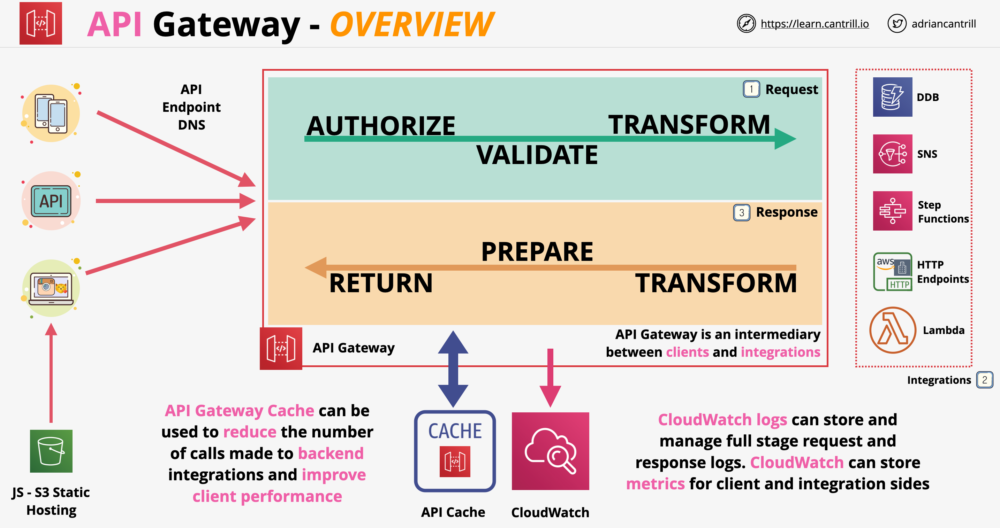

# API Gateway

- É um serviço que nos permite criar e gerenciar APIs
- O API Gateway atua como endpoint ou ponto de entrada de aplicativos que desejam falar com nossos serviços
- Fica entre o aplicativo e as integrações (serviços)
- O API Gateway é altamente disponível (HA) e escalável
- Lida com autorização, limitação (throttling), cache, CORS, transformações
- Também suporta a especificação OpenAPI e integração direta com outros serviços da AWS
- O API gateway é um serviço público
- Ele pode fornecer APIs usando REST e WebSocket
- Visão geral do API Gateway:
    

## Autenticação

- O API Gateway suporta uma variedade de tipos de autenticação, como Cognito, autenticação baseada em Lambda (Autenticação baseada em cliente - podemos assumir que o cliente usa um token Bearer) e credenciais do IAM
- Podemos permitir que as APIs tenham acesso aberto sem autenticação

## Tipos de Endpoint

- **Otimizado para Borda (Edge-Optimized)**: qualquer solicitação de entrada é roteada para o POP (ponto de presença) mais próximo do CloudFront
- **Região (Region)**: endpoint da região para clientes na mesma região, não utiliza o endpoint do CloudFront
- **Privado (Private)**: endpoints acessíveis apenas em uma VPC por meio de endpoints de interface

## Estágios (Stages)

- Quando implantamos uma configuração de API, estamos fazendo isso em um estágio
- Exemplo: podemos ter estágio prod/dev com configurações e urls exclusivos
- As implantações podem ser revertidas em um estágio
- Nos estágios, podemos habilitar implantações canário (canary deployments). Quando ativado, a implantação será feita no canário e não no próprio estágio
- A distribuição de tráfego pode ser alterada entre o estágio canário e o base
- O estágio canário pode ser promovido para base

## Erros

- `4XX` - Erros do cliente: solicitação inválida do lado do cliente
- `5XX` - Erros do servidor: solicitação válida, problema no backend
- `400 - Bad Request`: erro genérico do lado do cliente
- `403 - Access Denied`: autorizador nega a solicitação, a solicitação é filtrada pelo WAF
- `429` - O API Gateway pode limitar (throttle): isso significa que excedemos uma quantidade especificada de solicitações
- `502 - Bad Gateway Exception`: saída inválida retornada pelo Lambda
- `503 - Service Unavailable`: o endpoint de suporte está offline
- `504` - Falha de Integração/Tempo Limite (limite de 29s)

## Cache (Caching)

- O cache é configurado por estágio
- Podemos definir um cache em um estágio (500 MB até 237 GB)
- O valor padrão do TTL do cache é 300 segundos, configurável entre 0 e 3600s. Pode ser criptografado
- As chamadas só chegarão ao backend em caso de falha no cache (cache miss)

## Métodos e Recursos (Methods and Resources)

- Exemplo de URL do API Gateway: `https://1nj7i16t37.execute-api.us-east-1.amazonaws.com/dev/listcats`
- A URL pode representar o seguinte: `[api-gateway-endpoint]/[estágio]/[recurso]`
- Estágios são configurações lógicas. APIs são implantadas em estágios. Estágios podem ser usados para diferentes versões de aplicativos ou pontos de ciclo de vida de uma API
- Alterações na API só entram em vigor depois de implantadas em um estágio
- Os métodos são a ação desejada a ser executada. Os métodos são verbos HTTP
- Métodos são onde as integrações são configuradas, as quais fornecem a funcionalidade de uma API. Os métodos podem se integrar com Lambda, HTTP e outros serviços da AWS

## Integrações

- O API Gateway é capaz de se conectar ao Lambda, Endpoints HTTP (rodando localmente ou na AWS), Step Functions, SNS, DynamoDB
- As APIs têm 3 fases:
    - Solicitação: autorizar, validar e transformar a solicitação
    - Integrações
    - Resposta: transformar, preparar e retornar a resposta
- As fases de solicitação e resposta são divididas em 2 partes:
    - Solicitação de Método (Method Request): define tudo sobre a solicitação do cliente para o método (caminho, cabeçalhos, parâmetros)
    - Solicitação de Integração (Integration Request): parâmetros da solicitação de método são transferidos para as integrações
    - Resposta de Integração (Integration Response): converte os dados do backend em uma forma que possa ser enviada de volta ao cliente
    - Resposta de Método (Method Response): como a comunicação é entregue de volta ao cliente
- Métodos de API que estão no lado do cliente decidem como é a solicitação do cliente para o método. Existem integrados a um endpoint de backend por meio de integrações
- Tipos de integração:
    - **MOCK**: usado para testes, nenhum back-end envolvido. Ele retorna uma resposta estática
    - **HTTP**: integração personalizada HTTP, backend é um endpoint HTTP. Temos que configurar a solicitação de integração e a resposta de integração
    - **HTTP Proxy**: subtipo de integração HTTP, mas onde o proxy é utilizado. Permite o acesso a endpoint HTTP com uma integração simplificada. O proxy é onde a solicitação é passada para o endpoint como está e enviada de volta ao cliente como está
    - **AWS**: permite que uma API exponha serviços da AWS. Temos que configurar a solicitação e a resposta de integração e configurar mapeamentos necessários da solicitação de método para a solicitação de integração. Pode ser usado com funções Lambda, mas é uma maneira relativamente complexa de usá-lo com o Lambda
    - **AWS_PROXY (LAMBDA)**: solicitação/resposta de integração não precisam ser definidas, o API Gateway passa a solicitação não modificada
- Modelo de mapeamento (Mapping template): usado para integrações não proxy. Usado para:
    - Modificar ou renomear parâmetros
    - Modificar o corpo ou o cabeçalho da solicitação
    - Filtragem - remover qualquer coisa da solicitação

## Modelos de Mapeamento (Mapping Templates)

- Usados para integrações AWS e HTTP (não proxy)
- São capazes de modificar e renomear parâmetros entre as integrações
- Podem modificar o corpo ou os cabeçalhos de uma solicitação
- Podem fornecer filtragem, removendo qualquer coisa que não seja necessária
- O mapeamento usa VTL (Velocity Template Langue) para editar a solicitação
- Casos de uso para modelos de mapeamento:
    - Integrar uma API REST no API Gateway com uma API SOAP

## Estágios e Implantações (Stages and Deployments)

- Ao editar uma API, estamos editando configurações que não estão ativas (não publicadas)
- O estado atual da API precisa ser implantado em um estágio
- Cada estágio tem sua própria configuração. As configurações não são imutáveis, podem ser modificadas, substituídas ou revertidas
- Variáveis de estágio: variáveis de ambiente para estágios

## Swagger e OpenAPI

- OpenAPI (OAS) define uma interface padrão agnóstica de linguagem para APIs RESTful
- OpenAPI v2 é formalmente conhecido como Swagger
- OpenAPI v3 é uma versão mais recente
- OpenAPI define endpoints, operações (GET, POST, etc.), parâmetros de entrada e saída e métodos de autenticação
- O API Gateway é capaz de importar o formato OpenAPI e gerá-lo. Útil para backups e migrações

---

# API Gateway

- Is a service which lets us create and manage APIs
- API Gateway acts as endpoint or entry-point applications which want to talk with our services
- Sits between the application and integrations (services)
- API Gateway is HA and scalable
- Handles authorization, throttling, caching, CORS, transformations
- It also supports the OpenAPI spec and direct integration with other AWS services
- API gateway is a public service
- It can provide APIs using REST and WebSocket
- API Gateway overview:
    

## Authentication

- API Gateway supports a range of authentication types such as Cognito, Lambda based authentication (Custom based authentication - we can assume the client uses a Bearer token) and IAM credentials
- We can allow APIs to be open access without authentication

## Endpoint Types

- **Edge-Optimized**: any incoming request is routed to the nearest CloudFront POP (point of presence)
- **Region**: region endpoint for clients in the same region, it does not utilize the CloudFront endpoint
- **Private**: endpoints only accessible in a VPC via interface endpoints

## Stages

- When we deploy an API configuration, we are doing it into a stage
- Example we can have prod/dev stage with uniq settings and urls
- Deployments can be rolled back on a stage
- On stages we can enable canary deployments. When enabled, the deployment will be made to the canary not the stage itself
- Traffic distribution can be altered between canary and base stage
- Canary stage can be promoted to base

##  Errors

- `4XX` - Client errors: invalid request on the client side
- `5XX` - Server errors: valid request, backend issue
- `400 - Bad Request`: generic client side error
- `403 - Access Denied`: authorizer denies request, request is WAF filtered
- `429` - API Gateway can throttle: this means we have exceeded a specified amount of requests
- `502 - Bad Gateway Exception`: bad output returned by Lambda
- `503 - Service Unavailable`: backing endpoint is offline
- `504` - Integration Failure/Timeout (29s limit)

## Caching

- Caching is configured per stage
- We can define a cache on a stage (500 MB up to 237 GB)
- Cache TTL default value is 300 seconds, configurable between 0 and 3600s. Can be encrypted
- Calls only will reach the backend in case of a cache miss

## Methods and Resources

- API Gateway URL example: `https://1nj7i16t37.execute-api.us-east-1.amazonaws.com/dev/listcats`
- The URL can be represents the following: `[api-gateway-endpoint]/[stage]/[resource]`
- Stages are logical configurations. APIs are deployed into stages. Stages can be used for different application versions or lifecycle points for an API
- API changes only take effect after it is deployed into a stage
- Methods are the desired action to be performed. Methods are HTTP verbs
- Methods are where integrations are configured which provide the functionality of an API. Methods can integrate with Lambda, HTTP and other AWS services

## Integrations

- API Gateway is capable of connecting to Lambda, HTTP Endpoints (running on-premises or on AWS), Step Functions, SNS, DynamoDB
- APIs have 3 phases:
    - Request: authorize, validate and transform the request
    - Integrations
    - Response: transform, prepare and return the response
- The request and response phases are split into 2 parts:
    - Method Request: defines everything about the client request to method (path, headers, parameters)
    - Integration Request: parameters from the method request are transferred to the integrations
    - Integration Response: converts the data from the backend to a form which can be sent back to the client
    - Method Response: how the communication is delivered back to the client
- API methods which are on the client side decide what the client request to method is like. There are integrated to a backend endpoint via integrations
- Integration types:
    - **MOCK**: used for testing, no backed involved. It returns a static response
    - **HTTP**: http custom integration, backend is a HTTP endpoint. We have to configure both integration request and integration response
    - **HTTP Proxy**: subtype of the HTTP integration, but where proxying is utilized. Allows the access HTTP endpoint with a streamline integration. Proxying is where the request is passed to the endpoint as is and sent back to the client as is
    - **AWS**: allows an API to expose AWS services. We have to configure both the integration request and response and setup necessary mappings from the method request to the integration request. Can be used with Lambda functions, but it is relatively complex way of using it with Lambda
    - **AWS_PROXY (LAMBDA)**: integration request/response does not have to be defined, API Gateway passes the request unmodified
- Mapping template: used for non-proxy integrations. Used for:
    - Modify or rename parameters
    - Modify the body or header of the request
    - Filtering - remove anything from the request

## Mapping Templates

- Used for AWS and HTTP (non proxy) integrations
- It is able modify and rename parameters between the integrations
- It can modify the body or the headers of a request
- It can provide filtering by removing anything which is not needed
- Mapping uses VTL (Velocity Template Langue) for editing the request
- Use cases for mapping templates:
    - Integrate a REST API on API Gateway with a SOAP API

## Stages and Deployments

- Editing an API, we are editing settings which are not live (not published)
- The current state of the API needs to be deployed to a stage
- Each stage has its own configuration. Configurations are not immutable, can be modified, overwritten or rolled back
- Stage variables: environment variables for stages

## Swagger and OpenAPI

- OpenAPI (OAS) defines a standard language-agnostic interface to RESTful APIs
- OpenAPI v2 is formerly known as Swagger
- OpenAPI v3 is a more recent version
- OpenAPI defines endpoints, operation (GET, POST, etc.), input and output parameters and authentication methods
- API Gateway is capable of import OpenAPI format and generating it. Useful for backups and migrations