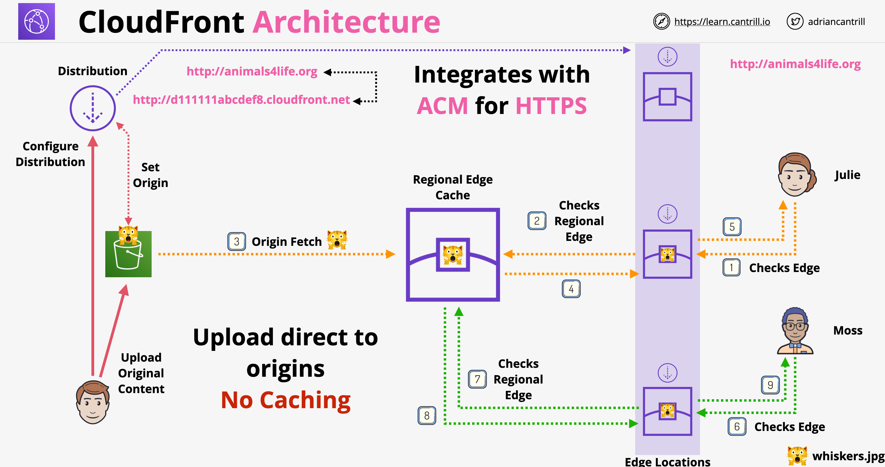
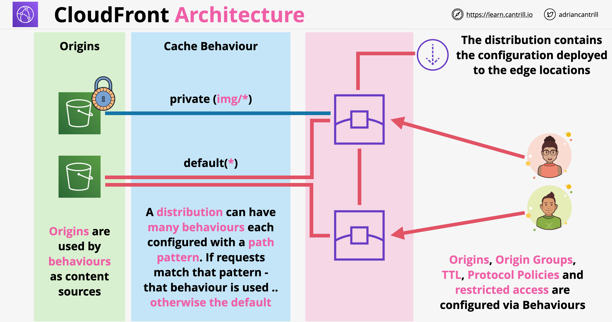
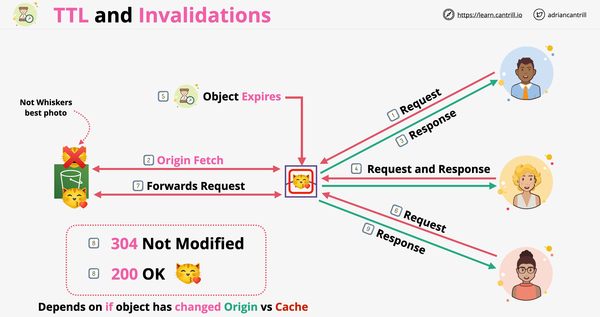
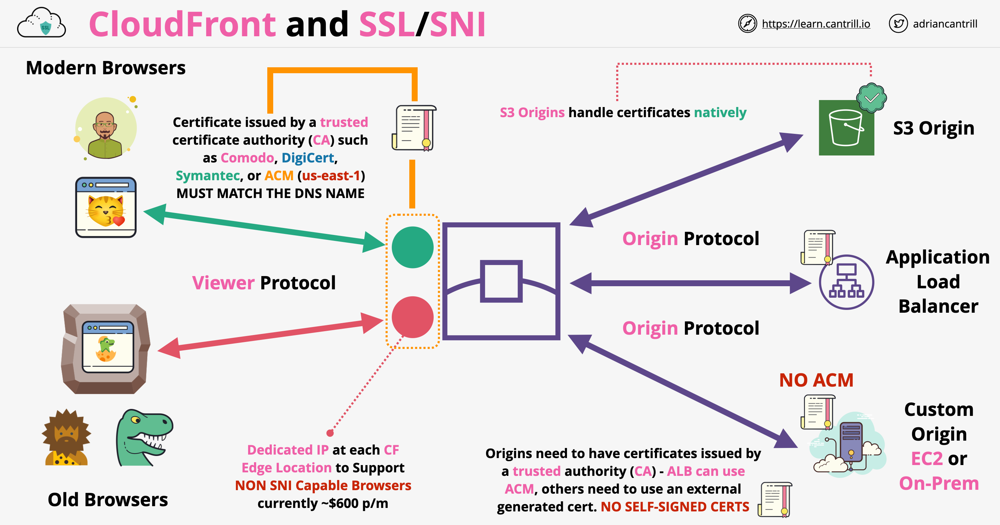
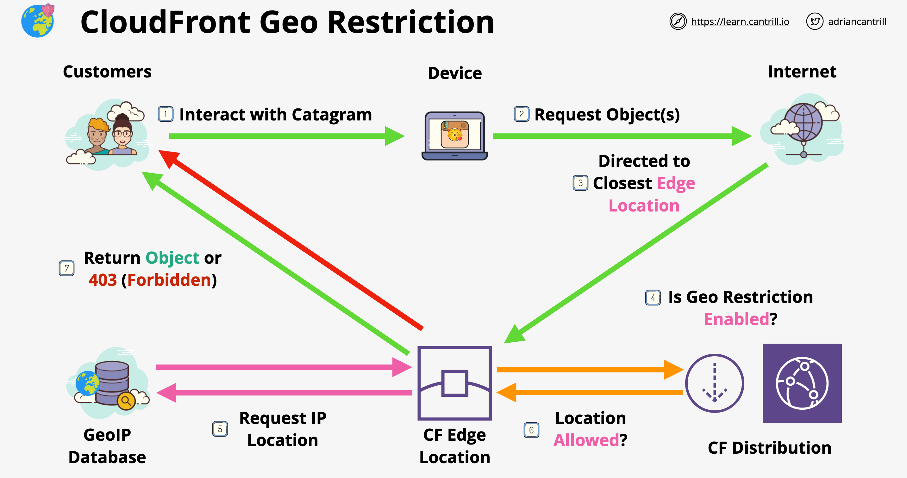
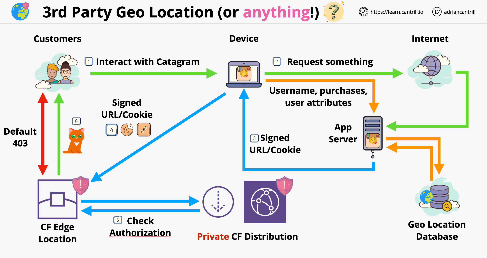
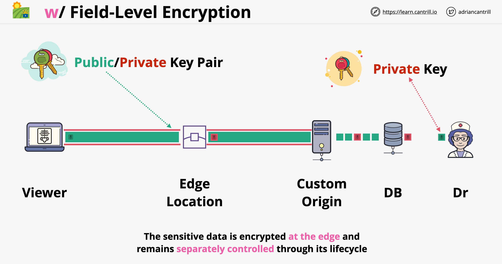

# CloudFront

- É uma rede de entrega de conteúdo (Content Delivery Network - CDN)
- Seu trabalho é melhorar a entrega de conteúdo desde o seu local original (origem) até os visualizadores (viewers) do conteúdo
- Consegue isso através do uso de cache e de uma rede global eficiente

## Termos e Arquitetura do CloudFront

- **Origem (Origin)**: o local de origem do conteúdo, pode ser o S3 ou origem personalizada (endereço IPv4 roteável publicamente)
- **Distribuição (Distribution)**: unidade de configuração dentro do CloudFront, que é implantada na rede do CloudFront. Quase tudo é configurado dentro da distribuição de forma direta ou indireta
- **Local de Borda (Edge Location)**: partes da infraestrutura global onde o conteúdo é armazenado em cache. Eles são menores do que as regiões da AWS. Estão presentes em um número muito maior do que os locais da AWS e são mais amplamente distribuídos. Podem ser usados para distribuir apenas dados estáticos
- **Cache de Borda Regional (Regional Edge Cache)**: versão maior de um edge location, mas em menor quantidade. Fornece outra camada de cache
- Arquitetura do CloudFront:
    
- Se usarmos origens do S3, o cache de borda regional não será usado caso ocorra uma falha de cache (cache miss) no edge location. Apenas origens personalizadas (custom origins) podem usar o cache de borda regional!
- **Busca na Origem (Origin fetch)**: o conteúdo é buscado na origem em caso de falha de cache no edge location
- **Comportamento (Behavior)**: é a configuração dentro de uma distribuição. As origens estão diretamente vinculadas aos comportamentos, e os comportamentos estão vinculados às distribuições
    

## Comportamentos (Behaviors) do CloudFront

- Distribuições são unidades de configuração no CF; muitas opções de alto nível são configuradas no nível da distribuição:
    - Classe de preço (Price class)
    - Anexação de Web Application Firewall
    - Nomes de domínio alternativos (Alternate domain names)
    - Tipo de certificado SSL
    - Configuração SNI
    - Política de segurança
    - Versões HTTP suportadas
    - etc.
- Uma única distribuição pode ter um comportamento padrão (default behavior) ou vários comportamentos
- Qualquer requisição recebida é combinada com o padrão do comportamento
- O comportamento padrão tem um padrão curinga (`*`) e corresponderá a qualquer coisa que não tenha sido combinada com outro comportamento mais específico
- Quando uma requisição corresponde ao padrão de um comportamento, ela fica sujeita às configurações desse comportamento, que podem ser as seguintes:
    - Origem ou grupo de origens
    - Política de protocolo do visualizador (Viewer protocol policy - redirecionar HTTP para HTTPS)
    - Métodos HTTP permitidos
    - Criptografia em nível de campo (Field level encryption)
    - Diretivas de cache - podemos usar:
        - Configurações de cache herdadas (Legacy cache settings)
        - Política de cache e política de requisição de origem (recomendado pela AWS)
    - TTL (mínimo, máximo, padrão)
    - Restringir o acesso do visualizador a um comportamento: define todo o comportamento como restrito ou privado. Se selecionarmos isso, precisaremos especificar o tipo de autorização confiável (trusted authorization), que pode ser:
        - Grupos de chaves confiáveis (Trusted key groups - recomendado pela AWS)
        - Assinante confiável (Trusted signer - legado)
    - Compactar objetos automaticamente
    - Associar função Lambda@Edge

## TTL e Invalidações

- Um edge location vê um objeto como não expirado quando ele está dentro do seu período TTL
- Maior frequência de acertos de cache (cache hits) = menores cargas na origem
- O período de validade padrão de um objeto (TTL) é de 24 horas. Isso é definido no comportamento
- TTL Mínimo, TTL máximo: define os valores mínimo ou máximo que o TTL de um objeto individual pode ter
- Valores de TTL específicos do objeto podem ser definidos pelas origens usando cabeçalhos (headers) diferentes:
    - Cache-Control `max-age` (segundos): valor de TTL em segundos para um objeto
    - Cache-Control `s-maxage` (segundos): mesmo que `max-age`
    - Expires (Data e Hora): data e hora de expiração
- Para todos esses cabeçalhos, se eles especificarem um valor fora do intervalo mínimo e máximo, o valor mín/máx será usado
- Cabeçalhos personalizados para origens do S3 podem ser configurados nos metadados do objeto
- Invalidações de cache são executadas numa distribuição e aplicam-se a todos os edge locations (isso leva tempo)
- A invalidação do cache invalida todos os objetos, independentemente do valor de TTL, com base no padrão de invalidação
- Há um custo associado quando a invalidação é aplicada. Esse custo é o mesmo, independentemente do número de arquivos que invalidamos
- Em vez de invalidação, podemos considerar usar **nomes de arquivo versionados**
- Nomes de arquivo versionados também ajudam a:
    - Evitar o uso de cache local do navegador no caso de um arquivo mais novo
    - Melhorar o registro (logging)
    - Reduzir custos, pois não há necessidade de invalidação manual
- O versionamento de objetos do S3 e os nomes de arquivo versionados não devem ser confundidos!

## CloudFront e SSL

- Cada distribuição CF recebe um nome de domínio padrão (CNAME)
- O HTTPS pode ser habilitado por padrão para este endereço
- O CF permite nomes de domínio alternativos (CNAME)
- Processo de adição de nomes de domínio alternativos:
    - Se usarmos HTTPS, precisamos de um certificado aplicado à distribuição que corresponda a esse nome
    - Mesmo que não queiramos usar o HTTPS, precisamos de uma maneira de verificar se possuímos e controlamos o domínio. Isso é conseguido adicionando um certificado SSL que corresponda ao nome que estamos adicionando à distribuição CF
    - O resultado é que precisamos adicionar um certificado SSL quer usemos HTTPS ou não
- Certificados SSL são importados usando o ACM (AWS Certificate Manager)
- O ACM é um serviço regional; por causa disso, o certificado para serviços globais (como o CF) precisa ser importado na região *us-east-1*
- Opções que podemos definir num comportamento CF para lidar com HTTP e HTTPS:
    - Podemos permitir HTTP e HTTPS em uma distribuição
    - Podemos redirecionar HTTP para HTTPS
    - Podemos restringir para permitir apenas HTTPS (qualquer HTTP falhará)
- Existem dois conjuntos de conexões quando qualquer indivíduo está usando o CF:
    - Viewer (Visualizador) => CF (protocolo do viewer)
    - CF => Origin (origem) (protocolo de origem)
- Ambas as conexões precisam de certificados públicos válidos, bem como quaisquer certificados intermediários. Certificados autoassinados (self-signed) não funcionarão!
- Se nossa origem for o S3, não precisamos nos preocupar com esse certificado para o protocolo da origem. O S3 lida com isso nativamente por conta própria. Não precisamos/não podemos aplicar certificados a buckets S3

## CloudFront e SNI (Server Name Indication)

- Historicamente, todo site habilitado para SSL precisava de seu próprio IP
- A criptografia para HTTP/HTTPS acontece no nível de conexão TCP
- O cabeçalho do host acontece depois disso na Camada 7. Ele permite especificar a qual aplicativo queremos nos conectar, caso vários aplicativos rodem no mesmo servidor
- A criptografia TLS ocorre antes de decidir a qual aplicativo queremos acessar
- Em 2003, uma extensão foi adicionada ao TLS: SNI - permitindo especificar a qual domínio queremos acessar. Isso ocorre no TLS handshake, antes que o HTTP se envolva
- Isso permite que um servidor com um único IP hospede muitos sites HTTPS que precisam de seus próprios certificados
- Navegadores mais antigos não suportam SNI necessariamente. O CF precisa alocar endereços IP dedicados para esses usuários, por um custo extra
- O CF pode ser usado no modo SNI (grátis) ou alocando endereços IP extras (US$ 600 por mês, por distribuição)
- Arquitetura SSL/SNI do CloudFront:
    
- Para origem S3, não precisamos aplicar certificados para o protocolo de origem. Para ALB/EC2/on-prem podemos ter certificados públicos que precisam corresponder ao nome DNS da origem

## Tipos de Origem e Arquitetura

- Origens são os locais para onde o CF vai para obter conteúdo
- Se houver uma falha de cache no caso de uma requisição, uma busca na origem (origin fetch) ocorre
- Os grupos de origem (Origin groups) nos permitem adicionar resiliência. Podemos agrupar origens e ter um grupo de origens usado pelo comportamento
- Categorias de origens:
    - Buckets do Amazon S3
    - Endereço (endpoint) do canal do AWS Media Package
    - Endereço (endpoint) do contêiner do AWS Media Store
    - Tudo o mais (servidores web - web-servers) - origens personalizadas (custom origins)
- Se o S3 estiver configurado para ser usado como um servidor web, o CF o verá como uma origem personalizada
- Opções de configuração de origem S3:
    - Caminho da Origem (Origin Path): podemos usar um caminho no bucket em vez do nível raiz do bucket
    - Configurações de controle de acesso original (Original access control settings): é usado para restringir o acesso ao bucket apenas ao CloudFront. A versão legada disso era a Identidade de Acesso de Origem (Origin Access Identity)
    - Origin Access Identity (legado): mesma finalidade do origin access control
    - Adicionar cabeçalhos personalizados (opcional): podemos passar cabeçalhos customizados para o bucket S3 de origem
- No caso do S3, o protocolo do visualizador é combinado com o protocolo da origem. Isso significa que, se usarmos HTTP para os usuários finais, o CF também usará HTTP para acessar o bucket
- Opções de configuração de origens personalizadas (Custom origin):
    - Caminho da Origem (Origin Path): podemos configurar o uso de um subcaminho para acessar a origem
    - Minimum Origin SSL Protocol (Protocolo SSL de Origem Mínimo): versão mínima do protocolo TLS a ser usada com a origem. A melhor prática é selecionar a mais recente compatível com a origem
    - Origin Protocol Policy (Política de Protocolo de Origem): apenas HTTP, apenas HTTPS ou Match Viewer protocol policy (Corresponder à política de protocolo do visualizador)
    - Porta HTTP/HTTPS: podemos usar uma porta arbitrária em vez de 80 ou 443 para conseguir conectar-se à origem
    - Cabeçalhos Personalizados de Origem (Origin Custom Headers): passa cabeçalhos personalizados para a origem. Pode ser usado como segurança para restringir acesso apenas a partir do CF

## Desempenho e Otimização de Cache

- Cache Hit (Acerto de Cache): o objeto está disponível no cache do edge location
- Cache Miss (Falha de Cache): o objeto não está disponível no cache, a busca na origem é necessária
- Para aumentar o desempenho, precisamos maximizar a taxa (ratio) entre cache hit e cache miss
- Podemos recuperar objetos do CF com base nisto:
    1. Quando requeremos um objeto do CF, geralmente o solicitamos usando o nome
    2. Também podemos usar parâmetros de string de consulta (query string parameters), exemplo: `index.html&lang=en`
    3. Cookies
    4. Request Headers (Cabeçalhos da Requisição)
- Ao usar o CF, todos esses dados chegam primeiro ao CloudFront e, em seguida, podem ser encaminhados para a origem
- Podemos configurar o CF para armazenar dados em cache com base em algumas ou em todas essas propriedades de requisição
- Essas escolhas afetam a performance com que a recuperação de dados da nossa distribuição CF será feita
- Recomendações de otimização:
    - Ao usar o CF, devemos encaminhar apenas os cabeçalhos necessários pelo aplicativo e dados de cache com base apenas no que pode alterar o objeto
    - Quanto mais coisas estiverem envolvidas no armazenamento em cache, menos eficiente será o processo

## Segurança do CloudFront

### OAI/OAC e Origens Personalizadas

- Origens S3:

    - OAI - Origin Access Identity (legado): 
        - É um tipo de identidade, pode ser associada com distribuições CloudFront
        - Essencialmente a distribuição CloudFront "torna-se" o OAI, o que significa que essa identidade pode ser usada em políticas de bucket S3
        - O padrão comum é bloquear o bucket S3 para ser acessível apenas pelo CloudFront
        - Os edge locations adquirem a identidade OAI vinculada, o que significa que eles conseguirão acessar o bucket
        - O acesso direto do usuário final ao conteúdo do bucket pode ser desabilitado com uma política de bucket
        - Os OAIs podem ser criados e usados em várias distribuições CF e vários buckets ao mesmo tempo. É mais fácil gerenciar um OAI com uma distribuição CF
    - OAC - Origin Access Control (recomendado):
        - Usado para a mesma finalidade do OAI - restringir o acesso ao bucket apenas ao CF
        - Se habilitado, o CF assinará cada solicitação ao bucket S3
        - Uma vez ativado, precisaremos ajustar a política do bucket para permitir requisições da distribuição CF
- Origens personalizadas:
    - Não podemos usar o OAI para controlar o acesso!
    - Podemos utilizar cabeçalhos personalizados, que serão protegidos pelo protocolo HTTPS. O CloudFront será configurado para enviar este cabeçalho customizado
    - Outra maneira de lidar com a segurança do CloudFront a partir de origens personalizadas é determinar os intervalos de IP dos quais a solicitação está vindo. Os intervalos de IP do CloudFront estão disponíveis publicamente

### Distribuições Privadas

- O CloudFront pode rodar em 2 modos diferentes:
    - Público: pode ser acessado por qualquer visualizador
    - Privado: as solicitações para o CloudFront precisam ser feitas com um URL assinado (signed URL) ou cookie assinado
- Se a distribuição CloudFront tiver apenas 1 comportamento, toda a distribuição é considerada pública ou privada
- No caso de vários comportamentos: cada comportamento pode ser público ou privado
- Há duas maneiras de configurar comportamentos privados no CF:
    - A forma antiga: para habilitar a distribuição privada de conteúdo, precisamos criar uma **CloudFront Key** (Chave CloudFront) pelo Usuário Raiz da Conta (Account Root User). Essa conta é adicionada como um **Trusted Signer** (Assinante Confiável)
    - A nova (preferencial) forma:
        - Crie Grupos de Chaves Confiáveis (Trusted Key Groups) e atribua signatários a eles
        - Os grupos de chaves determinam quais chaves podem ser usadas para criar urls assinados e cookies assinados
        - Algumas razões pelas quais podemos usar isso em vez da abordagem herdada:
            - Não precisamos que o usuário raiz da conta gerencie as chaves do CF
            - Podemos gerenciar grupos de chaves com a API do CF e podemos associar um número maior de chaves com a nossa distribuição/comportamento, oferecendo mais flexibilidade
- Signed URLs vs Cookies:
    - URLs assinados fornecem acesso a um objeto específico
    - Devemos usar URLs assinados se o cliente não oferecer suporte a cookies
    - Os cookies assinados podem fornecer acesso a grupos de objetos ou a todos os arquivos de um tipo específico
    - Com cookies assinados, podemos manter o URL do aplicativo se isso for importante

### Restrição Geográfica (Geo Restriction) do CloudFront

- Oferece uma maneira de restringir o conteúdo a um local específico
- Existem 2 tipos de restrição:
    - CloudFront Geo Restriction (Restrição Geográfica do CloudFront):
        - Lista Branca (Whitelist) ou Lista Negra (Blacklist) de países
        - **Funciona apenas com países!**
        - Usa um banco de dados GeoIP com 99,8% de precisão alegada
        - Aplica-se a toda a distribuição
        
    - 3rd Party Geolocation (Geolocalização de Terceiros):
        - Totalmente personalizável, pode ser usada para filtrar por muitos outros atributos, exemplo: nome de usuário, atributos de usuário, etc.
        - Exige um servidor de aplicativos na frente do CloudFront, que controla se o cliente tem ou não acesso ao conteúdo
        - O aplicativo gera um url/cookie assinado que é retornado ao navegador. Isso pode ser enviado ao CloudFront para autorização
        

### Criptografia em Nível de Campo (Field-Level Encryption)

- Podemos configurar a criptografia nos edge locations para certos campos do request usando uma chave pública
- Útil para criptografar dados confidenciais como senhas, informações de pagamento, etc. diretamente nos edge locations
- A criptografia em nível de campo acontece separadamente do túnel HTTPS
- Uma chave privada é necessária para descriptografar os campos individuais
- A descriptografia dos campos criptografados pode ser feita na origem, se necessário
- Arquitetura de criptografia em nível de campo:
    

## Lambda@Edge

- O Lambda@Edge nos permite executar funções Lambda leves nos locais de borda (edge locations)
- Essas funções Lambda nos permitem ajustar dados entre o visualizador e a origem
- Funções Lambda que rodam na borda (edge) não possuem o conjunto completo de recursos Lambda:
    - Atualmente, apenas NodeJS e Python são suportados
    - As funções não têm acesso a nenhum recurso em uma VPC, elas rodam no espaço público da AWS
    - Lambda Layers não são suportadas
- Elas têm limites diferentes de tamanho e duração em comparação com as funções clássicas do Lambda:
    - Lado do Viewer (Visualizador): 128 MB de limite em tamanho / o timeout (tempo limite) da função é de 5 segundos
    - Lado da Origem (Origin): o tamanho da função é o mesmo do Lambda clássico / o timeout (tempo limite) da função é de 30 segundos
- Casos de uso do Lambda@Edge:
    - Teste A/B - geralmente feito com uma função de Requisição do Visualizador (Viewer Request). A função Lambda pode visualizar a solicitação do usuário e pode modificar a resposta de forma correspondente
    - Migração entre origens S3 - geralmente feita com uma função de Requisição de Origem (Origin Request)
    - Objetos diferentes com base no tipo de dispositivo - geralmente feito com uma função Origin Request
    - Conteúdo exibido por país - geralmente feito com uma função Origin Request
    - Mais exemplos: [https://docs.aws.amazon.com/AmazonCloudFront/latest/DeveloperGuide/lambda-examples.html#lambda-examples-redirecting-examples](https://docs.aws.amazon.com/AmazonCloudFront/latest/DeveloperGuide/lambda-examples.html#lambda-examples-redirecting-examples)

---

# CloudFront

- It is a content deliver network (CDN)
- Its job is to improve the delivery of content from its original location to the viewers of the content
- It is accomplishing this by caching and by using an efficient global network

## CloudFront Terms and Architecture

- **Origin**: the source location of the content, can be S3 or custom origin (publicly routable IPv4 address)
- **Distribution**: unit of configuration within CloudFront, which gets deployed out to the CloudFront network. Almost everything is configured within the distribution directly or indirectly
- **Edge Location**: pieces of global infrastructure where the content is cached. They are smaller than AWS regions. They are way bigger in number than AWS locations and more widely distributed. Can be used to distribute static data only
- **Regional Edge Cache**: larger version of an edge location, but there are fewer of them. Provides another layer of caching
- CloudFront Architecture:
    
- If we are using S3 origins, the region edge location is not used in case there is a cache miss for the edge location. Only custom origin can use the regional edge cache!
- **Origin fetch**: the content is fetched from the origin in case of a cache miss on the edge location
- **Behavior**: it is configuration within a distribution. Origins are directly linked to behaviors, behaviors are linked to distributions
    

## CloudFront Behaviors

- Distributions are units of configuration in CF, lots of high level options are configured on the distribution level:
    - Price class
    - Web Application Firewall attachment
    - Alternate domain names
    - Type of SSL certificate
    - SNI configuration
    - Security policy
    - Supported HTTP versions
    - etc.
- A single distribution can have one (default behavior) or multiple behaviors
- Any incoming request is pattern matched against behavior's pattern
- The default behavior has a wildcard (`*`) pattern and it will match anything that was not matched by other more specific behavior
- Once a request is pattern matched against a behavior, it will become subject ot the behavior's configurations which can be the following:
    - Origin or origin group
    - Viewer protocol policy (redirect HTTP to HTTPS)
    - Allowed HTTP methods
    - Field level encryption
    - Cache directives - we can use:
        - Legacy cache settings
        - Cache policy nad origin request policy (recommended by AWS)
    - TTL (min, max, default)
    - Restrict viewer access to a behavior: sets the entire behavior to restricted or private. If we select this , we need to specify the trusted authorization type, which can be:
        - Trusted key groups (recommended by AWS)
        - Trusted signer (legacy)
    - Compress objects automatically
    - Associate Lambda@Edge function

## TTL and Invalidations

- And edge location views an object as not expired when it is within its TTL period
- More frequent cache hits = lower origin loads
- Default validity period of an object (TTL) is 24 hours. This is defined in the behavior
- Minimum TTL, maximum TTL: set lower or upper values which an individual object's TTL can have
- Object specific TTL values can be set by the origins using different headers:
    - Cache-Control `max-age` (seconds): TTL value in seconds for an object
    - Cache-Control `s-maxage` (seconds): same as `max-age`
    - Expires (Date and Time): expiration date and time
- For all of these headers if they specify a value outside of minimum, maximum range, the min/max value will be used
- Custom headers for S3 origins can be configured in object's metadata
- Cache invalidations are performed in a distribution and it applies to all edge locations (it takes time)
- Cache invalidation invalidates every object regardless of the TTL value, based on the invalidation pattern
- There is a cost allocated when invalidation is applied. This cost is the same regardless of the number of files we invalidate
- Instead of invalidation we may consider **versioned file names**
- Versioned file names also help to:
    - Avoid using local browser cache in case of a newer file
    - Help improve logging
    - Reduce cost, no need for manual invalidation
- S3 object versioning and versioned file names should not be confused!

## CloudFront and SSL

- Each CF distribution receives a default domain name (CNAME)
- HTTPS can be enabled by default for this address
- CF allows alternate domain names (CNAME)
- Process of adding alternate domain names:
    - If we use HTTPS, we need a certificate applied to the distribution which matches that name
    - Even if we don't want to use HTTPS, we need a way verifying that we own and control the domain. This is accomplished by adding an SSL certificate which matches the the name we are adding to the CF distribution
    - The result is we need to add an SSL certificate wether we are using HTTPS or not
- SSL certificates are imported using ACM (AWS Certificate Manager)
- ACM is a regional service, because of this the certificate for global services (such as CF) needs to be imported in *us-east-1* region
- Option we can set on a CF behavior for handling HTTP and HTTPS:
    - We can allow both HTTP and HTTPS on a distribution
    - We can redirect HTTP to HTTPS
    - We can restrict to only allow HTTPS (any HTTP will fail)
- There are two sets of connections when any individual is using CF:
    - Viewer => CF (viewer protocol)
    - CF => Origin (origin protocol)
- Both connections need valid public certificates as well as any intermediate certificates. Self-signed certificates will not work!
- If our origin is S3, we don't have to worry about this certificate for the origin protocol. S3 handles this natively on it own. We don't/can't apply certificates to S3 buckets

## CloudFront and SNI (Server Name Indication)

- Historically every SSL enabled site needed its own IP
- Encryption for HTTP/HTTPS happens on the TCP connection level
- Host header happens after that at Layer 7. It allows to specify to which application we want to connect in case multiple applications run on the same server
- TLS encryption happens before deciding which application we want to access
- In 2003 an extension was added to TLS: SNI - allowing to specify which domain we want to access. This occurs in the TLS handshake, before HTTP being involved
- This allows one server with a single IP to host many HTTPS websites which need their own certificates
- Older browser do not necessary support SNI. CF needs to allocate dedicated IP addresses for these users, at extra charge
- CF can be used in SNI mode (free) or allocating extra IP addresses ($600 per month per distribution)
- CloudFront SSL/SNI architecture:
    
- For S3 origin, we don't need to apply certificates for the origin protocol. For ALB/EC2/on-prem we can have public certificates which needs to match the DNS name of the origin

## Origin Types and Architecture

- Origins are the locations from where CF goes to get content
- If there is a cache miss in case of a request, than an origin fetch occurs
- Origin groups allow us to add resiliency. We can group origins together an have an origin group used by the behavior
- Categories of origins:
    - Amazon S3 buckets
    - AWS media package channel endpoint
    - AWS media store container endpoint
    - everything else (web-servers) - custom origins
- If S3 is configured to be used as a web-server, CF views it as a custom origin
- S3 origin configuration options:
    - Origin Path: we can use a path from the bucket instead of the top level of the bucket
    - Original access control settings: it is used to restrict access to the bucket only to CloudFront. The legacy version of this was Origin Access Identity
    - Origin Access Identity (legacy): same purpose as the origin access control
    - Add custom headers (optional): we can pass custom headers to the origin S3 bucket
- In case of S3 the viewer protocol is matched with the origin protocol. This means if we use HTTP for the end-users, CF will also use HTTP to access the bucket
- Custom origin configuration options:
    - Origin Path: we can configure to use a sub-path to access the origin
    - Minimum Origin SSL Protocol: minimum TLS protocol version to be used with the origin. Best practice is to select the latest supported by the origin
    - Origin Protocol Policy: HTTP only, HTTPS only or Match Viewer protocol policy
    - HTTP/HTTPS Port: we can use arbitrary port instead of 80 or 443 for being able to connect to the origin
    - Origin Custom Headers: pass custom headers to the origin. Can be used for security to restrict access only from CF

## Caching Performance and Optimization

- Cache Hit: object is available in the cache in the edge location
- Cache Miss: object is not available in the cache, origin fetch is required
- To increase performance we need the maximize the ration between cache hit and cache miss
- We can retrieve objects from CF based on these:
    1. When we require an object from CF, we usually request it using its name
    2. We can use query string parameters as well, example `index.html&lang=en`
    3. Cookies
    4. Request Headers
- When using CF all of this data reaches CloudFront first and than can be forwarded to the origin
- We can configure CF to cache data based on some or all of these request properties
- These choices affect how performant would be the data retrieval from our CF distribution
- Optimization recommendations:
    - When using CF we should forward only the headers needed by the application and cache data based only on what can change the object
    - The more things are involved in caching, the less efficient the process is

## CloudFront Security

### OAI/OAC and Custom Origins

- S3 origins:

    - OAI - Origin Access Identity (legacy): 
        - Is a type of identity, it can be associated with CloudFront distributions
        - Essentially the CloudFront distributions "becomes" the OAI, meaning that this identity can be used in S3 bucket policies
        - Common pattern is to lock the S3 bucket to be only accessible to CloudFront
        - The edge locations gains the attached OAI identity, meaning they will be able to access the bucket
        - Direct access from the end-user to the bucket content can be disabled with a bucket policy
        - OAIs can be created and used one many CF distributions and many buckets at the same time. It is easier to manage one OAI with one CF distribution
    - OAC -  Origin Access Control (recommended):
        - Used for the same purpose as OAI - restrict access to bucket to CF only
        - If enabled CF will sign each request to S3 bucket
        - Once enabled, we will have to adjust the bucket policy to allow request from the CF distribution
- Custom origins:
    - We can not use OAI to control access!
    - We can utilize custom headers, which will be protected by the HTTPS protocol. CloudFront will be configured to send this custom header
    - Other way to handle CloudFront security from custom origins is to determine the IP ranges from which the request is coming from. CloudFront IP ranges are publicly available

### Private Distributions

- CloudFront can run in 2 different modes:
    - Public: can be accessed by any viewer
    - Private: requests to CloudFront needs to be made with a signed url or cookie
- If the CloudFront distribution has only 1 behavior the whole distribution is considered to be either public or private
- In case of multiple behaviors: each behavior can be either public or private
- There are 2 ways two configure private behaviors in CF:
    - The old way: in order to enable private distribution of content, we need to create a **CloudFront Key** by an Account Root User. That account is added as a **Trusted Signer**
    - The new (preferred) way:
        - Create Trusted Key Groups and assign them signers
        - They key groups determine which keys can be used to create signed urls and signed cookies
        - Few reasons we might use this compared to the legacy approach:
            - We don't need the root user from the account to manage CF keys
            - We can manage keys groups with CF API and we can associate a higher number of keys with our distribution/behavior giving us more flexibility
- Signed URLs vs Cookies:
    - Signed URLs provide access to one particular object
    - We should use signed urls if the client does not support cookies
    - Signed cookies can provide access to groups of objects or all files of a particular type
    - With signed cookies we can maintain the application's URL if this is important

### CloudFront Geo Restriction

- Gives a way to restrict content to a particular location
- They are 2 types of restriction:
    - CloudFront Geo Restriction:
        - Whitelist or Blacklist countries
        - **Only works with countries!**
        - Uses a GeoIP database with 99.8% claimed accuracy
        - Applies to the entire distribution
        
    - 3rd Party Geolocation:
        - Completely customizable, can be used to filter on lots of other attributes, example: username, user attributes, etc.
        - Requires an application server in front of CloudFront, which controls weather the customer has access to the content or not
        - The application generates a signed url/cookie which is returned to the browser. This can be sent to CloudFront for authorization
        

### Field-Level Encryption

- We can configure encryption ath the edge location for certain fields from the request using a public key
- Useful for encrypting sensitive data such as passwords, payment information, etc. at the edge locations
- Field-Level encryption happens separately from the HTTPS tunnel
- A private key is needed to decrypt individual fields
- Decryption of the encrypted fields can be done at the origin, if necessary
- Field-Level encryption architecture:
    

## Lambda@Edge

- Lambda@Edge allows us to run lightweight Lambda functions at the edge locations
- These Lambda functions allow us to adjust data between the viewer and the origin
- Lambda functions running at the edge don't have the full Lambda feature set:
    - Currently only NodeJS and Python are supported
    - Functions don't have access to any resources in a VPC, they run in AWS public space
    - Lambda Layers are not supported
- They have different size and duration limits compared to classic Lambda functions:
    - Viewer side: 128 MB limit in size / function timeout is 5 seconds
    - Origin side: function size is the same as classic Lambda / function timeout is 30 seconds
- Lambda@Edge use cases:
    - A/B testing - generally done with Viewer Request function. Lambda function can view the request from the viewer and can modify the response accordingly
    - Migration between S3 origins - generally done with an Origin Request function
    - Different objects based on the type of device - generally done with an Origin Request function
    - Content displayed by country - generally done with an Origin Request function
    - More examples: [https://docs.aws.amazon.com/AmazonCloudFront/latest/DeveloperGuide/lambda-examples.html#lambda-examples-redirecting-examples](https://docs.aws.amazon.com/AmazonCloudFront/latest/DeveloperGuide/lambda-examples.html#lambda-examples-redirecting-examples)