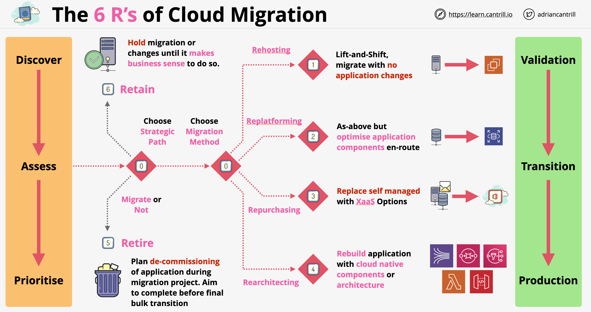

# Os 6 Rs das Migrações para a Nuvem

- São um conjunto de 6 estratégias diferentes de migração de sistemas para a nuvem
- O ponto de partida de uma migração é *descobrir*, *avaliar* e *priorizar* (discover, assess and prioritize) todos os aplicativos a serem migrados
- Uma vez feito isso, há 6 maneiras diferentes de fazer migrações:
    - **Rehosting (Re-hospedagem)**: lift and shift (elevar e mudar)
    - **Replatforming (Re-plataforma)**: lift and shift com otimizações
    - **Repurchase (Recompra)**: migrar o aplicativo usando algo mais novo, por exemplo, SaaS
    - **Refactoring / Re-architecting (Refatoração / Rearquitetura)**: aproveitar os recursos oferecidos pela nuvem
    - **Retire (Aposentadoria)**: descartar os aplicativos que não são mais necessários
    - **Retain (Retenção)**: não migrar o aplicativo, não vale o tempo e dinheiro ou é muito arriscado migrar

## Rehosting (Re-hospedagem)

- "Lift and shift" ou migrar como está (migrate as is): mover o aplicativo com o mínimo de alterações para a nuvem
- Geralmente usado com aplicativos legados ou monolíticos
- Razões para fazer o rehosting de aplicativos:
    - Reduzir a sobrecarga de administração (admin overhead) usando IaaS
    - Potencialmente mais fácil otimizar o aplicativo quando ele está rodando na nuvem em comparação a trabalhar com ferramentas legadas
    - Redução de custos (cost savings), consumindo um certo tipo de instâncias
- Pontos negativos:
    - Não poderemos aproveitar todas as ofertas da Nuvem (Cloud offerings)
    - Potencialmente "empurrando com a barriga" - atrasando o que podemos fazer hoje para amanhã
- Para fazer o rehosting, podemos usar as ferramentas VM Import/Export e o Server Migration Service

## Replatforming (Re-plataforma)

- Semelhante ao rehosting com a adição de aplicar certas otimizações aos aplicativos como parte do processo de migração
- Podemos decidir usar o RDS em vez de instâncias de banco de dados autogerenciadas (self-managed)
- Podemos usar ELBs em vez de balanceadores de carga autogerenciados
- Podemos usar o S3 como armazenamento de backup ou mídia
- A abordagem de replataforma não traz desvantagens reais, mas também não traz benefícios que mudam o mundo
- Benefícios potenciais da migração:
    - Redução da sobrecarga administrativa
    - Benefícios de performance
    - Backups mais efetivos
    - HA/FT aprimorados (Alta Disponibilidade / Tolerância a Falhas)

## Repurchasing (Recompra)

- A menos que tenhamos um motivo para usar um aplicativo autogerenciado, preferiríamos usar produtos XaaS (Anything as a Service / Qualquer coisa como Serviço)
- Exemplos deste tipo de migrações:
    - MS Exchange => Microsoft 365
    - CRM autogerenciado => SalesForce
    - Folha de pagamento (payroll) autogerenciada => Xero
- Usar um serviço gerenciado reduz a sobrecarga de administração, os custos e os riscos. Quase sempre a opção preferida

## Refactoring / Re-architecting (Refatoração / Rearquitetura)

- Requer uma revisão completa da arquitetura de um aplicativo
- O objetivo é adotar uma arquitetura e produtos nativos da nuvem (cloud-native)
- Podemos pensar em adotar arquiteturas baseadas em microsserviços (microservice) e orientadas a serviços (service-oriented)
- Podemos adotar uma arquitetura mais baseada em APIs, arquitetura orientada a eventos ou arquitetura serverless (sem servidor)
- Essa abordagem é inicialmente muito cara e consome muito tempo
- A longo prazo, oferece os melhores benefícios em comparação a outros tipos de migrações
- Rodar um aplicativo cloud-native costuma ser mais barato, muito mais escalável, tem melhor HA/FT e os custos estão alinhados ao uso do app

## Retire (Aposentar)

- Muitas vezes, os sistemas estão em execução sem motivo nenhum
- Auditar seu uso geralmente dá mais trabalho do que deixá-los rodando
- Uma migração é o momento perfeito para reavaliar a utilidade de um aplicativo. Se não precisarmos dele, devemos desligá-lo
- Geralmente economiza de 10% a 20% do custo em caso de migração em larga escala

## Retain (Reter)

- Essencialmente, não fazer nada
- Para alguns aplicativos, o uso é incerto e possui alguns fatores complicadores que impedem a aposentadoria ou a migração para a nuvem
- Em outros casos, alguns aplicativos antigos podem ter algum uso, mas não valerá a pena o esforço para movê-los para a nuvem
- Ou podemos ter um aplicativo complexo - deixá-lo para mais tarde
- Aplicativos superimportantes - arriscado para mover
- O melhor conselho é concluir a migração de outros aplicativos e voltar para focar no que sobrou

## 6R Migration Plan (Plano de Migração 6Rs)

---

# The 6R's of Cloud Migrations

- Are a set of 6 different strategies of migrating systems into the cloud
- Starting point of a migration is the *discover*, *assess* and *prioritize* all the applications to migrate
- Once we have done this, there are 6 different ways of doing migrations:
    - **Rehosting**: lif and shift
    - **Replatforming**: lift and shift with optimizations
    - **Repurchase**: migrate the application while using something newer, example SaaS
    - **Refactoring / Re-architecting**: take advantage of the feature offered by the cloud
    - **Retire**: dump the applications which are no longer needed
    - **Retain**: do not migrate the application, not worth the time and money or it is too scary to migrate

## Rehosting

- Lift and shift or migrate as is: move the application with the least amount of changes into the cloud
- Generally used with legacy or monolithic applications
- Reasons to do application rehosting:
    - Reduce admin overhead using IaaS
    - Potentially easier to optimize the application when is running in the cloud compared to working with legacy tooling
    - Cost savings, consuming a certain type of instances
- Negatives:
    - We wont be able to take advantage of the full Cloud offerings
    - Potentially "kicking the can down the road" - delaying what we can do today until tomorrow
- For doing rehosting we can use VM Import/Export tools and Server Migration Service

## Replatforming

- Similar to rehosting with the addition of applying certain optimizations to the applications as part of the migration process
- We might decide to use RDS instead of self-managed database instances
- We might use ELBs instead of self managed load balancers
- We might use S3 as a backup or media storage
- Replatforming approach brings no real negatives but also no world-changing benefits
- Potential benefits of migration:
    - Admin overhead reduction
    - Performance benefits
    - More effective backups
    - Improved HA/FT

## Repurchasing

- Unless we have a reason to use self-managed application, we would rather use XaaS (Anything as a Service) products
- Examples of this kind of migrations:
    - MS Exchange => Microsoft 365
    - Self managed CRM => SalesForce
    - Self managed payroll => Xero
- Using a managed service reduces admin overhead, costs and risks. Almost always a preferred option

## Refactoring / Re-architecting

- Requires a full review of the architecture of an application
- The aim is to adopt cloud-native architecture and products
- We might look at adopting service-origin and microservice based architectures
- We might adopt a more API based architecture, event-driven architecture or serverless architecture
- This approach is initially very expensive and time-consuming
- In the long term it does offer the best benefits compared to other types of migrations
- Running a cloud-native application is often cheaper, much more scalable, has better HA/FT, costs are aligned with app usage

## Retire

- Systems are often running for no reasons
- Auditing their usage is often more work than leaving them to run
- A migration is perfect time to re-evaluate the usefulness of an application. If we don't need it, we should switch if off
- Often saves 10% to 20% cost in case of large scale migration

## Retain

- Essentially do nothing
- For some application the usage is uncertain with some complicating factors against being able to retire it or migrate it to the cloud
- In other cases some old applications might have some usage, but it wont worth the effort to move them to the cloud
- Or we might have a complex application - leave it till later
- Super-import application - risky to move
- The best advice is to complete the migration of other applications and swing back to focus on the left-overs

## 6R Migration Plan

