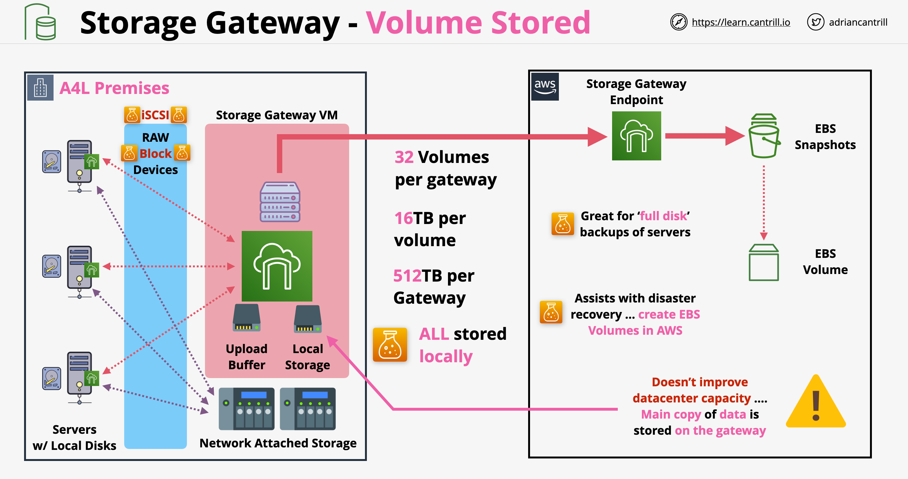
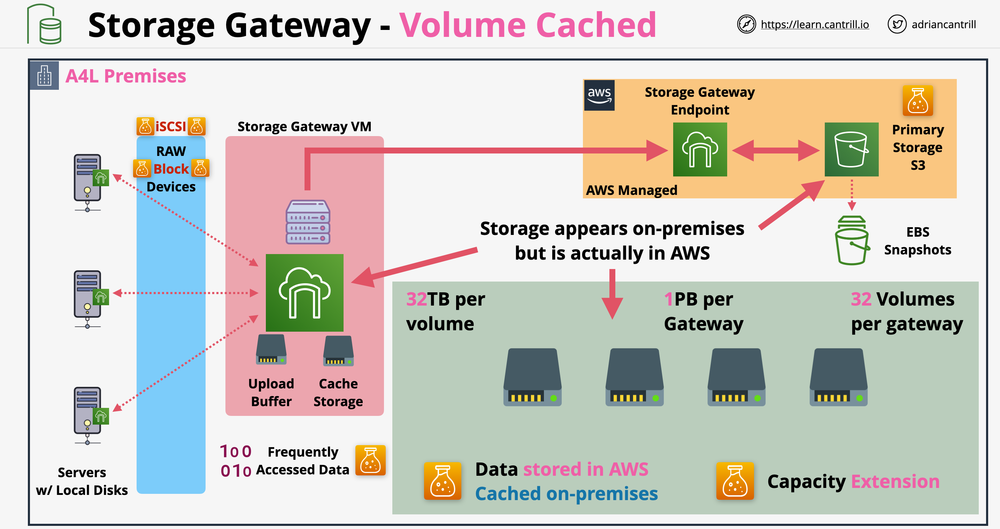
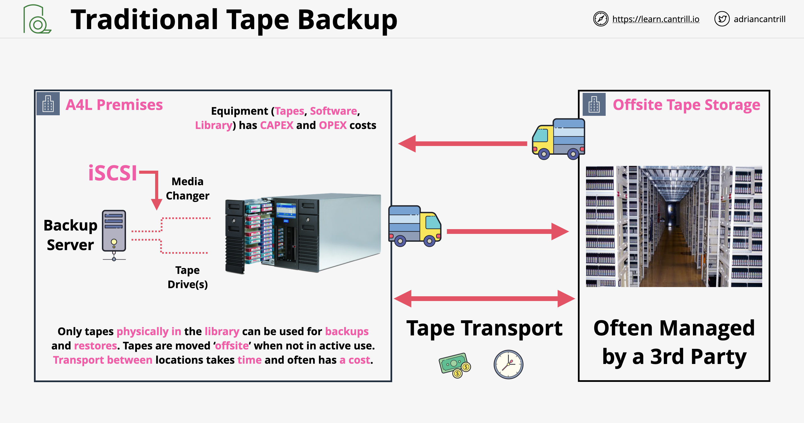
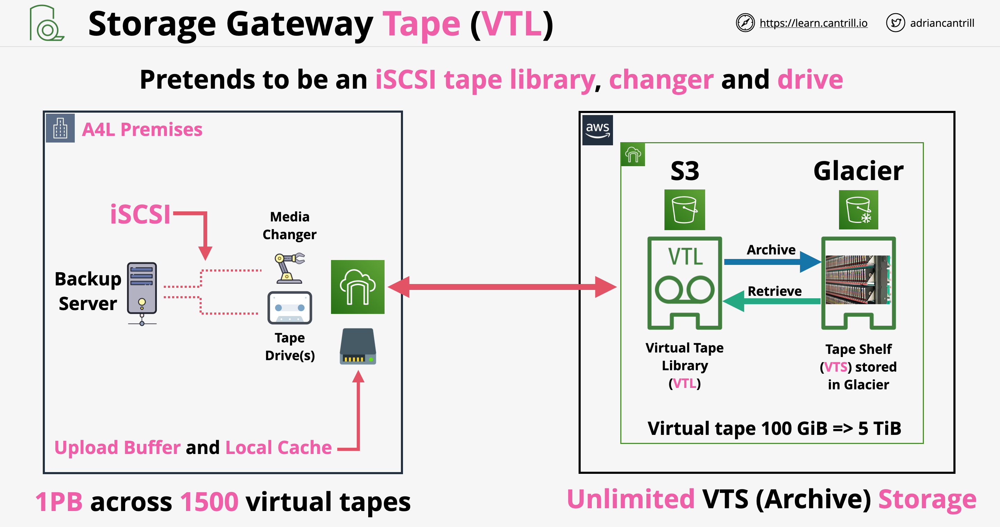
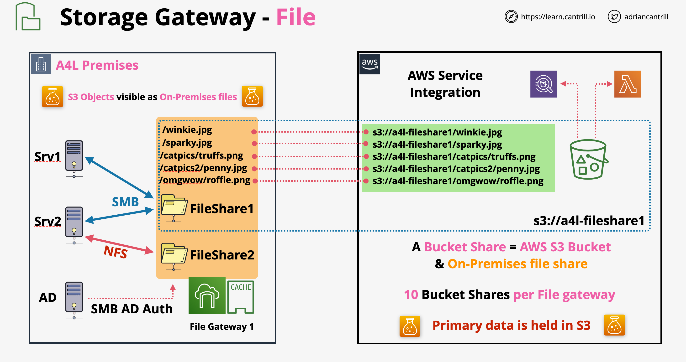

# Storage Gateway

- Normalmente roda como uma VM on-premises (ou appliance físico)
- Age como uma ponte entre o armazenamento que existe on-premises e a AWS
- Apresenta o armazenamento usando iSCSI, NFS ou SMB
- Na AWS se integra com EBS, S3 e Glacier
- Storage gateways são usados para migrações, extensões, tiering (camadas) de armazenamento, DR (Recuperação de Desastres) e substituição de sistemas de backup

## Volume Gateway (Gateway de Volume)

- Oferece 2 tipos diferentes de operação:
    - Modo de Volume Armazenado (Volume Stored Mode):
        - O virtual appliance apresenta volumes via iSCSI a servidores rodando on-premises (similar ao que um hardware NAS/SAN faria)
        - Servidores podem criar sistemas de arquivos (file systems) em cima desses volumes e usá-los de forma normal
        - Esses volumes consomem capacidade on-premises
        - O storage gateway possui armazenamento local, usado como armazenamento principal (primary storage), tudo é armazenado localmente
        - Upload buffer: quaisquer dados gravados no armazenamento local também são copiados no upload buffer e serão enviados para a nuvem de forma assíncrona por meio do endpoint do storage gateway
        - Os dados enviados são copiados no S3 como snapshots (instantâneos) EBS, que podem ser convertidos em volumes EBS
        - É ótimo para fazer backups completos de disco, oferecendo excelentes valores de RTO e RPO
        - O Modo de Volume Armazenado não permite estender a capacidade do data center! A cópia completa dos dados é armazenada localmente
        
    - Modo de Volume em Cache (Volume Cached Mode):
        - O Modo de Volume em Cache compartilha a mesma arquitetura básica do Modo Armazenado
        - O local principal dos dados não é mais on-premises, é no AWS S3
        - Ele possui um cache local para os dados armazenando apenas os dados acessados com frequência; os dados primários estarão no S3
        - Os dados serão armazenados na área gerenciada pela AWS do S3, o que significa que não serão visíveis usando a console da AWS. Eles podem ser vistos na console do storage gateway
        - Os dados são armazenados no estado bruto de bloco (raw block)
        - Podemos criar volumes EBS a partir dos dados
        - O Modo de Volume em Cache permite uma arquitetura conhecida como extensão de data center (data center extension)
        

## Modo Tape (Fita) - VTL Mode

- VTL - Virtual Tape Library (Biblioteca de Fita Virtual)
- Exemplos de backups em fita: mídia LTO-9 (Linear Tape Open) que pode armazenar 24TB de dados brutos (raw) por fita
- Tape Loader (Carregador de Fita/Robô): o braço do robô pode inserir/remover/trocar fitas
- Uma Library (Biblioteca) consiste em 1 ou mais unidades (drives), 1 ou mais carregadores e slots
- Arquitetura tradicional de backup em fita:
    
- Arquitetura do Modo de Fita do Storage Gateway (VTL):
    
- Uma fita virtual pode ter de 100 GiB a 5 TiB
- Um Storage Gateway pode suportar no máximo 1 PB de dados em 1500 fitas virtuais
- Quando as fitas virtuais não são usadas, elas podem ser exportadas no software de backup, marcando-as como não estando na biblioteca (equivalente a ejetá-las e movê-las para o armazenamento externo / offsite storage)
- Quando exportada, a fita virtual é arquivada na Virtual Shelf (Prateleira Virtual) que é baseada no Glacier
- O Storage Gateway em Modo VTL finge ser uma biblioteca de fitas iSCSI, um trocador de fita (tape change) e um drive iSCSI (sistema de backup físico em fita)
- Casos de uso:
    - Extensão do armazenamento de dados on-premises para a AWS
    - Migração de conjuntos históricos de backups em fita

## File Mode (Modo Arquivo)

- O Storage Gateway gerencia arquivos no File Mode
- O File Gateway (Gateway de Arquivos) atua como ponte entre o armazenamento de arquivos on-premises e o S3
- Com o File Gateway criamos um ou mais pontos de montagem (compartilhamentos - shares) disponíveis via NFS ou SMB
- Os File Gateways mapeiam diretamente para um bucket S3 sobre o qual temos visibilidade na console da AWS
- O File Mode usa Caching de Leitura e Gravação garantindo desempenho similar ao de uma LAN
- Arquitetura do File Gateway:
    
- Para ambientes Windows, podemos usar a autenticação do AD para acessar o File Gateway
- O File Mode pode ser usado para vários contribuidores (vários compartilhamentos on-premises)
- Caminhos de arquivo num File Gateway são mapeados diretamente para nomes de objetos do S3
- `NotifyWhenUploaded`: API para notificar outros gateways quando objetos são alterados
- O File Gateway não suporta nenhum tipo de bloqueio de objeto (object locking) => um gateway pode substituir/sobrescrever (override) arquivos de outro gateway. Devemos usar um modo somente leitura em outros compartilhamentos ou controlar rigorosamente o acesso aos arquivos
- O bucket que dá suporte ao File Gateway pode ser usado com replicação entre regiões (CRR - cross-region replication)
- As políticas de ciclo de vida (lifecycle policies) também podem ser usadas para os arquivos serem movidos automaticamente entre as classes (storage classes)

---

# Storage Gateway

- Normally runs as a VM on-premises (or hardware appliance)
- Acts as bridge between storage that exists on-premises and AWS
- Presents storage using iSCSI, NFS or SMB
- On AWS integrates with EBS, S3 and Glacier
- Storage gateways is used for migrations, extensions, storage tiering, DR and replacement of backup systems

## Volume Gateway

- Offers 2 different types of operation:
    - Volume Stored Mode:
        - The virtual appliance presents volumes over iSCSI to servers running on-premises (similar to what NAS/SAN hardware would)
        - Servers can create files systems on top of these volumes and use it in a normal way
        - These volumes consume capacity on-premises
        - Storage gateway has local storage, used as primary storage, everything is stored locally
        - Upload buffer: any data written to the local storage is also copied in the upload buffer and it will be uploaded to the cloud asynchronously via the storage gateway endpoint
        - The upload data is copied into S3 as EBS snapshots which can be converted into EBS volumes
        - It is great to do full disk backups, offering excellent RTO and RPO values
        - Volume Stored Mode does not allow extending the data center capacity! The full copy of the data is stored locally
        
    - Volume Cached Mode:
        - Volume Cached Mode shares the same basic architecture with Stored Mode
        - The main location of data is no longer on-premises, it is on AWS S3
        - It has a local cache for the data only storing the frequently accessed data, the primary data will be in S3
        - The data will be stored in AWS managed area of S3, meaning it wont be visible using the AWS console. It can be viewed from the storage gateway console
        - The data is stored in raw block state
        - We can create EBS volumes out of the data
        - Volume Cached Mode allows for an architecture know as data center extension
        

## Tape - VTL Mode

- VTL - Virtual Tape Library
- Examples of tape backups: LTO-9 (Linear Tape Open) Media which can hold 24TB raw data per tape
- Tape Loader (Robot): robot arm can insert/remove/swap tapes
- A Library is 1 ore more drives, 1 or more loaders and slots
- Traditional tape backup architecture:
    
- Storage Gateway Tape (VTL) Mode architecture:
    
- A Virtual tape can be from 100 GiB to 5 TiB
- A Storage Gateway can handle at max 1PB ot data across 1500 virtual tapes
- When virtual tapes are not used, they can be exported in the backup software marking them not being in the library (equivalent of ejecting them and moving them to the offsite storage)
- When exported, the virtual tape is archived in the Virtual Shelf which is backed by Glacier
- Storage Gateway in VTL Mode pretends to be a iSCSI tape library, tape change and iSCSI drive (physical tape backup system)
- Use cases: 
    - On-premises data storage extension into AWS
    - Migration of historical sets a tape backups

## File Mode

- Storage Gateway manages files in File Mode
- File Gateway bridges on-premises file storage and S3
- With File Gateway we create one or more mount points (shares) available via NFS or SMB
- File Gateways maps directly onto on S3 bucket above which we have visibility from the AWS console
- File Mode uses Read an Write Caching ensuring LAN-like performance
- File Gateway architecture:
    
- For Windows environments we can use AD authentication to access the File Gateway
- File Mode can be used for multiple contributors (multiple shares on-premises)
- File paths in a File Gateway map directly to S3 object names
- `NotifyWhenUploaded`: API to notify other gateways when objects are changed
- File Gateway does not support any kind of object locking => one gateway can override files from another gateway. We should use a read only mode on other shares or tightly control file access
- The bucket backing the File Gateway can be used with cross-region replication (CRR)
- The lifecycle policies can also be used for files to be moved automatically between classes