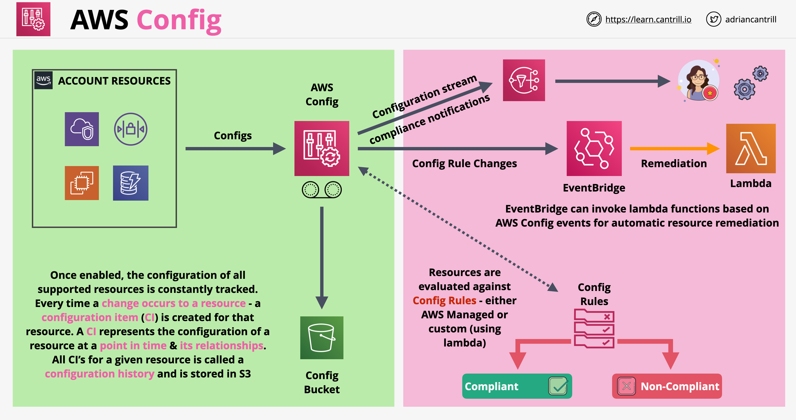

# AWS Config

- O AWS Config tem 2 trabalhos principais:
    - Primário: registrar alterações de configuração ao longo do tempo nos recursos da AWS. Cada vez que uma configuração é alterada num recurso, um item de configuração é criado, armazenando a alteração naquele ponto específico no tempo
    - Secundário: auditoria (auditing) de alterações, conformidade com os padrões
- O Config não impede que as alterações ocorram! Não é um produto de permissões ou de proteções. Mesmo que definamos padrões para os recursos, o Config pode verificar a conformidade com esses padrões, mas não nos impede de violá-los (braking those standards)
- O Config é um serviço regional, suporta agregações entre regiões (cross-region) e entre contas (cross-account)
- Alterações podem gerar notificações SNS e eventos em tempo quase real (near-realtime events) via EventBridge e Lambda
- O Config armazena alterações historicamente num formato consistente num bucket S3 do produto
- A gravação (recording) do Config precisa ser habilitada manualmente!
- Regras do Config (Config Rules):
    - Podem ser gerenciadas pela AWS (AWS managed) ou definidas pelo usuário usando Lambda
    - Os recursos são avaliados de acordo com essas regras, determinando se estão em conformidade (compliant) ou não conformidade (non-compliant)
    - Regras Customizadas (Custom Rules) usam o Lambda, a função faz a avaliação e retorna a informação de volta para o Config
- O Config pode ser integrado ao EventBridge, que pode ser usado para invocar funções Lambda para correção automática (automatic remediation)
- O Config também pode ter integração com o SSM para remediar (corrigir) problemas
- Arquitetura do AWS Config:
    

## Correções do AWS Config (AWS Config Remediations)

- Recursos não conformes (Non-compliant) podem ser corrigidos automaticamente usando documentos de Automação do System Manager (System Manager Automation documents)
- O AWS Config fornece um conjunto de documentos de automação gerenciados com ações de correção (remediation actions). Podemos criar documentos de correção personalizados

## Pacotes de Conformidade (Conformance Packs)

- Um pacote de conformidade é uma coleção de regras do AWS Config e ações de correção (remediation actions) que podem ser implantadas como uma única entidade numa conta/região ou em todo um AWS Organization
- Os pacotes de conformidade são criados por meio da autoria de um modelo (template) YAML que contém uma lista de regras do AWS Config e ações de correção

---

# AWS Config

- AWS Config has 2 main jobs:
    - Primary: record configuration changes over time on AWS resources. Every time a configuration is changed on a resource a configuration item is created which stores the change at that specific point in time
    - Secondary: auditing of changes, compliance with standards
- Config does not prevent changes from happening! It is not a permissions product or a protections product. Even if we define standards for resources, Config can check the compliance against those standards, but it does not prevent us from braking those standards
- Config is a regional service, supports cross-region and cross-account aggregations
- Changes can generate SNS notifications and near-realtime events via EventBridge and Lambda
- Config stores changes historically in a consistent format in an S3 product bucket
- Config recording has to be manually enabled!
- Config Rules:
    - Can be AWS managed ones or user defined using Lambda
    - Resources are evaluated against these rules determining if there are compliant or non-compliant
    - Custom Rules use Lambda, the function does the evaluation and returns the information back to Config
- Config can be integration to EventBridge which can be used to invoke Lambda functions for automatic remediation
- Config can also have integration with SSM to remediate issues
- AWS Config architecture:
    

## AWS Config Remediations

- Nom-compliant resources can be remediated automatically using System Manager Automation documents
- AWS Config provides a set of managed automation documents with remediation actions. We can create custom remediation documents

## Conformance Packs

- A conformance pack is a collection of AWS Config rules and remediation actions that can be deployed as a single entity in an account/region or across an AWS Organization
- Conformance packs are created by authoring a YAML template that contains a list AWS Config rules and remediation actions