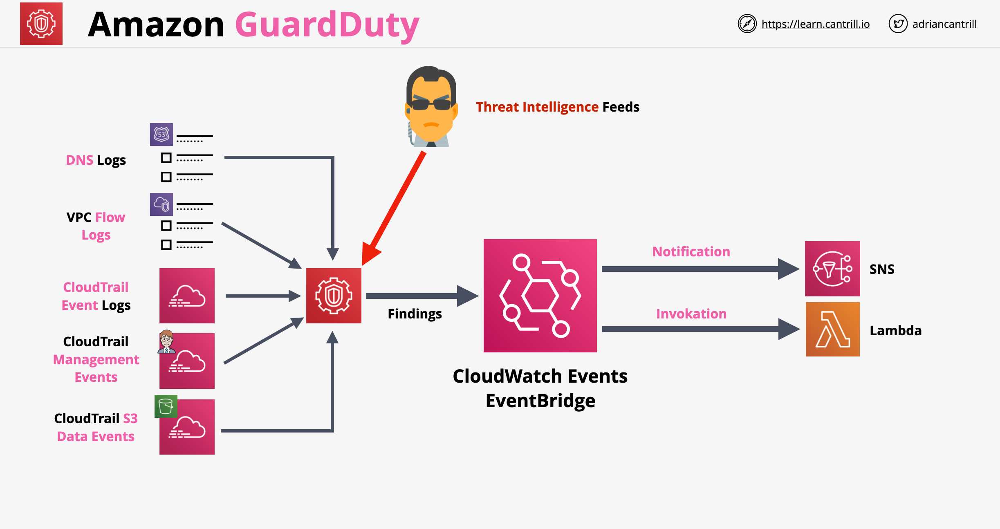

# AWS GuardDuty

- É um serviço de segurança usado para monitoramento contínuo de uma conta
- Pode ser integrado a fontes de dados suportadas, monitorando-as constantemente
- Usa IA/ML (Inteligência Artificial / Machine Learning) e feeds de inteligência de ameaças (threat intelligent feeds) para monitorar atividades suspeitas
- Identifica qualquer atividade inesperada e não autorizada e tenta detectar atividades estranhas
- Se encontrar algo, pode ser configurado para nos notificar ou para fazer proteção/remediação orientada a eventos (event-driven)
- Suporta várias contas (Contas Master e Member)
- Arquitetura do GuardDuty:
    

---

# AWS GuardDuty

- It is a security service used for continuous monitoring of an account
- It can be integrated with supported data sources, constantly monitoring them
- It uses AI/ML and thread intelligent feeds for monitoring for suspicious activities
- Identifies any unexpected and unauthorized activity and it tries to spot odd activities
- If it finds something, it can be configured to notify us or to do event-driven protection/remediation
- Supports multiple accounts (Master and Member accounts)
- GuardDuty architecture:
    