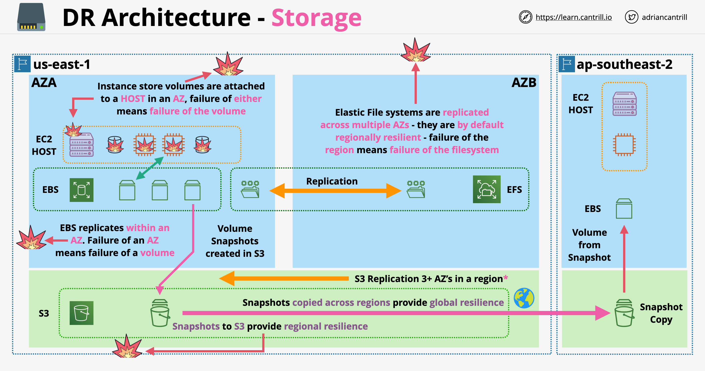
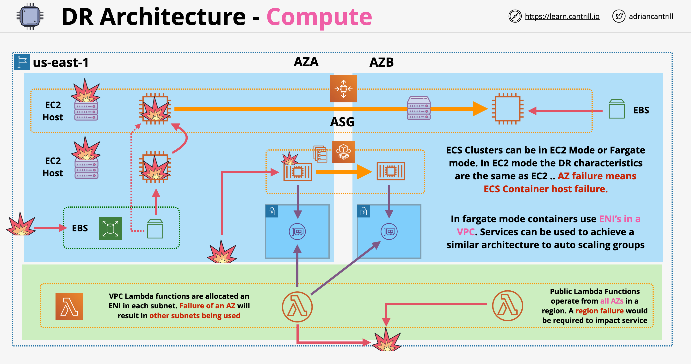
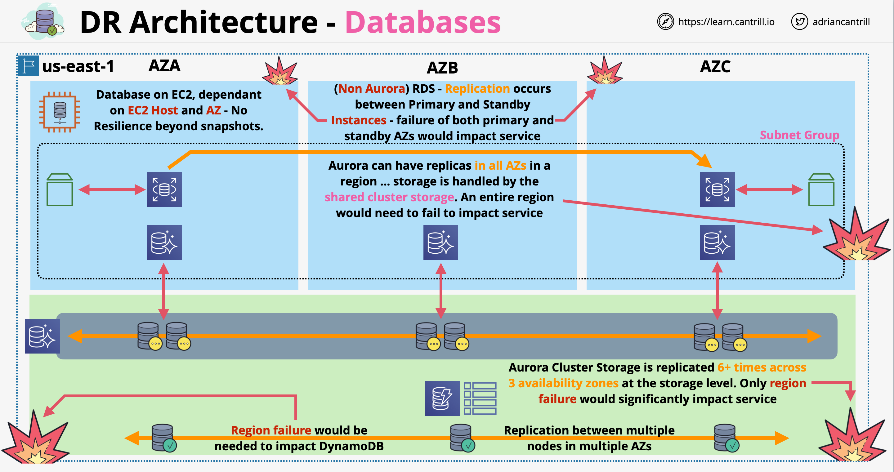
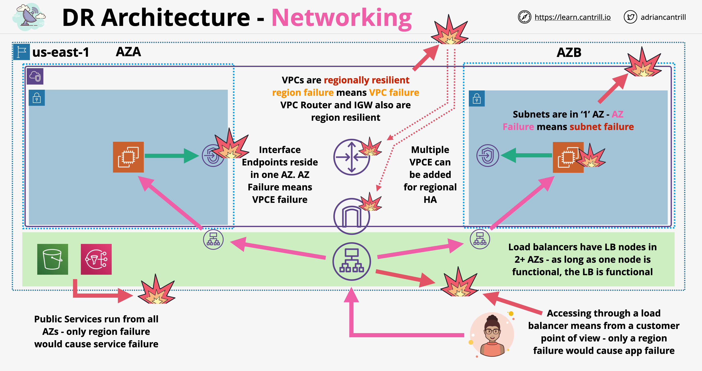

# Arquitetura de DR/BC (Recuperação de Desastres / Continuidade de Negócios)

- DR/BC eficaz custa dinheiro o tempo todo
- Precisamos de algum tipo de recursos extras que aumentarão os custos
- Executar o processo de recuperação de desastres/continuidade de negócios leva tempo. O tempo que leva depende do tipo de DR/BC em uso
- DR/BC é um trade-off (compromisso) entre tempo e custos

## Tipos de Recuperação de Desastres

- **Backup e Restauração (Backup and Restore)**:
    - O backup dos dados é feito constantemente no site principal
    - Os únicos custos são a mídia de backup e o gerenciamento, sem custos contínuos de infraestrutura de espaço
    - Tem pouco ou nenhum custo inicial (upfront), mas implica um tempo significativo para recuperação
    - O tempo de recuperação esperado é contado em horas
- **Luz Piloto (Pilot Light)**:
    - O site principal está rodando a todo vapor
    - Luz Piloto implica executar um ambiente secundário tendo apenas o mínimo absoluto de serviços rodando
    - No caso de um desastre, os serviços desligados podem ser iniciados (spined up); não são esperados custos caso não haja necessidade de DR
    - O tempo de recuperação esperado é de algumas dezenas de minutos
- **Warm Standby (Espera Quente)**:
    - O site principal está rodando a todo vapor, tudo é replicado no site de backup em menor escala
    - Pronto para ter o tamanho aumentado quando o failover for necessário
    - É mais rápido que a abordagem de luz piloto e mais barato que a abordagem ativo/ativo
    - O tempo de recuperação esperado é de alguns minutos
- **Ativo/Ativo (Multi-site):**
    - O site principal é totalmente replicado num site secundário
    - Os dados são constantemente replicados do site principal para o backup
    - Os custos são geralmente de 200%
    - Não existe conceito de tempo de recuperação
    - Benefícios adicionais:
        - Balanceamento de carga em todos os ambientes
        - Melhoria de HA (Alta Disponibilidade) e performance
- Resumo:
    - Backups: baratos e lentos
    - Pilot Light: razoavelmente barato, mas mais rápido
    - Warm Standby: custoso, mas rápido para recuperar
    - Active/Active: caro, tempo de recuperação 0

## Arquitetura DR - Armazenamento (Storage)

- Volumes Instance Store:
    - Forma de armazenamento de maior risco disponível
    - Se o host falhar, os volumes do instance store também falharão
    - Devem ser vistos como armazenamento temporário e não confiável
- EBS:
    - Volumes são criados e rodam em uma única AZ (falha da AZ significa falha nos volumes EBS)
    - Snapshots do EBS são armazenados no S3, o que aumentará a confiabilidade
- S3:
    - Os dados são replicados em várias AZs
    - One-Zone: não é regionalmente resiliente
- EFS:
    - Sistemas de arquivos EFS são replicados em várias AZs
    - Eles são, por padrão, regionalmente resilientes - a falha numa região significa a falha nos volumes EFS
- Arquitetura DR - Armazenamento:
    

## Arquitetura DR - Computação (Compute)

- EC2:
    - Se o host falhar, as instâncias EC2 falham também
    - Uma instância EC2 por si só não é resiliente de forma alguma
    - Se a falha for limitada a um host, a instância pode ser movida para outro host na AZ. O volume EBS pode ser apresentado (anexado) à nova instância
    - Auto Scaling Group: pode ser colocado em várias AZs; se a instância falhar numa AZ, a função do ASG é recriá-la em outra
- ECS:
    - Pode rodar em 2 modos: EC2 e Fargate
    - Modo EC2: a arquitetura DR é semelhante à acima
    - Modo Fargate: contêineres rodam em um host de cluster gerenciado pela AWS sendo injetados em VPCs
    - O Fargate pode fornecer HA automática rodando as coisas em AZs diferentes
- Lambda:
    - Por padrão roda no modo público (public mode)
    - No modo VPC (privado), as funções Lambda são injetadas nas VPCs. Se uma AZ falhar, a Lambda pode ser automaticamente injetada em outra sub-rede em uma AZ diferente
    - Seria necessária a falha de uma região inteira para que o Lambda fosse impactado
- Arquitetura DR - Computação:
    

## Arquitetura DR - Bancos de Dados (Databases)

- Executar bancos de dados no EC2 deve ser feito apenas em certos casos!
- DynamoDB:
    - Os dados são replicados entre vários nós (nodes) em diferentes AZs
    - A falha só pode ocorrer se a região inteira falhar
- RDS:
    - Requer a criação de um grupo de sub-redes (subnet group) que especifica qual sub-rede pode ser usada numa VPC para um Banco de Dados
    - O RDS normal (não Aurora) envolve uma única instância ou instância primária e standby rodando em AZs diferentes
    - Os dados são armazenados no armazenamento local para cada instância, os dados são replicados de forma assíncrona para a standby
    - Se a instância primária falhar, o fallback (failover) automático é feito para a standby
    - No caso do Aurora, podemos ter uma ou mais réplicas em cada AZ
    - O Aurora usa uma arquitetura de armazenamento em cluster; o armazenamento é compartilhado entre as instâncias de BD em execução
    - O Aurora pode resistir a falhas de até a falha de uma região inteira (sem usar o Aurora Global)
- Bancos de Dados Globais (Global Databases):
    - DynamoDB Global Table (Tabela Global): replicação multi-master (multimestre) entre réplicas regionais.
    - Aurora Global Databases: cluster de leitura-gravação (read-write) numa região, cluster de leitura secundário em outras regiões. A replicação acontece na camada de armazenamento, nenhuma carga extra (load) é colocada no BD
    - Cross Region Read Replicas for RDS (Réplicas de Leitura Inter-Regiões para RDS): replicação assíncrona, mas não feita na camada de armazenamento
- Arquitetura DR - Bancos de Dados:
    

## Arquitetura DR - Rede (Networking)

- Rede em nível local:
    - VPCs são regionalmente resilientes
    - Certos objetos de gateway como VPC Router e IGW também são regionalmente resilientes
    - As sub-redes (Subnets) estão vinculadas à AZ em que estão localizadas; se a AZ falhar, a sub-rede falha também
    - LB (Load Balancers): serviços regionais, nós são implantados em cada AZ que selecionarmos
    - Usando um LB podemos rotear o tráfego para as AZs que estão saudáveis
- Interface endpoint (Ponto de extremidade de interface):
    - Estão vinculados a uma AZ
    - Múltiplos interface endpoints podem ser implantados em diferentes AZs
- Arquitetura DR - Rede:
    
- Redes Globais (Global Networking):
    - O Route53 pode rotear globalmente para regiões diferentes (roteamento de failover - failover routing)

---

# DR/BC Architecture

- Effective DR/BC costs money all of the time
- We need some type of extra resources which will increase costs
- Executing disaster recover/business continuity process takes time. How long it takes depends on the type of DR/BC in usage
- DR/BC is trade-off between the time and costs

## Types of Disaster Recovery

- **Backup and Restore**:
    - Data is constantly backup up at the primary site
    - The only costs are backup media and management, no ongoing space infrastructure costs
    - Has little or no upfront costs, but implies a significant time for recovery
    - Expected recovery time is counted in hours
- **Pilot Light**:
    - Primary site is running at full
    - Pilot Light implies running a secondary environment only having the absolute minimum services running
    - In the event of a disaster the shutdown services can be spined up, no costs are expected to be inquired if there is no need for DR
    - Expected recovery time is a few 10s of minutes
- **Warm Standby**:
    - Primary site is running at full, everything is replicated on the backup site at a smaller scale
    - Ready to be increased in size when failover is required
    - It is faster than pilot light approach and cheaper than active/active approach
    - Expected recovery time is a few minutes
- **Active/Active (Multi-site):**
    - Primary site is entirely replicated on a secondary site
    - Data is constantly replicated from the primary site to the backup
    - Costs are generally 200%
    - There is no concept of recovery time
    - Additional benefits:
        - Load balancing across environments
        - Improved HA and performance
- Summary:
    - Backups: cheap and slow
    - Pilot Light: fairly cheap but faster
    - Warm Standby: costly, but quick to recover
    - Active/Active: expensive, 0 recovery time

## DR Architecture - Storage

- Instance Store volumes:
    - Most high risk form of storage available
    - If the host fails, the instance store volumes will also fail
    - Should be viewed as temporary and unreliable storage
- EBS:
    - Volumes are created an run in a single AZ (failure of AZ means failure of EBS volumes)
    - Snapshots of EBS are stored in S3, will increase reliability
- S3: 
    - Data is replicated across multiple AZs
    - One-Zone: not regionally resilient
- EFS:
    - EFS file systems are replicated across multiple AZs
    - They are by default regionally resilient - failure of a region means failure of EFS volumes
- DR Architecture - Storage:
    

## DR Architecture - Compute

- EC2:
    - If the host fails, EC2 instances fails as well
    - An EC2 instance by itself is not resilient in any way
    - If the failure is limited to one host, the instance can move to another host in the AZ. The EBS volume can be presented to the new instance
    - Auto Scaling Group: can be placed in multiple AZs, if the instance fails in one AZ, the ASG's role is to recreate them in another
- ECS:
    - Can run it 2 modes: EC2 and Fargate
    - EC2 mode: DR architecture is similar as above
    - Fargate mode: containers are running on a cluster host managed by AWS being injected in VPCs
    - Fargate can provide automatic HA by running things in different AZs
- Lambda:
    - By default runs in public mode
    - In VPC mode (private) Lambdas are injected in VPCs. If an AZ fails, Lambda can be automatically injected in another subnet in a different AZ
    - It will take the failure if a region in order for Lambda to be impacted
- DR Architecture - Compute:
    

## DR Architecture - Databases

- Running databases on EC2 should be done in certain cases only!
- DynamoDB:
    - Data is replicated between multiple nodes in different AZs
    - Failure can occur only if the entire region fails
- RDS:
    - Requires creation of a subnet group which specifies which subnet can be used in a VPC for a DB
    - Normal RDS (not Aurora) involves a single instance or primary and standby instance running in different AZs
    - Data is stored in local storage for each instance, data is replicated asynchronously to the standby
    - If the primary instance fails, automatic fallback is done to the standby
    - In case of Aurora, we can have one or more replicas in each AZs
    - Aurora uses a cluster storage architecture, storage is shared between running DB instances
    - Aurora can resist failures up to the entire region failure (not using Aurora Global)
- Global Databases:
    - DynamoDB Global Table: multi master replication between regional replicas.
    - Aurora Global Databases: read-write cluster in one region, secondary read cluster in other regions. Replication happens at the storage layer, no additional load placed on the DB
    - Cross Region Read Replicas for RDS: asynchronous replication but not done on the storage layer
- DR Architecture - Databases:
    

## DR Architecture - Networking

- Networking at local level:
    - VPC are regionally resilient
    - Certain gateway objects like VPC Router and IGW are also regionally resilient
    - Subnets are tied to AZ they are located in, if the AZ fails, the subnet fails as well
    - LB: regional services, nodes are deployed into each AZ we select
    - By using a LB we can route traffic to AZs which are healthy
- Interface endpoint:
    - Are tied to an AZ
    - Multiple interface endpoints can be deployed into different AZs
- DR Architecture - Networking:
    
- Global Networking:
    - Route53 can route globally to different regions (failover routing)