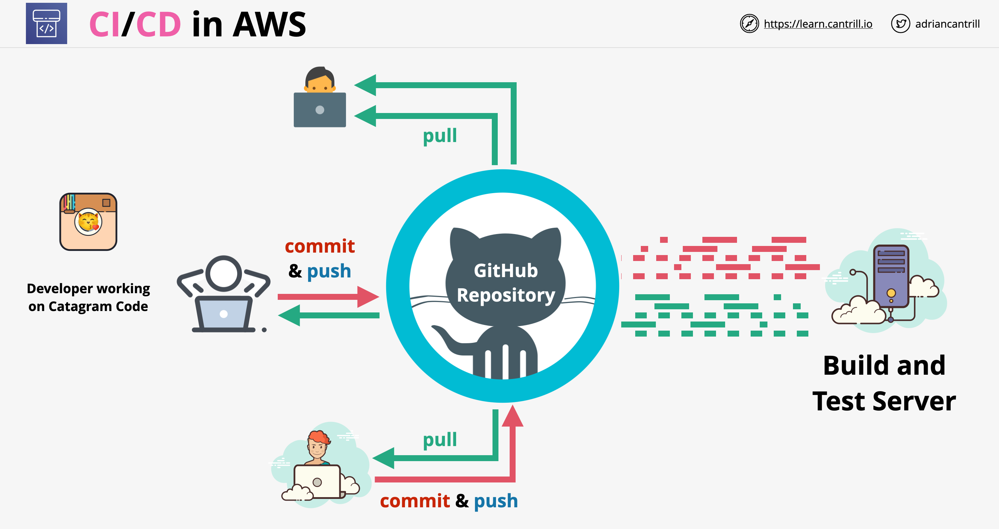
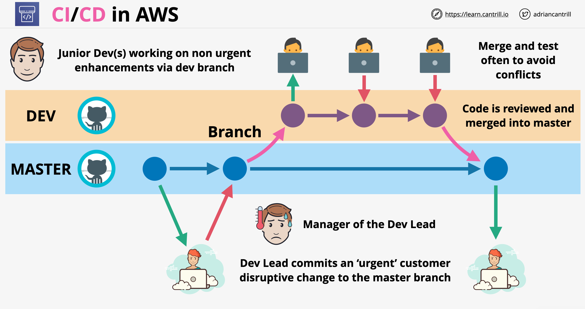
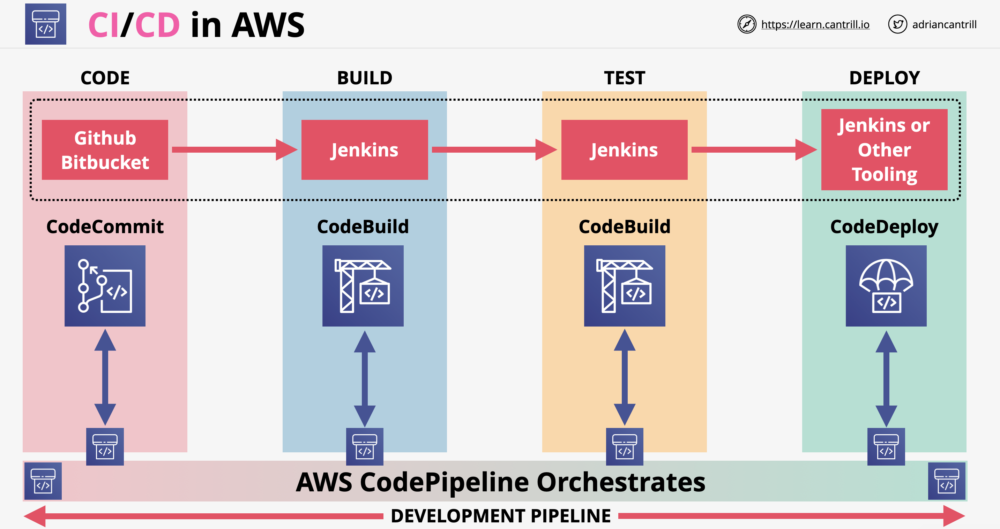
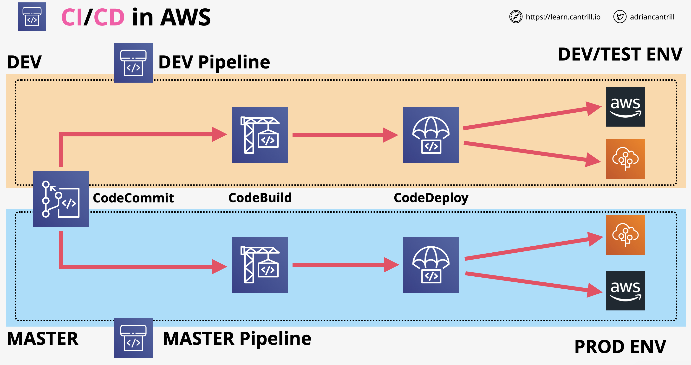

# CI/CD (Integração Contínua / Entrega Contínua)

- Arquitetura CI/CD:
    
- Arquitetura de ramificação (Branching architecture):
    
- Pipeline de código (Code pipeline):
    
- Cada pipeline tem estágios (stages)
- Cada pipeline deve estar vinculado a uma única ramificação (branch) num repositório
    
- Arquivos de configuração do CodeBuild/CodeDeploy:
    - `buildspec.yml, appspec.[yml|json]`
    - Referência para esses arquivos: [https://docs.aws.amazon.com/codedeploy/latest/userguide/reference-appspec-file.html](https://docs.aws.amazon.com/codedeploy/latest/userguide/reference-appspec-file.html)
    - o buildspec é usado para influenciar a maneira como o processo de build (compilação) ocorre dentro do CodeBuild
    - o appspec permite influenciar como o processo de deployment (implantação) prossegue no CodeDeploy

## AWS CodeCommit

- Serviço git gerenciado
- A entidade básica do CodeCommit é um repositório
- A autenticação pode ser configurada via console do IAM. O CodeCommit suporta HTTPS, SSH e HTTPS sobre GRPC
- Gatilhos e notificações (Triggers and notifications):
    - Regras de notificações (Notifications rules): pode enviar notificações com base em eventos que acontecem no repositório, exemplo: commits, pull request, mudanças de status, etc. As notificações podem ser enviadas para tópicos SNS ou AWS chat bots
    - Gatilhos (Triggers): permitem gerar processos orientados a eventos (event driven) com base em coisas que acontecem no repositório. Eventos podem ser enviados para SNS ou funções Lambda

## AWS CodePipeline

- É uma ferramenta de Entrega Contínua (Continuos Delivery)
- Controla o fluxo do código-fonte, passando pelo build em direção ao deployment
- Os pipelines são construídos a partir de estágios (stages). Os estágios contêm ações que podem ser sequenciais ou paralelas
- O movimento entre os estágios pode acontecer automaticamente ou pode exigir uma aprovação manual
- Ações dentro dos estágios podem consumir artefatos ou gerar artefatos
- Artefatos são apenas arquivos que são gerados e/ou consumidos por ações
- Quaisquer alterações no estado de um pipeline, estágios ou ações geram eventos que são publicados no Event Bridge
- O CloudTrail pode ser usado para monitorar chamadas de API. A interface (UI) do Console pode ser usada para visualizar/interagir com o pipeline

## AWS CodeBuild

- O CodeBuild é um produto de build as a service (compilação como serviço)
- É totalmente gerenciado, pagamos apenas pelos recursos consumidos durante as builds
- O CodeBuild é uma alternativa às soluções fornecidas por soluções de terceiros, como o Jenkins
- O CodeBuild usa o Docker para ambientes de build, que podem ser personalizados por nós
- O CodeBuild se integra a outros serviços da AWS, como KMS, IAM, VPC, CloudTrails, S3, etc.
- Arquitetonicamente, o CodeBuild obtém o material de origem do GitHub, CodeCommit, CodePipeline ou até mesmo S3
- Ele compila e testa o código. A build pode ser personalizada através do arquivo `buildspec.yml` que deve estar localizado na raiz (root) do código-fonte Lembre-se da ortografia do arquivo e do local para o EXAME
- Os logs de saída (output logs) do CodeBuild são publicados no CloudWatch Logs, as métricas também são publicadas no CloudWatch Metrics e os eventos no Event Bridge (ou CloudWatch Events)
- O CodeBuild suporta ambientes de build como Java, Ruby, Python, Node.JS, PHP, .NET, Go e muitos mais

### `buildspec.yml`

- É usado para personalizar o processo de build
- Tem que estar localizado na pasta raiz do repositório
- Pode conter quatro fases (phases) principais:
    - `install`: usado para instalar pacotes no ambiente de build
    - `pre_build`: fazer login (sign-in) nas coisas ou instalar dependências de código
    - `build`: comandos rodados durante o processo de build
    - `post_build`: usado para empacotar artefatos, fazer push de imagens docker, notificações explícitas
- Pode conter variáveis de ambiente: shell, variáveis, parameter-store, secret-manager variables
- Parte de `Artifacts` do arquivo: especifica o que colocar e onde

## AWS CodeDeploy

- É um produto de implantação de código como serviço (code deployment as a service)
- É uma alternativa a serviços de terceiros, como Jenkins, Ansible, Chef, Puppet ou até mesmo CloudFormation
- É usado para implantar (deploy) código, não recursos (use o CloudFormation para isso)
- Usa o docker para ambientes de build, pode ser personalizado
- O CodeDeploy pode implantar código no EC2, on-premises (local), Lambda e ECS
- Além do código, pode implantar configurações, executáveis, pacotes, scripts, mídia e muito mais
- O CodeDeploy se integra a outros serviços da AWS, como KMS, IAM, VPC, CloudTrail, S3
- Para implantar código em EC2 e on-premises, o CodeDeploy requer a presença de um agente

### `appspec.[yaml|json]`

- Ele controla como as implantações ocorrem no destino
- Gerencia implantações: configurações + ganchos de eventos de ciclo de vida (lifecycle event hooks)
- Seção de configuração - tem 3 seções importantes:
    - **Files** (Arquivos): aplica-se ao EC2/on-premises. Fornece informações sobre quais arquivos devem ser instalados na instância
    - **Resources** (Recursos): aplica-se ao ECS/Lambda. Para a Lambda, ele contém o nome, o alias, a versão atual e a versão de destino de uma função Lambda. Para o ECS, ele contém coisas como a definição de tarefa (task definition) e os detalhes do contêiner (portas, roteamento de tráfego)
    - **Permissions** (Permissões): aplica-se ao EC2/on-premises. Detalha quaisquer permissões especiais e como devem ser aplicadas aos arquivos e pastas das seções de arquivos
- Ganchos de eventos de ciclo de vida (Lifecycle event hooks):
    - `ApplicationStop`: acontece antes do download do aplicativo. Usado para parar o aplicativo graciosamente (gracefully)
    - `DownloadBundle`: o agente copia o aplicativo para um local temporário (temp location)
    - `BeforeInstall`: usado para tarefas de pré-instalação
    - `Install`: o agente copia o aplicativo da pasta temporária para o local final
    - `AfterInstall`: executa os passos de pós-instalação
    - `ApplicationStart`: usado para reiniciar/iniciar serviços que foram interrompidos durante o gancho `ApplicationStop`
    - `ValidateService`: verifica se a implantação foi concluída com sucesso Lembre-se para o EXAME

---

# CI/CD

- CI/CD architecture:
    
- Branching architecture:
    
- Code pipeline:
    
- Each pipeline has stages
- Each pipeline should be linked to a single branch in a repository
    
- CodeBuild/CodeDeploy configuration files:
    - `buildspec.yml, appspec.[yml|json]`
    - Reference to these files: [https://docs.aws.amazon.com/codedeploy/latest/userguide/reference-appspec-file.html](https://docs.aws.amazon.com/codedeploy/latest/userguide/reference-appspec-file.html)
    - buildspec is used to influence the way the build process occurs within CodeBuild
    - appspec allows the influence how the deployment process proceeds in CodeDeploy

## AWS CodeCommit

- Managed git service
- Basic entity of CodeCommit is a repository
- Authentication can be configured via IAM console. CodeCommit supports HTTPS, SSH and HTTPS over GRPC
- Triggers and notifications:
    - Notifications rules: can send notifications based on events happening in the repo, example: commits, pull request, status changes, etc. Notifications can be sent to SNS topics or AWS chat bots
    - Triggers: allow the generate event driven processes based on things that happen in the repo. Events can be sent ot SNS or Lambda functions

## AWS CodePipeline

- It is a Continuos Delivery tool
- Controls the flow from source code, through build towards deployment
- Pipelines are built from stages. Stages contain actions which can be sequential or parallel
- Movement between stages can happen automatically or it can require a manual approval
- Actions within stages can consume artifacts or they can generate artifacts
- Artifacts are just files which are generated and/or consumed by actions
- Any changes to the sate of a pipeline, stages or actions generate events which are published to Event Bridge
- CloudTrail can be used to monitor API calls. Console UI can be used to view/interact with the pipeline

## AWS CodeBuild

- CodeBuild is a build as a service product
- It is fully managed, we pay only for the resources consumed during builds
- CodeBuild is an alternative to the solutions provided by third party solutions such as Jenkins
- CodeBuild uses Docker for build environments which can be customized by us
- CodeBuild integrates with other AWS services such as KMS, IAM, VPC, CloudTrails, S3, etc.
- Architecturally CodeBuild gets source material from GitHub, CodeCommit, CodePipeline or even S3
- It builds and tests code. The build can be customized via `buildspec.yml` file which has to be located in the root of the source Remember the spelling of file and location for EXAM
- CodeBuild output logs are published to CloudWatch Logs, metrics are also published to CloudWatch Metrics and events to Event Bridge (or CloudWatch Events)
- CodeBuild supports build environments such as Java, Ruby, Python, Node.JS, PHP, .NET, Go and many more

### `buildspec.yml`

- It is used to customize the build process
- It has to be located in root folder of the repository
- It can contain four main phases:
    - `install`: used to install packages in the build environment
    - `pre_build`: sign-in to things or install code dependencies
    - `build`: commands run during the build process
    - `post_build`: used for packaging artifacts, push docker images, explicit notifications
- It can contain environment variables: shell, variables, parameter-store, secret-manager variables
- `Artifacts` part of the file: specifies what stuff to put where

## AWS CodeDeploy

- Is a code deployment as a service product
- It is an alternative for third-party services such as Jenkins, Ansible, Chef, Puppet or even CloudFormation
- It is used to deploy code, not resources (use CloudFormation for that)
- Uses docker for build environments, it can be customized
- CodeDeploy can deploy code to EC2, on-premises, Lambda and ECS
- Besides code, it can deploy configurations, executables, packages, scripts, media and many more
- CodeDeploy integrates with other AWS services such as KMS, IAM, VPC, CloudTrail, S3
- In order to deploy code on EC2 and on-premises, CodeDeploy requires the presence of an agent

### `appspec.[yaml|json]`

- It controls how deployments occur on the target
- Manages deployments: configurations + lifecycle event hooks
- Configuration section - has 3 important sections:
    - **Files**: applies to EC2/on-premises. Provides information about which files should be installed on the instance
    - **Resources**: applies to ECS/Lambda. For Lambda it contains the name, alias, current version and target version of a Lambda function. For ECS contains things like the task definition and container details (ports, traffic routing)
    - **Permissions**: applies to EC2/on-premises. Details any special permissions and how should be applies to files and folders from the files sections
- Lifecycle event hooks:
    - `ApplicationStop`: happens before the application is downloaded. Used for gracefully stop the application
    - `DownloadBundle`: agent copies the application to a temp location
    - `BeforeInstall`: used for pre-installation tasks
    - `Install`: agent copies the application from the temp folder to the final location
    - `AfterInstall`: perform post-install steps
    - `ApplicationStart`: used to restart/start services which were stopped during the `ApplicationStop` hook
    - `ValidateService`: verify the deployment was completed successfullyRemember for EXAM