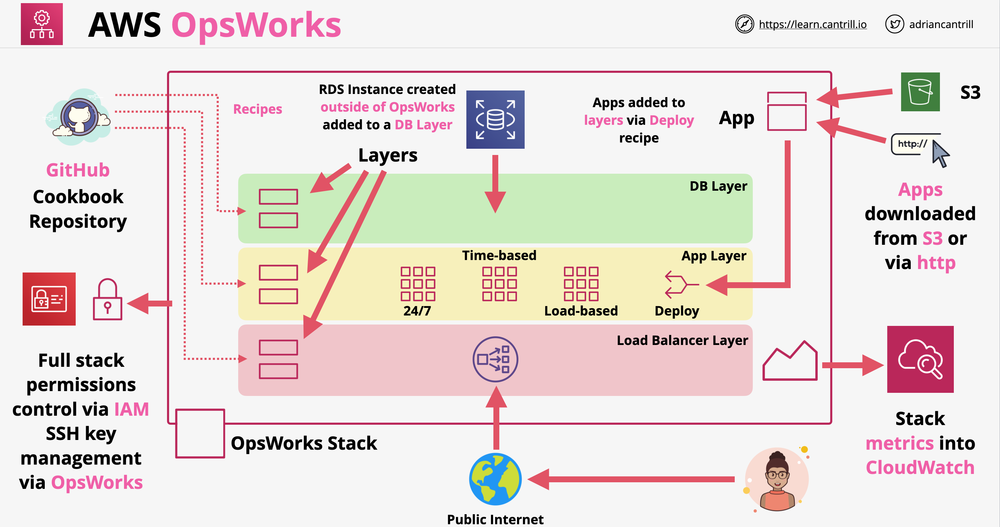

# AWS OpsWorks

- O OpsWorks é um serviço de gerenciamento de configuração que fornece uma implementação gerenciada pela AWS do Chef e do Puppet
- O OpsWorks funciona num de 3 modos:
    - Puppet Enterprise: podemos criar um AWS Managed Puppet Master Server (Servidor Mestre Puppet Gerenciado pela AWS - arquitetura de estado desejado)
    - Chef Automate: podemos criar AWS Managed Chef Servers (Servidores Chef Gerenciados pela AWS - similar ao IaC, conjunto de passos usando Ruby)
    - OpsWorks: Implementação da AWS do Chef, sem servidores. Chef num nível básico, pouca sobrecarga administrativa (admin overhead)
- Geralmente, só devemos escolher usá-los se formos obrigados a usar o Chef ou o Puppet, por exemplo, em caso de migração
- Outro caso de uso seria a exigência de automatizar
- Se você vir qualquer menção de Recipes (Receitas), Cookbook (Livro de Receitas) ou Manifests (Manifestos), você já sabe que seria qualquer uma das três opções mencionadas acima.

## Modo OpsWorks (Opsworks Mode)

- **Stacks (Pilhas)**: componentes centrais do OpsWorks, contêiner de recursos semelhante às stacks do CFN
- **Layers (Camadas)**: representam uma função específica numa stack, exemplo: camada de balanceadores de carga, camada de banco de dados, camada de instâncias EC2 rodando uma aplicação web
- **Recipes (Receitas)** e **Cookbooks (Livros de Receitas)**: eles são aplicados às camadas. Podemos usá-los para instalar pacotes, implantar aplicativos, rodar scripts, realizar reconfigurações. Cookbooks são coleções de receitas que podem ser armazenadas no GitHub
- **Lifecycle Events (Eventos de Ciclo de Vida)**: eventos especiais que rodam numa camada, exemplos:
    - Setup (Configuração)
    - Configure (Configurar): geralmente executado quando instâncias são removidas ou adicionadas à stack. Rodará em todas as instâncias, incluindo as já existentes
    - Deploy (Implantar)
    - Undeploy (Desimplantar)
    - Shutdown (Desligar)
- **Instances (Instâncias)**: instâncias de computação (instâncias EC2 ou servidores on-premises). Elas podem ser:
    - Instâncias **24/7**: iniciadas manualmente
    - Instâncias **Baseadas em Tempo (Time-Based)**: configuradas para iniciar e parar num cronograma
    - Instâncias **Baseadas em Carga (Load-Based)**: ligam ou desligam com base nas métricas do sistema (semelhante ao ASG)
- **Cura automática (auto-healing)** da instância: o OpsWorks reinicia automaticamente as instâncias se elas falharem por algum motivo
- **Apps (Aplicativos)**: eles podem ser armazenados em repositórios como o S3. Cada aplicativo é representado por um OpsWorks App, que especifica o tipo de aplicativo e contém quaisquer informações necessárias para implantar o aplicativo dos repositórios para as instâncias.
- Arquitetura OpsWorks:
    

---

# AWS OpsWorks

- OpsWorks is configuration managed service which provides AWS managed implementation of Chef a Puppet
- OpsWorks functions in one of 3 modes:
    - Puppet Enterprise: we can create an AWS Managed Puppet Master Server (desired state architecture)
    - Chef Automate: we can create AWS Managed Chef Servers (similar as IaC, set of steps using Ruby)
    - OpsWorks: AWS implementation of Chef, no servers. Chef at a basic level, little admin overhead
- Generally we should only chose to use them if we are required to use Chef or Puppet, for example in case of a migration
- Other use case would be a requirement to automate
- If you see any mention of Recipes, Cookbook or Manifests than you know that it would be any of the three options mentioned above.

## Opsworks Mode

- **Stacks**: core components of OpsWorks, container of resource similar to CFN stacks
- **Layers**: represent a specific function in a stack, example layer of load balancers, layer of database, layer of EC2 instances running a web application
- **Recipes** and **Cookbooks**: they are applied to layers. We can use them to install packages, deploy applications, run scripts, perform reconfigurations. Cookbooks are collections of recipes which can be stored on GitHub
- **Lifecycle Events**: special events which run on a layer, examples:
    - Setup
    - Configure: generally executed when instances are removed or added to the stack. It will run on all instances, including already existing ones
    - Deploy
    - Undeploy
    - Shutdown
- **Instances**: compute instances (EC2 instances or on-premise servers). They can be:
    - **24/7** instances: started manually
    - **Time-Based** instances: configured to start and stop on a schedule
    - **Load-Based** instances: turn on or off based on system metrics (similar to ASG)
- Instance **auto-healing**: Opsworks automatically restarts instances in they fail for some reason
- **Apps**: they can be stored in repositories such as S3. Each app is represented by an OpsWorks App which specifies the application type and containing any information needed to deploy the app from repositories to instances.
- OpsWorks architecture:
    