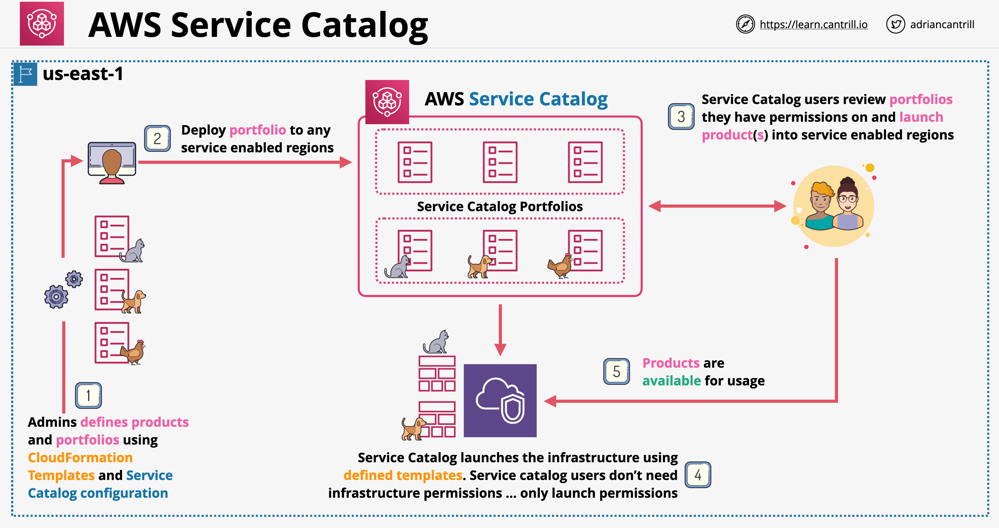

# Catálogo de Serviços (Service Catalog)

- Um catálogo de serviços é um documento ou banco de dados criado pela equipe de TI que contém uma coleção organizada de produtos
- Usado quando diferentes equipes na empresa usam um módulo de cobrança por serviço (service-charge)
- Informações principais do produto: Proprietário do Produto (Product Owner), Custo, Requisitos, Informações de Suporte, Dependências
- Define a aprovação do provisionamento por parte da TI e do cliente
- Projetado para gerenciar custos e escalar a entrega de serviços

## AWS Service Catalog

- Portal para usuários finais (end users) que podem iniciar (launch) produtos predefinidos por administradores
- As permissões do usuário final podem ser controladas
- Os administradores podem criar (build) esses produtos usando o CloudFormation e as permissões necessárias para iniciá-los
- Os administradores agrupam os produtos em portfólios (portfolios) que são tornados visíveis aos usuários finais
- Arquitetura do Service Catalog:
    

---

# Service Catalog

- A service catalog is a document or database crate by the IT team containing an organized collection of products
- Used when different teams in the business use a service-charge module
- Key product information: Product Owner, Cost, Requirements, Support Information, Dependencies
- Defines approval of provisioning from IT and customer side
- Designed for managing cost and scale service delivery

## AWS Service Catalog

- Portal for end users who can launch predefined products by admins
- End user permissions can be controlled
- Admins can those products using CloudFormation and the permissions required to launch them
- Admins build products into portfolios which are made visible to the end users
- Service Catalog architecture:
    